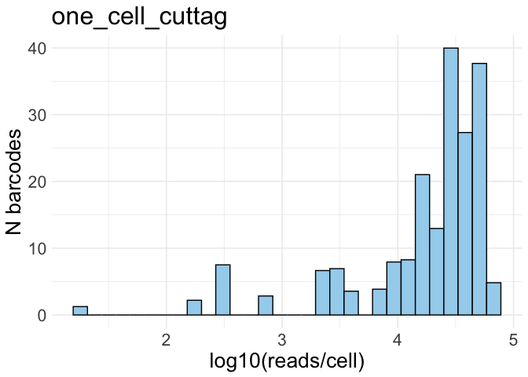
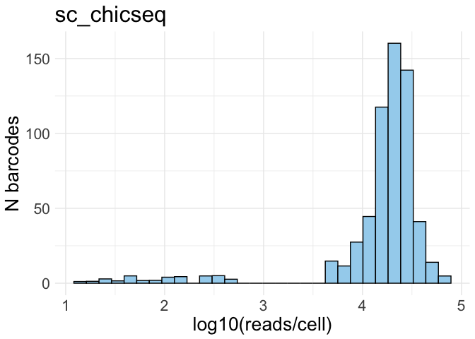
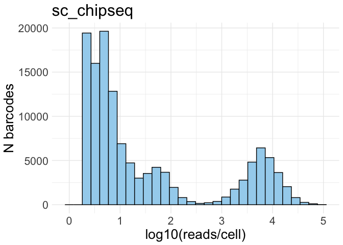
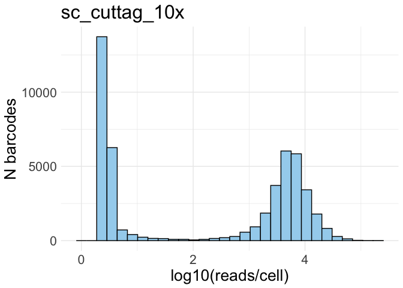
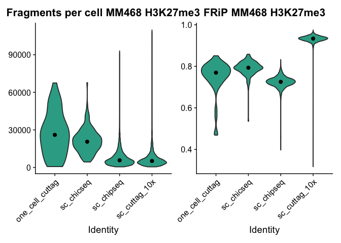
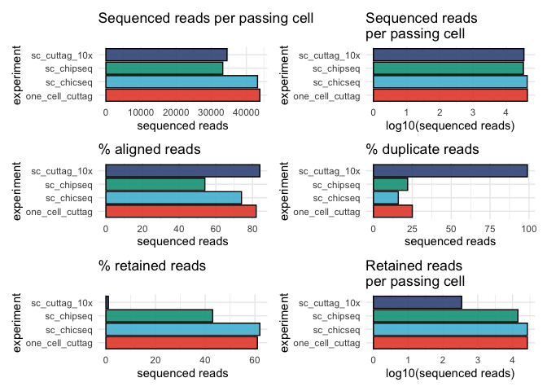

1.1_technique_comparison
================
Anna Schwager
2026-02-02

Load the global variables

``` r
here::i_am("scripts/1.1_technique_comparison.Rmd")
mainDir = here::here()
source(knitr::purl(file.path(mainDir,"scripts/global_variables.Rmd"), quiet=TRUE))
source(knitr::purl(file.path(mainDir, "scripts/functions.Rmd"), quiet=TRUE))

set.seed(123)
```

# Preparation and object creation

## Setting directories and input files

``` r
inputDir_local = file.path(inputDir, "hg38", "MM468")
outputDir_local = file.path(outputDir, "1.1_technique_comparison") ; if(!file.exists(outputDir_local)){dir.create(outputDir_local)}
outputDir_objects = file.path(outputDir_local, "objects") ; if(!file.exists(outputDir_objects)){dir.create(outputDir_objects)}
outputDir_plots = file.path(outputDir_local, "plots") ; if(!file.exists(outputDir_plots)){dir.create(outputDir_plots)}
outputDir_tables = file.path(outputDir_local, "tables") ; if(!file.exists(outputDir_tables)){dir.create(outputDir_tables)}


ld <- list.dirs(inputDir_local)
fragpaths <- list.files(ld[grepl("h3k27me3/.*fragmentFiles", ld)], full.names = TRUE)
fragpaths <- fragpaths[grepl('.tsv.gz$', list.files(ld[grepl("h3k27me3/.*fragmentFiles", ld)], full.names = TRUE))]
fragpaths <- fragpaths[!grepl("one_cell_multiome", fragpaths)]
fragpaths <- fragpaths[!grepl("auto", fragpaths)] 
names(fragpaths) <- sub(".*MM468/([^/]+)/.*", "\\1", fragpaths)

rm(ld)
```

## Loading annotation

``` r
consensus_peaks_k27 <- toGRanges(file.path(annotDir, "MM468_peaks_h3k27me3.bed"), format="BED", header=FALSE)
```

## Creating Seurat objects

``` r
seurat_list <- list()

for (i in names(fragpaths)){
    message(paste0("### Making fragment object for ", i))
    total_counts <- CountFragments(fragpaths[[i]])
    barcodes <- total_counts$CB
    frags <- CreateFragmentObject(path = fragpaths[[i]], cells = barcodes)
    
    message(paste0("### Making 50k bin matrix for ", i))
    bin50k_kmatrix = GenomeBinMatrix(
    frags,
    genome = hg38,
    cells = NULL,
    binsize = 50000,
    process_n = 10000,
    sep = c(":", "_"),
    verbose = TRUE)
    
    message(paste0("### Making peak matrix for ", i))
    peak_matrix = FeatureMatrix(
      frags,
      features = consensus_peaks_k27,
      cells = NULL,
      sep = c("-", "-"),
      verbose = TRUE)
    
    message(paste0("### Creating chromatin assay for ", i))
    chrom_assay <- CreateChromatinAssay(
      counts = bin50k_kmatrix,
      sep = c(":", "_"),
      genome = "hg38",
      fragments = fragpaths[[i]],
      min.cells = 1,
      min.features = -1)
    
    message(paste0("### Creating Seurat object for ", i))
    seurat <- CreateSeuratObject(
      counts = chrom_assay,
      assay = "bin_50k")
    
    seurat[["peaks"]] <- CreateChromatinAssay(
      counts = peak_matrix, genome = "hg38")
    
    Annotation(seurat) <- annotations_hg38
    
    seurat <- AddMetaData(seurat, CountFragments(fragpaths[[i]]))
    seurat <- FRiP(object = seurat, assay = "peaks", total.fragments = "frequency_count")
    seurat@meta.data[["orig.ident"]] <- i
    seurat_list[[i]] <- seurat
    
    rm(seurat)
    rm(frags)
    rm(total_counts)
    rm(barcodes)
    rm(fragments_per_cell)
    rm(bin50k_matrix)
    rm(peak_matrix)
    rm(chromatin_assay)
}

saveRDS(seurat_list, file.path(outputDir_objects, "seurat_list_MM468_h3k27me3_new.rds"))
```

``` r
seurat_list <- readRDS(file.path(outputDir_objects, "seurat_list_MM468_h3k27me3_new.rds"))
```

# QC

## Weighted histograms

``` r
for (seurat in seurat_list){
  p <- plot_weighted_hist(seurat) + ggtitle(print(seurat@meta.data[["orig.ident"]][1]))
  print(p)
  ggsave(file.path(outputDir_plots, paste(seurat@meta.data[["orig.ident"]][1], "_wist.pdf")),
       plot = p,
       device = "pdf",
       units = "mm",
       width = 100,
       height = 70)
}
```

    ## [1] "one_cell_cuttag"

    ## [1] "sc_chicseq"

    ## [1] "sc_chipseq"

    ## [1] "sc_cuttag_10x"



## Filtering

``` r
min_reads = 500
max_reads = 120000 # remove 1 outlier cell of 10x

for (p in names(seurat_list)){
  seurat_list[[p]]$filtering <- ifelse(seurat_list[[p]]$frequency_count > min_reads & seurat_list[[p]]$frequency_count < max_reads, 'pass', 'fail')
}

seurat <- merge(seurat_list[["one_cell_cuttag"]],
              c(seurat_list[["sc_chicseq"]],
                seurat_list[["sc_chipseq"]],
                seurat_list[["sc_cuttag_10x"]]))
```

## FrIP and N fragments plots

``` r
p_frip <- VlnPlot(subset(seurat, subset = filtering == 'pass'), c("FRiP"),
                      group.by = "orig.ident", split.by = NULL, pt.size = 0) +
                      labs(title = "FRiP MM468 H3K27me3") +
                      stat_summary(fun.y = median, geom='point', size = 2, colour = "black") +
                      theme(legend.position = "none") +
                      scale_fill_manual(values = rep(mypal[3], 4))

p_count <- VlnPlot(subset(seurat, subset = filtering == 'pass'), c("frequency_count"),
                       group.by = "orig.ident", split.by = NULL, pt.size = 0) +
                       labs(title = "Fragments per cell MM468 H3K27me3") +
                       stat_summary(fun.y = median, geom='point', size = 2, colour = "black") +
                       theme(legend.position = "none")+
                       scale_fill_manual(values = rep(mypal[3], 4))

p1 <- p_count | p_frip
p1
```



``` r
ggsave(file.path(outputDir_plots, "count_frip.pdf"),
       plot = p1,
       device = "pdf",
       units = "mm",
       width = 200,
       height = 110)
```

## Cell numbers and sequensing stats

``` r
df_ncells <-data.frame(experiment = rep(NA, length(seurat_list)),
                       n_barcodes = rep(NA, length(seurat_list)),
                       n_pass_cells = rep(NA, length(seurat_list)))

for (i in 1:length(seurat_list)){
  df_ncells$experiment[i] <- seurat_list[[i]]@meta.data[["orig.ident"]][1]
  df_ncells$n_barcodes[i] <- length(seurat_list[[i]]@meta.data[["CB"]])
  df_ncells$n_pass_cells[i] <- length(subset(seurat_list[[i]], subset = filtering == 'pass')@meta.data[["CB"]])
}

#1885854 - 46% subsampled L589 (full - 4099738)
#5831841 - for ChIC-seq
#261234433 - for ChIP-seq
#239111939 - for 10x

## these numbers are obtained from fastqs with (gunzip -c *.R1.fastq.gz | wc -l)/4
## and from the multiQC output of the scEpigenome pipeline 

df_ncells$sequenced_reads <- c(1885854, 5831841, 261234433, 239111939)
df_ncells$sequenced_reads_per_cell <- df_ncells$sequenced_reads/df_ncells$n_barcodes
df_ncells$sequenced_reads_per_pass_cell <- df_ncells$sequenced_reads/df_ncells$n_pass_cells
df_ncells$pct_aligned <- c(82, 74, 54, 84)
df_ncells$pct_duplicates<- c(25, 16, 22, 99)
df_ncells$pct_retained_reads <- c(61, 62, 43, 1)
df_ncells$retained_reads <- df_ncells$sequenced_reads/100 * df_ncells$pct_retained_reads
df_ncells$retained_reads_per_pass_cell <- df_ncells$retained_reads/df_ncells$n_pass_cells

df_ncells
```

    ##        experiment n_barcodes n_pass_cells sequenced_reads
    ## 1 one_cell_cuttag         48           43         1885854
    ## 2      sc_chicseq        154          135         5831841
    ## 3      sc_chipseq     317486         7846       261234433
    ## 4   sc_cuttag_10x     249947         6928       239111939
    ##   sequenced_reads_per_cell sequenced_reads_per_pass_cell pct_aligned
    ## 1               39288.6250                      43857.07          82
    ## 2               37869.0974                      43198.82          74
    ## 3                 822.8219                      33295.24          54
    ## 4                 956.6506                      34513.85          84
    ##   pct_duplicates pct_retained_reads retained_reads retained_reads_per_pass_cell
    ## 1             25                 61        1150371                   26752.8126
    ## 2             16                 62        3615741                   26783.2698
    ## 3             22                 43      112330806                   14316.9521
    ## 4             99                  1        2391119                     345.1385

``` r
p_sequnced_reads <- ggplot(df_ncells, aes(x = experiment, y = sequenced_reads_per_pass_cell, fill = experiment)) +
                    geom_col(position = 'dodge', color="black", show.legend = FALSE) +
                    labs(title="Sequenced reads per passing cell", y = "sequenced reads") + 
                    theme_minimal() +
                    coord_flip() +
                    scale_fill_manual(values = mypal)

p_sequnced_reads_log <- ggplot(df_ncells, aes(x = experiment, y = log10(sequenced_reads_per_pass_cell), fill = experiment)) +
                    geom_col(position = 'dodge', color="black", show.legend = FALSE) +
                    labs(title="Sequenced reads\nper passing cell", y = "log10(sequenced reads)") + 
                    theme_minimal() +
                    coord_flip() +
                    scale_fill_manual(values = mypal)

p_aligned_reads <- ggplot(df_ncells, aes(x = experiment, y = pct_aligned, fill = experiment)) +
                    geom_col(position = 'dodge', color="black", show.legend = FALSE) +
                    labs(title="% aligned reads", y = "sequenced reads") + 
                    theme_minimal() +
                    coord_flip() +
                    scale_fill_manual(values = mypal)

p_duplicate_reads <- ggplot(df_ncells, aes(x = experiment, y = pct_duplicates, fill = experiment)) +
                    geom_col(position = 'dodge', color="black", show.legend = FALSE) +
                    labs(title="% duplicate reads", y = "sequenced reads") + 
                    theme_minimal() +
                    coord_flip() +
                    scale_fill_manual(values = mypal)

p_retained_reads <- ggplot(df_ncells, aes(x = experiment, y = pct_retained_reads, fill = experiment)) +
                    geom_col(position = 'dodge', color="black", show.legend = FALSE) +
                    labs(title="% retained reads", y = "sequenced reads") + 
                    theme_minimal() +
                    coord_flip() +
                    scale_fill_manual(values = mypal)

p_retained_reads_log <- ggplot(df_ncells, aes(x = experiment, y = log10(retained_reads_per_pass_cell), fill = experiment)) +
                    geom_col(position = 'dodge', color="black", show.legend = FALSE) +
                    labs(title="Retained reads\nper passing cell", y = "log10(sequenced reads)") + 
                    theme_minimal() +
                    coord_flip() +
                    scale_fill_manual(values = mypal)


p <- (p_sequnced_reads | p_sequnced_reads_log) / (p_aligned_reads | p_duplicate_reads) / (p_retained_reads | p_retained_reads_log)
p
```



``` r
ggsave(file.path(outputDir_plots, "sequencing_stats.pdf"),
       plot = p,
       device = "pdf",
       units = "mm",
       width = 400,
       height = 300)
```

## Values per cell

``` r
df <- data.frame(experiment = c(seurat@meta.data$orig.ident),
                 cell = c(seurat@meta.data$CB),
                 N_frag = c(seurat@meta.data$frequency_count),
                 FRiP = c(seurat@meta.data$FRiP),
                 filt = seurat@meta.data$filtering)
df
write.csv(df, file.path(outputDir_tables, "qc_values_per_cell.csv"))
```
