2.1_multiome_zygotes
================
Anna Schwager
2026-05-20

Load the global variables

``` r
here::i_am("scripts/2.1_multiome_zygotes.Rmd")
mainDir = here::here()
source(knitr::purl(file.path(mainDir,"scripts/global_variables.Rmd"), quiet=TRUE))
source(knitr::purl(file.path(mainDir, "scripts/functions.Rmd"), quiet=TRUE))

set.seed(123)
#scales::show_col(mypal)
```

# Preparation and object creation

## Setting directories and input files

``` r
inputDir_local = file.path(inputDir, "mm10", "zygotes", "one_cell_multiome")

outputDir_local = file.path(outputDir, "2.3_multiome_zygotes") ; if(!file.exists(outputDir_local)){dir.create(outputDir_local)}
outputDir_objects = file.path(outputDir_local, "objects") ; if(!file.exists(outputDir_objects)){dir.create(outputDir_objects)}
outputDir_plots = file.path(outputDir_local, "plots") ; if(!file.exists(outputDir_plots)){dir.create(outputDir_plots)}
outputDir_tables = file.path(outputDir_local, "tables") ; if(!file.exists(outputDir_tables)){dir.create(outputDir_tables)}

ld <- list.dirs(inputDir_local)

fragpaths <- list.files(ld[grepl("/.*fragmentFiles", ld)], full.names = TRUE)
fragpaths_k4 <- fragpaths[grepl(".*/h3k4me1/.*fragmentFiles/.*tsv.gz$", fragpaths)]
fragpaths_k27 <- fragpaths[grepl(".*/h3k27me3/.*fragmentFiles/.*tsv.gz$", fragpaths)]

fragpaths <- list(fragpaths_k27, fragpaths_k4)
names(fragpaths) <- c("h3k27me3", "h3k4me1")

rnapaths <- list.dirs(ld[grepl("/.*flash", ld)], full.names = TRUE)
rnapaths_umi <- unique(rnapaths[grepl("/.*10XlikeMatrix_umi$", rnapaths)])
rnapaths_fl <- unique(rnapaths[grepl("/.*10XlikeMatrix_read$", rnapaths)])

rnapaths <- list(rnapaths_umi, rnapaths_fl)
names(rnapaths) <- c("umi", "full_length")

rm(ld)
```

## Loading tables

``` r
lf <- list.files(file.path(inputDir, "mm10", "zygotes", "matrices"), full.names = TRUE)

# the matrix was generated from the bigwigs using the multiBigwigSummary function from deeptools 
matrix_500kb <- read.delim(lf[grepl(".*05mb.*", lf)])
colnames(matrix_500kb) <- c("chr", "start", "end",
                            "CT_bulk_h3k27me3_r1", "CT_bulk_h3k27me3_r2", "TACIT_pb_H3K27me3",
                            "OneCell_pb_H3K27me3", "OneCell_cell1_H3K27me3", "OneCell_cell8_H3K27me3",
                            "OneCell_pb_H3K4me1", "OneCell_cell5_H3K4me1", "OneCell_cell16_H3K4me1",
                            "TACIT_pb_H3K4me1", "OneCell_pb_H3K27me3_RNA", "OneCell_pb_H3K4me1_RNA")
# remove 1 extreme value bin from chrM 
matrix_500kb <- matrix_500kb %>% filter(chr != "chrM")
```

## Loading annotation

``` r
consensus_peaks <- list("h3k27me3" = toGRanges(file.path(annotDir, "mouse_zygote_peaks_h3k27me3.bed"), format="BED", header=FALSE),
                        "h3k4me1" = toGRanges(file.path(annotDir, "mouse_zygote_peaks_h3k4me1.bed"), format="BED", header=FALSE))
```

## Loading bigwigs

``` r
ld <- list.dirs(inputDir)
bw_paths <- list.files(ld[grepl(".*zygotes/bigwigs.*", ld)], full.names = TRUE)

nm <- sub("\\.(bigwig|bw)$", "", basename(bw_paths), ignore.case = TRUE)
bw_paths <- setNames(bw_paths, nm)
```

# Creating the object

## RNA

``` r
rna_seurat_list <- lapply(rnapaths, function(pathvec) {
  lapply(pathvec, function(p) {
    rna.data <- Read10X(data.dir = p)
    CreateSeuratObject(counts = rna.data,
                       min.cells = 1,
                       min.features = -1,
                       project = "zygotes")
  })
}) |> unlist(recursive = FALSE)
```

## Epi

``` r
seurat_list <- lapply(names(fragpaths), function(mark) {
  fragpath <- fragpaths[[mark]]

  message(paste0("### Processing ", mark))

  message("### Counting fragments")
  total_counts <- CountFragments(fragpath)
  barcodes <- total_counts$CB

  message("### Creating fragment object")
  frags <- CreateFragmentObject(path = fragpath, cells = barcodes)

  message("### Making 50k bin matrix")
  bin50k_kmatrix <- GenomeBinMatrix(
    frags,
    genome = mm10,
    cells = NULL,
    binsize = 50000,
    process_n = 10000,
    sep = c(":", "_"),
    verbose = FALSE
  )

  message("### Making peak matrix")
  peak_matrix <- FeatureMatrix(
    frags,
    features = consensus_peaks[[mark]],
    cells = NULL,
    sep = c("-", "-"),
    verbose = FALSE
  )

  message("### Creating chromatin assay")
  chrom_assay <- CreateChromatinAssay(
    counts = bin50k_kmatrix,
    sep = c(":", "_"),
    genome = "mm10",
    fragments = fragpath,
    min.cells = 1,
    min.features = -1
  )

  message("### Creating Seurat object")
  seurat <- CreateSeuratObject(counts = chrom_assay, assay = "bin_50k")
  #colnames(seurat) <- sub(".*(S[0-9]+)$", "\\1", colnames(seurat))

  message("### Adding peak assay")
  seurat[["peaks"]] <- CreateChromatinAssay(counts = peak_matrix, genome = "mm10")

  message("### Adding RNA assays")
  
  seurat <- AddMetaData(seurat, rna_seurat_list[["full_length"]]@meta.data)
  seurat[["RNA_fl"]] <- rna_seurat_list[["full_length"]]@assays[["RNA"]]
  seurat$nCount_RNA_fl <- seurat$nCount_RNA
  seurat$nFeature_RNA_fl <- seurat$nFeature_RNA
  
  seurat <- AddMetaData(seurat, rna_seurat_list[["umi"]]@meta.data)
  seurat[["RNA_umi"]] <- rna_seurat_list[["umi"]]@assays[["RNA"]]
  seurat$nCount_RNA_umi <- seurat$nCount_RNA
  seurat$nFeature_RNA_umi <- seurat$nFeature_RNA
  
  Annotation(seurat) <- annotations_mm10
  seurat <- AddMetaData(seurat, total_counts)
  seurat <- FRiP(seurat, assay = "peaks", total.fragments = "frequency_count")
  seurat$orig.ident <- mark
  seurat$mark <- mark

  seurat
}) |> setNames(names(fragpaths))

saveRDS(seurat_list, file.path(outputDir_objects, "seurat_list.rds"))
```

## Joint

``` r
seurat_list <- lapply(names(fragpaths), function(mark) {
  fragpath <- fragpaths[[mark]][1]

  message(paste0("### Processing ", mark))

  total_counts <- CountFragments(fragpath)
  barcodes <- total_counts$CB
  frags <- CreateFragmentObject(path = fragpath, cells = barcodes)

  bin50k_kmatrix <- GenomeBinMatrix(
    frags, genome = mm10, cells = NULL, binsize = 50000,
    process_n = 10000, sep = c(":", "_"), verbose = TRUE
  )

  peak_matrix <- FeatureMatrix(
    frags, features = consensus_peaks[[mark]], cells = NULL,
    sep = c("-", "-"), verbose = TRUE
  )

  chrom_assay <- CreateChromatinAssay(
    counts = bin50k_kmatrix, sep = c(":", "_"),
    genome = "mm10", fragments = fragpath,
    min.cells = 1, min.features = -1
  )

  seurat <- CreateSeuratObject(counts = chrom_assay, assay = "bin_50k")
  seurat[["peaks"]] <- CreateChromatinAssay(counts = peak_matrix, genome = "mm10")

  # --- add RNA assays (aligned by cell names) ---
  for (rna_type in c("umi", "full_length")) {
    if (!is.null(rna_seurat_list[[rna_type]])) {
      rna_big <- rna_seurat_list[[rna_type]]

      cells_small <- colnames(seurat)
      if (!all(cells_small %in% colnames(rna_big))) {
        stop("Missing cells from RNA ", rna_type, " for mark ", mark)
      }

      rna_sub <- subset(rna_big, cells = cells_small)
      rna_sub <- rna_sub[, cells_small]  # ensure same order

      # add RNA assay
      assay_name <- ifelse(rna_type == "umi", "RNA_umi", "RNA_fl")
      seurat[[assay_name]] <- rna_sub[["RNA"]]

      # add aligned metadata
      md <- rna_big@meta.data[cells_small, , drop = FALSE]
      seurat <- AddMetaData(seurat, metadata = md)

      # add extra nCount/nFeature slots for clarity
      seurat[[paste0("nCount_", assay_name)]]   <- seurat@meta.data[["nCount_RNA"]]
      seurat[[paste0("nFeature_", assay_name)]] <- seurat@meta.data[["nFeature_RNA"]]
    }
  }

  # --- annotations & QC ---
  Annotation(seurat) <- annotations_mm10
  seurat <- AddMetaData(seurat, total_counts)
  seurat <- FRiP(seurat, assay = "peaks", total.fragments = "frequency_count")
  seurat$orig.ident <- mark
  seurat$mark <- mark

  seurat
}) |> setNames(names(fragpaths))

saveRDS(seurat_list, file.path(outputDir_objects, "seurat_list.rds"))
```

# Reload 1

``` r
seurat_list <- readRDS(file.path(outputDir_objects, "seurat_list.rds"))
```

# QC

## Weighted histograms

``` r
for (s in seurat_list){
  p1 <- plot_weighted_hist(s) + ggtitle(print(s@meta.data[["orig.ident"]][1]), " DNA fragments")
  p2 <- plot_weighted_hist(s, assay = "RNA") + ggtitle(print(s@meta.data[["orig.ident"]][1]), " RNA reads")
  p3 <- plot_weighted_hist(s, assay = "RNA_features") + ggtitle(print(s@meta.data[["orig.ident"]][1]), " RNA features")
  print(p1)
  print(p2)
  print(p3)
  rm(s)
}
```

    ## [1] "h3k27me3"
    ## [1] "h3k27me3"
    ## [1] "h3k27me3"

    ## [1] "h3k4me1"
    ## [1] "h3k4me1"
    ## [1] "h3k4me1"

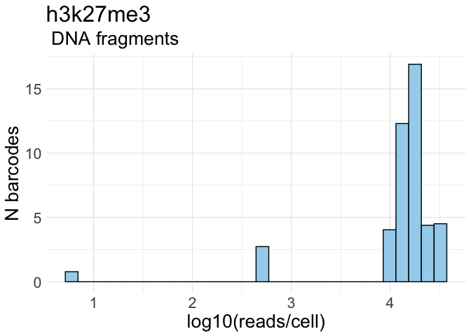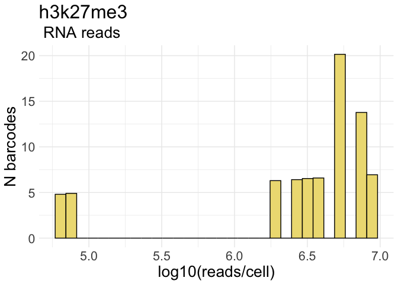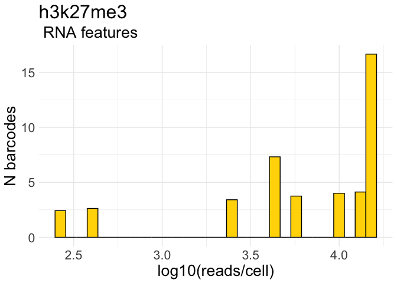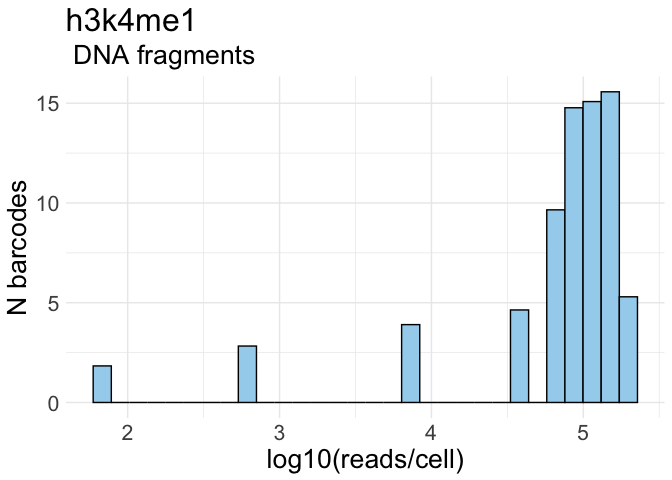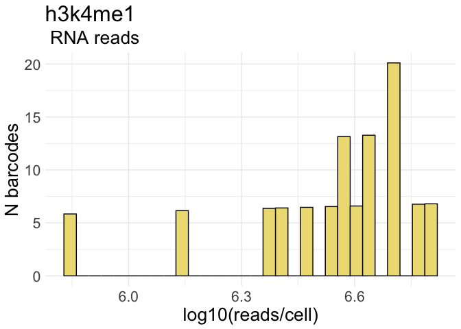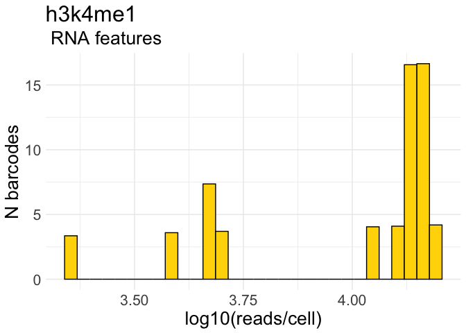

## Filtering

``` r
min_reads_chromatin = 700
min_feature_rna = 400

seurat_list[["h3k27me3"]]@meta.data[["filtering"]] <- ifelse(seurat_list[["h3k27me3"]]@meta.data$frequency_count > min_reads_chromatin & 
                                                            seurat_list[["h3k27me3"]]@meta.data$nFeature_RNA_fl > min_feature_rna,
                                                                             'pass', 'fail')

seurat_list[["h3k4me1"]]@meta.data[["filtering"]] <- ifelse(seurat_list[["h3k4me1"]]@meta.data$frequency_count > min_reads_chromatin & 
                                                            seurat_list[["h3k4me1"]]@meta.data$nFeature_RNA_fl > min_feature_rna,
                                                                             'pass', 'fail')
```

## Values per cell

``` r
df_k27 <- data.frame(cell = seurat_list[["h3k27me3"]]@meta.data$CB,
                 dna_fragments = seurat_list[["h3k27me3"]]@meta.data$frequency_count,
                 frip = seurat_list[["h3k27me3"]]@meta.data$FRiP,
                 rna_counts = seurat_list[["h3k27me3"]]@meta.data$nCount_RNA,
                 n_genes = seurat_list[["h3k27me3"]]@meta.data$nFeature_RNA,
                 filtering = seurat_list[["h3k27me3"]]@meta.data$filtering)
df_k27
```

    ##                               cell dna_fragments      frip rna_counts n_genes
    ## 1  Zygote-5-rH3K27me3-pA-Cell4-S25         19027 0.8694487    5150310   14681
    ## 2  Zygote-5-rH3K27me3-pA-Cell6-S27         15712 0.8457867    8811343   10220
    ## 3  Zygote-5-rH3K27me3-pA-Cell8-S29         12063 0.7519688    3403408   14271
    ## 4  Zygote-5-rH3K27me3-pA-Cell7-S28         24506 0.7794826    5270490   15174
    ## 5  Zygote-4-rH3K27me3-pA-Cell2-S12         14195 0.7353998    3908887    4554
    ## 6  Zygote-4-rH3K27me3-pA-Cell4-S14         10906 0.7299652    7687586    5605
    ## 7  Zygote-4-rH3K27me3-pA-Cell3-S13         11646 0.7515027    5166946    4599
    ## 8  Zygote-5-rH3K27me3-pA-Cell3-S24         32237 0.7391817    2576441   14583
    ## 9  Zygote-5-rH3K27me3-pA-Cell1-S22         17504 0.7221207    7722815   13208
    ## 10 Zygote-4-rH3K27me3-pA-Cell1-S11         15469 0.8116232    1999039    2603
    ## 11 Zygote-5-rH3K27me3-pA-Cell5-S26           538 0.4702602      63894     422
    ## 12 Zygote-5-rH3K27me3-pA-Cell2-S23             6 0.6666667      80354     266
    ##    filtering
    ## 1       pass
    ## 2       pass
    ## 3       pass
    ## 4       pass
    ## 5       pass
    ## 6       pass
    ## 7       pass
    ## 8       pass
    ## 9       pass
    ## 10      pass
    ## 11      fail
    ## 12      fail

``` r
df_k4 <- data.frame(cell = seurat_list[["h3k4me1"]]@meta.data$CB,
                 dna_fragments = seurat_list[["h3k4me1"]]@meta.data$frequency_count,
                 frip = seurat_list[["h3k4me1"]]@meta.data$FRiP,
                 rna_counts = seurat_list[["h3k4me1"]]@meta.data$nCount_RNA,
                 n_genes = seurat_list[["h3k4me1"]]@meta.data$nFeature_RNA,
                 filtering = seurat_list[["h3k4me1"]]@meta.data$filtering)
df_k4
```

    ##                               cell dna_fragments      frip rna_counts n_genes
    ## 1   Zygote-5-rH3K4me1-pA-Cell7-S37        155550 0.8729797    6345816   14001
    ## 2   Zygote-4-rH3K4me1-pA-Cell5-S20        103853 0.8687953    3700088    4788
    ## 3   Zygote-5-rH3K4me1-pA-Cell1-S31         66908 0.8646500    3948310   14409
    ## 4   Zygote-5-rH3K4me1-pA-Cell4-S34        198175 0.8594071    2328075   14136
    ## 5  Zygote-5-rH3K4me1-pA-Cell10-S40        142753 0.8576492    2577749   13912
    ## 6   Zygote-5-rH3K4me1-pA-Cell8-S38         78074 0.8592489    2950213   12470
    ## 7   Zygote-5-rH3K4me1-pA-Cell6-S36        168695 0.8614719     699646   11171
    ## 8   Zygote-5-rH3K4me1-pA-Cell3-S33         91845 0.8612227    4282761   14880
    ## 9   Zygote-5-rH3K4me1-pA-Cell2-S32        109054 0.8643333    3477982   14551
    ## 10  Zygote-5-rH3K4me1-pA-Cell5-S35        106924 0.8588063    4895170   15547
    ## 11 Zygote-5-rH3K4me1-pA-Cell11-S41          7992 0.8831331    3760254   13827
    ## 12  Zygote-4-rH3K4me1-pA-Cell4-S19         82727 0.8574468    4420870    4771
    ## 13  Zygote-5-rH3K4me1-pA-Cell9-S39         43410 0.8517392    5039589   13596
    ## 14  Zygote-4-rH3K4me1-pA-Cell2-S17         67661 0.8643384    5135134    3911
    ## 15  Zygote-4-rH3K4me1-pA-Cell1-S16           674 0.8471810    1432078    2259
    ## 16  Zygote-4-rH3K4me1-pA-Cell3-S18            68 0.9264706    5800673    4976
    ##    filtering
    ## 1       pass
    ## 2       pass
    ## 3       pass
    ## 4       pass
    ## 5       pass
    ## 6       pass
    ## 7       pass
    ## 8       pass
    ## 9       pass
    ## 10      pass
    ## 11      pass
    ## 12      pass
    ## 13      pass
    ## 14      pass
    ## 15      fail
    ## 16      fail

## N fragments and RNA counts

``` r
df_frags <- rbind(
  transform(FetchData(subset(seurat_list[["h3k27me3"]], filtering == "pass"),
                      vars = c("frequency_count", "FRiP",
                               "nCount_RNA_umi", "nFeature_RNA_umi",
                               "nCount_RNA_fl", "nFeature_RNA_fl")),
                      mark = "H3K27me3"),
  transform(FetchData(subset(seurat_list[["h3k4me1"]], filtering == "pass"),
                      vars = c("frequency_count", "FRiP",
                               "nCount_RNA_umi", "nFeature_RNA_umi",
                               "nCount_RNA_fl", "nFeature_RNA_fl")),
            mark = "H3K4me1")
)

p_frags <- ggplot(df_frags, aes(mark, frequency_count, fill = mark)) +
  geom_boxplot(outlier.shape = NA) +
  geom_jitter(width = 0.15, size = 1.5, alpha = 1) +
  labs(title = "Fragments per cell\n — zygotes", x = NULL, y = "Unique fragments per cell") +
  scale_fill_manual(values = c("H3K27me3" = mypal[3], "H3K4me1" = mypal[2])) +
  theme_classic() +
  theme(
    legend.position = "none",
    axis.text.x = element_text(angle = 45, hjust = 1, vjust = 1)
  )

p_frags_log10 <- ggplot(df_frags, aes(mark, log10(frequency_count), fill = mark)) +
  geom_boxplot(outlier.shape = NA) +
  geom_jitter(width = 0.15, size = 1.5, alpha = 1) +
  labs(title = "log10(fragments per cell)\n — zygotes", x = NULL, y = "Unique fragments per cell") +
  scale_fill_manual(values = c("H3K27me3" = mypal[3], "H3K4me1" = mypal[2])) +
  scale_y_continuous(expand = expansion(mult = c(0, 0.05)), limits = c(0, NA)) +
  theme_classic() +
  theme(
    legend.position = "none",
    axis.text.x = element_text(angle = 45, hjust = 1, vjust = 1)
  )

p_frip <- ggplot(df_frags, aes(mark, FRiP, fill = mark)) +
  geom_boxplot(outlier.shape = NA) +
  geom_jitter(width = 0.15, size = 1.5, alpha = 1) +
  labs(title = "FRiP per cell\n — zygotes", x = NULL, y = "Unique fragments per cell") +
  scale_fill_manual(values = c("H3K27me3" = mypal[3], "H3K4me1" = mypal[2])) +
  scale_y_continuous(expand = expansion(mult = c(0, 0.05)), limits = c(0, NA)) +
  theme_classic() +
  theme(
    legend.position = "none",
    axis.text.x = element_text(angle = 45, hjust = 1, vjust = 1)
  )

p_umi_counts <- ggplot(df_frags, aes(mark, nCount_RNA_umi, fill = mark)) +
  geom_boxplot(outlier.shape = NA) +
  geom_jitter(width = 0.15, size = 1.5, alpha = 1) +
  labs(title = "RNA counts per cell, umi\n — zygotes", x = NULL, y = "RNA counts per cell, umi") +
  scale_fill_manual(values = c("H3K27me3" = mypal[1], "H3K4me1" = mypal[1])) +
  theme_classic() +
  theme(
    legend.position = "none",
    axis.text.x = element_text(angle = 45, hjust = 1, vjust = 1)
  )

p_fl_counts <- ggplot(df_frags, aes(mark, nCount_RNA_fl, fill = mark)) +
  geom_boxplot(outlier.shape = NA) +
  geom_jitter(width = 0.15, size = 1.5, alpha = 1) +
  labs(title = "RNA counts per cell, fl\n — zygotes", x = NULL, y = "RNA counts per cell, fl") +
  scale_fill_manual(values = c("H3K27me3" = mypal[1], "H3K4me1" = mypal[1])) +
  theme_classic() +
  theme(
    legend.position = "none",
    axis.text.x = element_text(angle = 45, hjust = 1, vjust = 1)
  )

p_umi_genes <- ggplot(df_frags, aes(mark, nFeature_RNA_umi, fill = mark)) +
  geom_boxplot(outlier.shape = NA) +
  geom_jitter(width = 0.15, size = 1.5, alpha = 1) +
  labs(title = "Genes per cell, umi\n — zygotes", x = NULL, y = "Unique genes per cell, umi") +
  scale_fill_manual(values = c("H3K27me3" = mypal[1], "H3K4me1" = mypal[1])) +
  theme_classic() +
  theme(
    legend.position = "none",
    axis.text.x = element_text(angle = 45, hjust = 1, vjust = 1)
  )

p_fl_genes <- ggplot(df_frags, aes(mark, nFeature_RNA_fl, fill = mark)) +
  geom_boxplot(outlier.shape = NA) +
  geom_jitter(width = 0.15, size = 1.5, alpha = 1) +
  labs(title = "Genes per cell, fl\n — zygotes", x = NULL, y = "Unique genes per cell, fl") +
  scale_fill_manual(values = c("H3K27me3" = mypal[1], "H3K4me1" = mypal[1])) +
  theme_classic() +
  theme(
    legend.position = "none",
    axis.text.x = element_text(angle = 45, hjust = 1, vjust = 1)
  )

p_dna <- p_frags | p_frags_log10 | p_frip
p_umi <- p_umi_counts | p_umi_genes
p_fl <- p_fl_counts | p_fl_genes


p_umi
p_fl
p_dna
```

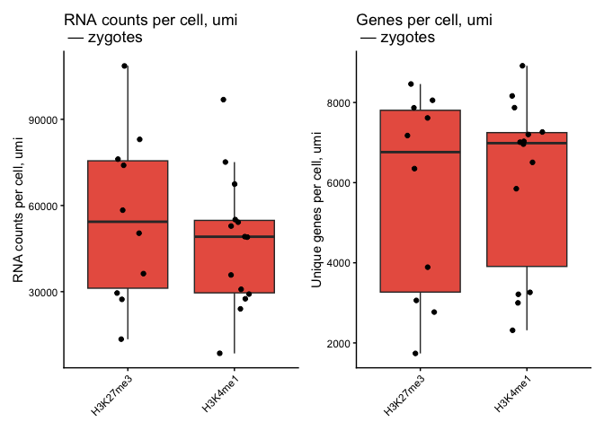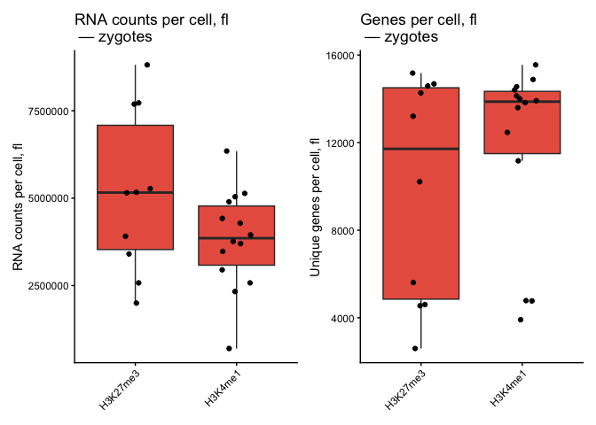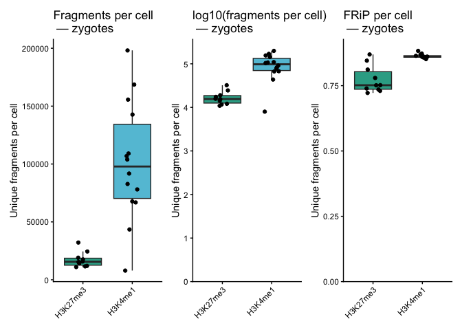

``` r
ggsave(file.path(outputDir_plots, "fragments_frip_zygotes.pdf"),
       plot = p_dna,
       device = "pdf",
       units = "mm",
       width = 120,
       height = 90)

ggsave(file.path(outputDir_plots, "counts_genes_umi.pdf"),
       plot = p_umi,
       device = "pdf",
       units = "mm",
       width = 80,
       height = 90)

ggsave(file.path(outputDir_plots, "counts_genes_fl.pdf"),
       plot = p_fl,
       device = "pdf",
       units = "mm",
       width = 80,
       height = 90)
```

## DNA to RNA reads scatter plots

``` r
meta_k27 <- subset(seurat_list[["h3k27me3"]], filtering == "pass")@meta.data
meta_k4 <- subset(seurat_list[["h3k4me1"]], filtering == "pass")@meta.data 
meta_all <- rbind(meta_k27, meta_k4)

frags_to_rna_reads_fl <- ggplot(meta_all,
                             aes(x = frequency_count, y = nCount_RNA_fl, color = mark)) +
                             geom_point(alpha = 1, stroke = 0, size = 2) +  
                             labs(x = "N unique DNA fragments",
                                  y =  "N unique RNA reads, fl",
                                title = "N unique DNA fragments\n vs.\nN unique RNA reads, fl") +
                              coord_cartesian(xlim = c(0, NA), ylim = c(0, NA)) +
                              theme_classic() +
                              scale_color_manual(values = c(mypal[3], mypal[2]))

frags_to_genes_fl <- ggplot(meta_all,
                         aes(x = frequency_count, y = nFeature_RNA_fl, color = mark)) +
                             geom_point(alpha = 1, stroke = 0, size = 2) +  
                             labs(x = "N unique DNA fragments",
                                  y =  "N unique genes, fl",
                                title = "N unique DNA fragments\n vs.\nN unique genes, fl") +
                                coord_cartesian(xlim = c(0, NA), ylim = c(0, NA)) +
                              theme_classic() +
                              scale_color_manual(values = c(mypal[3], mypal[2]))

frags_to_rna_reads_umi <- ggplot(meta_all,
                             aes(x = frequency_count, y = nCount_RNA_umi, color = mark)) +
                             geom_point(alpha = 1, stroke = 0, size = 2) +  
                             labs(x = "N unique DNA fragments",
                                  y =  "N unique RNA reads, umi",
                                title = "N unique DNA fragments\n vs.\nN unique RNA reads, umi") +
                                coord_cartesian(xlim = c(0, NA), ylim = c(0, NA)) +
                              theme_classic() +
                              scale_color_manual(values = c(mypal[3], mypal[2]))

frags_to_genes_umi <- ggplot(meta_all,
                         aes(x = frequency_count, y = nFeature_RNA_umi, color = mark)) +
                             geom_point(alpha = 1, stroke = 0, size = 2) +  
                             labs(x = "N unique DNA fragments",
                                  y =  "N unique genes, umi",
                                title = "N unique DNA fragments\n vs.\nN unique genes, umi") +
                                coord_cartesian(xlim = c(0, NA), ylim = c(0, NA)) +
                              theme_classic() +
                              scale_color_manual(values = c(mypal[3], mypal[2]))

p_scatter_fl <- frags_to_rna_reads_fl | frags_to_genes_fl
p_scatter_umi <- frags_to_rna_reads_umi | frags_to_genes_umi

p_scatters <- p_scatter_fl / p_scatter_umi

#p_scatter_fl
#p_scatter_umi
p_scatters
```

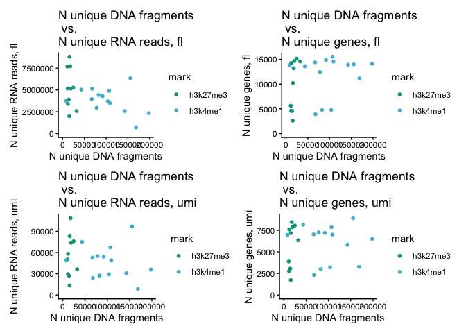<!-- -->

``` r
ggsave(file.path(outputDir_plots, "dna_rna_scatters_fl.pdf"),
       plot = p_scatter_fl,
       device = "pdf",
       units = "mm",
       width = 180,
       height = 70)

ggsave(file.path(outputDir_plots, "dna_rna_scatters_umi.pdf"),
       plot = p_scatter_umi,
       device = "pdf",
       units = "mm",
       width = 180,
       height = 70)

ggsave(file.path(outputDir_plots, "dna_rna_scatters_all.pdf"),
       plot = p_scatters,
       device = "pdf",
       units = "mm",
       width = 180,
       height = 145)
```

``` r
meta_k27 <- subset(seurat_list[["h3k27me3"]], filtering == "pass")@meta.data
meta_k4 <- subset(seurat_list[["h3k4me1"]], filtering == "pass")@meta.data 
meta_all <- rbind(meta_k27, meta_k4)

frags_to_rna_reads_fl_log <- ggplot(meta_all,
                             aes(x = log10(frequency_count), y = log10(nCount_RNA_fl), color = mark)) +
                             geom_point(alpha = 1, stroke = 0, size = 2) +  
                             labs(x = "log10(unique DNA fragments)",
                                  y =  "log10(unique RNA reads)",
                                title = "N unique DNA fragments\n vs.\nN unique RNA reads, fl") +
                              coord_cartesian(xlim = c(0, NA), ylim = c(0, NA)) +
                              theme_classic() +
                              scale_color_manual(values = c(mypal[3], mypal[2]))

frags_to_genes_fl_log <- ggplot(meta_all,
                         aes(x = log10(frequency_count), y = nFeature_RNA_fl, color = mark)) +
                             geom_point(alpha = 1, stroke = 0, size = 2) +  
                             labs(x = "log10(unique DNA fragments)",
                                  y =  "unique genes",
                                title = "N unique DNA fragments\n vs.\nN unique genes, fl") +
                                coord_cartesian(xlim = c(0, NA), ylim = c(0, NA)) +
                              theme_classic() +
                              scale_color_manual(values = c(mypal[3], mypal[2]))

frags_to_rna_reads_umi_log <- ggplot(meta_all,
                             aes(x = log10(frequency_count), y = log10(nCount_RNA_umi), color = mark)) +
                             geom_point(alpha = 1, stroke = 0, size = 2) +  
                             labs(x = "log10(unique DNA fragments)",
                                  y =  "log10(unique RNA reads, UMI)",
                                title = "N unique DNA fragments\n vs.\nN unique RNA reads, umi") +
                                coord_cartesian(xlim = c(0, NA), ylim = c(0, NA)) +
                              theme_classic() +
                              scale_color_manual(values = c(mypal[3], mypal[2]))

frags_to_genes_umi_log <- ggplot(meta_all,
                         aes(x = log10(frequency_count), y = nFeature_RNA_umi, color = mark)) +
                             geom_point(alpha = 1, stroke = 0, size = 2) +  
                             labs(x = "log10(unique DNA fragments-",
                                  y =  "unique genes, UMI",
                                title = "N unique DNA fragments\n vs.\nN unique genes, umi") +
                                coord_cartesian(xlim = c(0, NA), ylim = c(0, NA)) +
                              theme_classic() +
                              scale_color_manual(values = c(mypal[3], mypal[2]))

p_scatter_fl_log <- frags_to_rna_reads_fl_log | frags_to_genes_fl_log
p_scatter_umi_log <- frags_to_rna_reads_umi_log| frags_to_genes_umi_log

p_scatters_log <- p_scatter_fl_log / p_scatter_umi_log

p_scatters_log
```

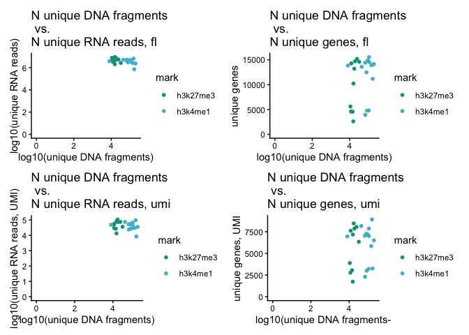<!-- -->

``` r
ggsave(file.path(outputDir_plots, "dna_rna_scatters_all_log.pdf"),
       plot = p_scatters_log,
       device = "pdf",
       units = "mm",
       width = 180,
       height = 145)
```

# Joint UMAP

``` r
seurat_k4 <- subset(seurat_list[["h3k4me1"]], subset = filtering == "pass")
seurat_k27 <- subset(seurat_list[["h3k27me3"]], subset = filtering == "pass")
```

``` r
## merging h3k4me1 and h3k27me3 data into one object
seurat_k27[["peaks"]] <- NULL
seurat_k4[["peaks"]]  <- NULL

seurat <- merge(seurat_k27, 
                seurat_k4)

seurat <- JoinLayers(seurat, assay = "RNA_umi")
seurat <- JoinLayers(seurat, assay = "RNA_fl")
```

“Clustering” RNA (do not expect heterogeniety, visualisation purposes
only)

``` r
seurat <- SCTransform(seurat, assay = "RNA_umi", new.assay.name = "SCT_umi", vars.to.regress = c("nCount_RNA_umi"))
seurat <- RunPCA(seurat, assay = "SCT_umi", reduction.name = "PCA_umi", npcs = 10)
seurat <- RunUMAP(seurat, dims = 1:10, verbose = FALSE, seed.use = 42, n.neighbors = 5,
                  reduction = "PCA_umi", reduction.name = "UMAP_umi")

seurat <- FindNeighbors(seurat, dims = 1:10, reduction = "PCA_umi")

DimPlot(seurat, reduction = "PCA_umi", group.by = "mark")
DimPlot(seurat, reduction = "UMAP_umi", group.by = "mark")
FeaturePlot(seurat, "nCount_RNA_umi", reduction = "PCA_umi")
```

Clustering K4 / K27

``` r
seurat_list <- list("h3k4me1" = subset(seurat, subset = mark == "h3k4me1"), 
                 "h3k27me3" = subset(seurat, subset = mark == "h3k27me3"))

for (mark in names(seurat_list)){
  DefaultAssay(seurat_list[[mark]]) <- 'bin_50k'
  seurat_list[[mark]] <- RunTFIDF(seurat_list[[mark]], assay = 'bin_50k')
  seurat_list[[mark]] <- FindTopFeatures(seurat_list[[mark]], min.cutoff = 'q50')
  seurat_list[[mark]] <- RunSVD(seurat_list[[mark]], reduction.name = paste("lsi_", mark, sep = ""))
  seurat_list[[mark]] <- RunUMAP(object = seurat_list[[mark]],
                                seed.use = 42, n.neighbors = 5,
                                reduction = paste("lsi_", mark, sep = ""),
                                reduction.name = paste("UMAP_", mark, sep = ""),
                                dims = 2:8)
}
```

``` r
saveRDS(seurat_list, file.path(outputDir_objects, "seurat_list_step1.rds"))
saveRDS(seurat, file.path(outputDir_objects, "seurat_step1.rds"))
```

# Reload 2

``` r
seurat <- readRDS(file.path(outputDir_objects, "seurat_step1.rds"))
seurat_list <- readRDS(file.path(outputDir_objects, "seurat_list_step1.rds"))
```

``` r
df1 <- seurat_list[["h3k4me1"]]@reductions[["UMAP_h3k4me1"]]@cell.embeddings %>% as.data.frame()
df2 <- seurat@reductions[["UMAP_umi"]]@cell.embeddings %>% as.data.frame()
df3 <- seurat_list[["h3k27me3"]]@reductions[["UMAP_h3k27me3"]]@cell.embeddings %>% as.data.frame()

# Add the info about the mark
df1$mark <- "H3K4me1"
df2$mark <- "RNA"
df3$mark <- "H3K27me3"

df1 <- df1 %>%
  rename(umap_1 = UMAPh3k4me1_1,
         umap_2 = UMAPh3k4me1_2)

df2 <- df2 %>%
  rename(umap_1 = UMAPumi_1,
         umap_2 = UMAPumi_2)

df3 <- df3 %>%
  rename(umap_1 = UMAPh3k27me3_1,
         umap_2 = UMAPh3k27me3_2)


# Shift umap_1 for each dataset 
df1$umap_1 <- df1$umap_1 - 30  # Shift H3K4me1 left
df3$umap_1 <- df3$umap_1/2 + 30  # Shift H3K27me3 right
df3$umap_2 <- df3$umap_2/2


# Create a list and bind dataframes into one
dat.umap.lst <- list(df1, df2, df3)
dat.umap.long <- dat.umap.lst %>% bind_rows()
dat.umap.long$cell <- c(rownames(df1), rownames(df2), rownames(df3))

cbPalette.ctype <- c(mypal[3], mypal[2], mypal[1])
names(cbPalette.ctype) <- unique(dat.umap.long$cluster)

connected_umap <- ggplot(dat.umap.long, aes(x = umap_1, y = umap_2, color = mark, group = cell)) +
                             geom_point(alpha = 1) +
                             geom_path(alpha = 0.2) +
                             scale_color_manual(values = cbPalette.ctype) +
                             theme_classic() + ggtitle("H3K4me1 -> RNA -> H3K27me3")
connected_umap 
```

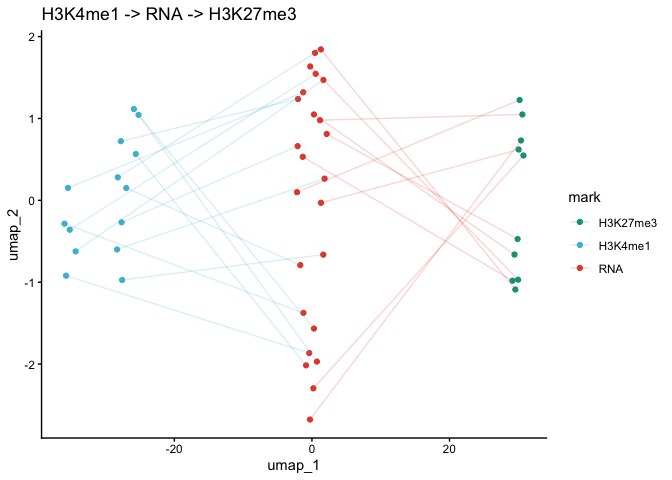<!-- -->

``` r
ggsave(file.path(outputDir_plots, "connected_umap.pdf"),
       plot = connected_umap,
       device = "pdf",
       units = "mm",
       width = 140,
       height = 50)
```

# Correlation with the bulk

## Correlation matrix

``` r
data <- matrix_500kb[, 4:15]
data <- data[rowSums(data) >0, ]

spearman_500kb <-cor(data, method="spearman")

p_corr_500 <- pheatmap(
    spearman_500kb,
    display_numbers = TRUE,
    number_color = "white",
    color = colorRampPalette(rev(brewer.pal(n = 8, name = "RdYlBu")))(10),
    main = "Spearman correlation 0.5Mb"
)

p_corr_500
```

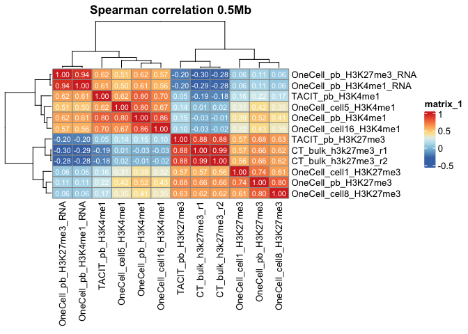<!-- -->

``` r
ggsave(file.path(outputDir_plots, "p_corr_500kb_no_zeros.pdf"),
       plot = p_corr_500,
       device = "pdf",
       units = "mm",
       width = 190,
       height = 170)
```

## Scatter plots

``` r
create_plot <- function(data, x, y, xlim = NULL, ylim = NULL) {
  xv <- data[[x]]; yv <- data[[y]]
  ok <- is.finite(xv) & is.finite(yv) & xv > 0 & yv > 0

  lab <- "n < 3"
  if (sum(ok) >= 3) {
    ct <- suppressWarnings(cor.test(xv[ok], yv[ok], method = "spearman"))
    lab <- paste0("R = ", round(unname(ct$estimate), 3),
                  "\np-val = ", format.pval(ct$p.value, digits = 3, eps = 1e-300))
  }

  ggplot(data, aes_string(x = x, y = y)) +
    geom_pointdensity(adjust = 1) +
    scale_x_log10() + scale_y_log10() +
    scale_color_viridis_c(option = "magma") +
    theme_bw() +
    coord_cartesian(xlim = xlim, ylim = ylim, clip = "off") +
    theme(
      legend.position = "none",
      axis.title.x = element_text(size = 9),
      axis.title.y = element_text(size = 9),
      axis.text.x  = element_text(size = 8),
      axis.text.y  = element_text(size = 8)
    ) +
    annotate("text_npc", npcx = 0.02, npcy = 0.98,
             label = lab, hjust = 0, vjust = 1, size = 3.2)
}

samples <- colnames(data) 


prefer_y <- function(nm) {
  grepl("^OneCell_pb_H3", nm, ignore.case = TRUE) &
    !grepl("_RNA$", nm, ignore.case = TRUE)
}

reorder_pair <- function(p) {
  hit <- vapply(p, prefer_y, logical(1))
  if (sum(hit) == 1) c(p[!hit], p[hit]) else p  # x, y
}

pairs <- lapply(combn(samples, 2, simplify = FALSE), reorder_pair)
pair_name <- function(xy) paste0(xy[2], "_vs_", xy[1])

plots <- setNames(
  lapply(pairs, function(p) create_plot(data, p[1], p[2])),
  sapply(pairs, pair_name)
)
```

## Selected scatter plots for the main figure

``` r
#p_flipped <- plots[["OneCell_pb_H3K4me1_vs_OneCell_pb_H3K27me3"]] + coord_flip()

p_scatters_k27 <- plots[["OneCell_pb_H3K27me3_vs_OneCell_cell1_H3K27me3"]] | plots[["OneCell_pb_H3K27me3_vs_CT_bulk_h3k27me3_r2"]] | plots[["OneCell_pb_H3K27me3_vs_TACIT_pb_H3K27me3"]] 

p_scatters_k4 <-plots[["OneCell_pb_H3K4me1_vs_OneCell_cell5_H3K4me1"]] | plots[["OneCell_pb_H3K4me1_vs_TACIT_pb_H3K4me1"]] 

p_scatters_k27
```

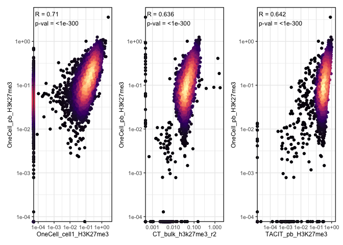<!-- -->

``` r
p_scatters_k4
```

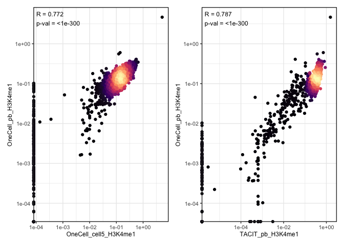<!-- -->

``` r
p_scatters_cell_to_cell <- plots[["OneCell_cell16_H3K4me1_vs_OneCell_cell5_H3K4me1"]] | plots[["OneCell_cell8_H3K27me3_vs_OneCell_cell1_H3K27me3"]] 

p_scatters_cell_to_cell
```

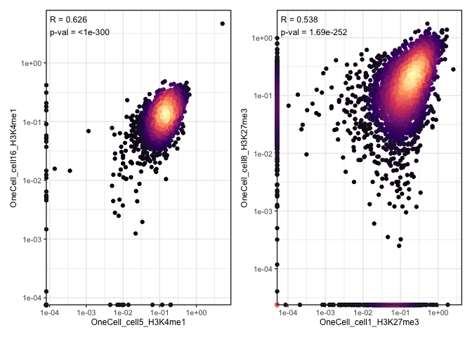<!-- -->

``` r
ggsave(file.path(outputDir_plots, "p_scatters_k27.pdf"),
       plot = p_scatters_k27,
       device = "pdf",
       units = "mm",
       width = 340,
       height = 68)

ggsave(file.path(outputDir_plots, "p_scatters_k4.pdf"),
       plot = p_scatters_k4,
       device = "pdf",
       units = "mm",
       width = 340,
       height = 68)

ggsave(file.path(outputDir_plots, "p_scatters_cell_to_cell.pdf"),
       plot = p_scatters_cell_to_cell,
       device = "pdf",
       units = "mm",
       width = 68,
       height = 120)
```

# Single-cell level corelations

## Create gene activity matrices

``` r
gene_activity_k4 <- GeneActivity(seurat_k4,
                                 assay = "bin_50k",
                                 extend.upstream = 5000,
                                 extend.downstream = 0,
                                 process_n = 3000)

seurat_k4[['gene_activity']] <- CreateAssayObject(counts = gene_activity_k4)

gene_activity_k27 <- GeneActivity(seurat_k27,
                                 assay = "bin_50k",
                                 extend.upstream = 5000,
                                 extend.downstream = 0,
                                 process_n = 3000)

seurat_k27[['gene_activity']] <- CreateAssayObject(counts = gene_activity_k27)
```

## Correlation function

``` r
# Safe per-gene/cell correlation (skips genes / cells with zero SD)
safe_cor <- function(x, y, method = "pearson") {
  x <- as.numeric(x); y <- as.numeric(y)
  if (length(x) < 3 || sd(x) == 0 || sd(y) == 0) return(NA_real_)
  stats::cor(x, y, use = "pairwise.complete.obs", method = method)
}
```

## Gene level correlation

H3K4me1

``` r
counts <- GetAssayData(seurat_k4, assay = "RNA_umi", layer = "counts")
common_genes  <- intersect(rownames(counts), rownames(gene_activity_k4))

X_k4 <- counts[common_genes, , drop = FALSE]
Y_k4 <- gene_activity_k4[common_genes, , drop = FALSE]
Xlog_k4 <- log1p(as.matrix(X_k4))
Ylog_k4 <- log1p(as.matrix(Y_k4))

r_gene_pearson  <- vapply(seq_len(nrow(Xlog_k4)), \(i) safe_cor(Xlog_k4[i, ], Ylog_k4[i, ], "pearson"),  numeric(1))
r_gene_spearman  <- vapply(seq_len(nrow(Xlog_k4)), \(i) safe_cor(Xlog_k4[i, ], Ylog_k4[i, ], "spearman"),  numeric(1))


df_gene <- data.frame(
  gene          = rownames(Xlog_k4),
  r_pearson     = r_gene_pearson,
  r_spearman     = r_gene_spearman,
  mean_counts   = rowMeans(Xlog_k4),
  mean_activity = rowMeans(Ylog_k4),
  nz_cells      = rowSums((X_k4 > 0) | (Y_k4 > 0))
)

p_gene_hist_k4 <- ggplot(df_gene, aes(x = r_pearson)) +
  geom_histogram(bins = 30,
                 fill = mypal[2],
                 color = "black",
                 linewidth = 0.3) +
  labs(title = "Per-gene Pearson R", x = "R", y = "Genes") +
  theme_classic()
```

H3K27me3

``` r
counts <- GetAssayData(seurat_k27, assay = "RNA_umi", layer = "counts")
common_genes  <- intersect(rownames(counts), rownames(gene_activity_k27))

X_k27 <- counts[common_genes, , drop = FALSE]
Y_k27 <- gene_activity_k27[common_genes, , drop = FALSE]
Xlog_k27 <- log1p(as.matrix(X_k27))
Ylog_k27 <- log1p(as.matrix(Y_k27))

r_gene_pearson  <- vapply(seq_len(nrow(Xlog_k27)), \(i) safe_cor(Xlog_k27[i, ], Ylog_k27[i, ], "pearson"),  numeric(1))
r_gene_spearman  <- vapply(seq_len(nrow(Xlog_k27)), \(i) safe_cor(Xlog_k27[i, ], Ylog_k27[i, ], "spearman"),  numeric(1))


df_gene <- data.frame(
  gene          = rownames(Xlog_k27),
  r_pearson     = r_gene_pearson,
  r_spearman     = r_gene_spearman,
  mean_counts   = rowMeans(Xlog_k27),
  mean_activity = rowMeans(Ylog_k27),
  nz_cells      = rowSums((X_k27 > 0) | (Y_k27 > 0))
)

p_gene_hist_k27 <- ggplot(df_gene, aes(x = r_pearson)) +
  geom_histogram(bins = 30,
                 fill = mypal[3],
                 color = "black",
                 linewidth = 0.3) +
  labs(title = "Per-gene Pearson R", x = "R", y = "Genes") +
  theme_classic()
```

``` r
p_gene_hist_k4 | p_gene_hist_k27
```

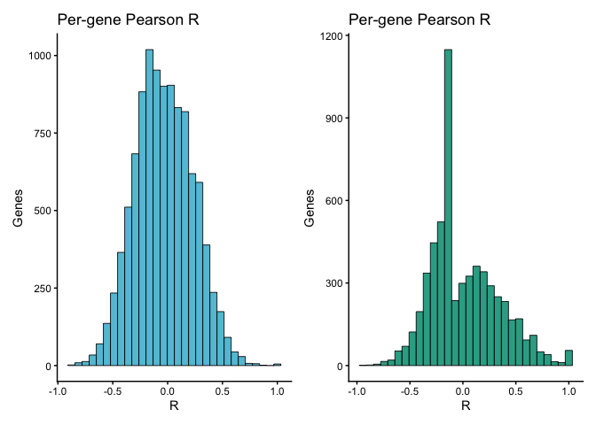<!-- -->

``` r
ggsave(file.path(outputDir_plots, "gene_level_cor_k4.pdf"),
       plot = p_gene_hist_k4,
       device = "pdf",
       units = "mm",
       width = 80,
       height = 60)

ggsave(file.path(outputDir_plots, "gene_level_cor_k27.pdf"),
       plot = p_gene_hist_k27,
       device = "pdf",
       units = "mm",
       width = 80,
       height = 60)
```

## Cell level correlation

``` r
r_cell_pearson  <- vapply(seq_len(ncol(Xlog_k4)), function(j) safe_cor(Xlog_k4[, j], Ylog_k4[, j], "pearson"),  numeric(1))

df_cell_k4 <- data.frame(
  cell = colnames(Xlog_k4),
  r_pearson = r_cell_pearson,
  mean_counts    = colMeans(Xlog_k4),
  mean_activity  = colMeans(Ylog_k4),
  mark = "h3k4me1"
)

r_cell_pearson  <- vapply(seq_len(ncol(Xlog_k27)), function(j) safe_cor(Xlog_k27[, j], Ylog_k27[, j], "pearson"),  numeric(1))

df_cell_k27 <- data.frame(
  cell = colnames(Xlog_k27),
  r_pearson = r_cell_pearson,
  mean_counts    = colMeans(Xlog_k27),
  mean_activity  = colMeans(Ylog_k27),
  mark = "h3k27me3"
)

df_cell <- rbind(df_cell_k4, df_cell_k27)

corr_dots <- ggplot(df_cell, aes(x = mark, y = r_pearson, color = mark)) +
  geom_jitter(width = 0.25, size = 1.5, alpha = 1) +
  geom_hline(yintercept = 0, linetype = "dashed", color = "grey40") +
  stat_summary(aes(color = mark),
               fun = median, geom = "point", shape = 95, size = 8) +
  theme_classic() +
  scale_color_manual(values = c(mypal[3], mypal[2])) +
  labs(x = NULL, y = "Pearson R") +
  theme(
    axis.text.x = element_text(angle = 45, hjust = 1, size = 12),
    strip.text = element_text(size = 12),
    legend.position = "none" 
  )
corr_dots
```

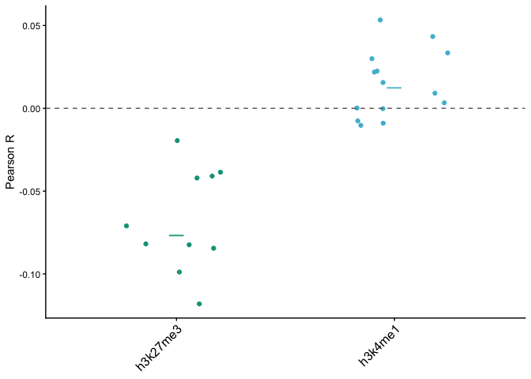<!-- -->

``` r
ggsave(file.path(outputDir_plots, "corr_dots.pdf"),
       plot = corr_dots,
       device = "pdf",
       units = "mm",
       width = 50,
       height = 60)
```

# Gene activity UMAP

Preparing input matrix

``` r
ga_mat_k4 <- GetAssayData(seurat_k4, assay = "gene_activity", layer = "counts")
ga_mat_k27 <- GetAssayData(seurat_k27, assay = "gene_activity", layer = "counts")
rna_mat <- GetAssayData(seurat, assay = "RNA_fl", layert = "counts")

#per-cell normalization (median size factor)
norm_cols <- function(m) {
  sf <- Matrix::colSums(m); sf[sf == 0] <- 1
  t(t(m) / (sf / median(sf)))
}

ga_mat_k4n  <- norm_cols(ga_mat_k4)
ga_mat_k27n <- norm_cols(ga_mat_k27)
rna_mat_n   <- norm_cols(rna_mat)

ga_sum_k4  <- Matrix::rowSums(ga_mat_k4n)
ga_sum_k27 <- Matrix::rowSums(ga_mat_k27n)
rna_sum    <- Matrix::rowSums(rna_mat_n)

#winsorize extreme tails
winsor <- function(x, p = 0.995) {
  cap <- unname(quantile(x, p, na.rm = TRUE))
  pmin(x, cap)
}
ga_sum_k4  <- winsor(ga_sum_k4,  0.995)
ga_sum_k27 <- winsor(ga_sum_k27, 0.995)
rna_sum    <- winsor(rna_sum,    0.995)

#align gene sets and zero-fill
all_genes <- Reduce(union, list(names(ga_sum_k4), names(ga_sum_k27), names(rna_sum)))
k4  <- ga_sum_k4[all_genes];   k4[is.na(k4)]   <- 0
k27 <- ga_sum_k27[all_genes];  k27[is.na(k27)] <- 0
rna <- rna_sum[all_genes];     rna[is.na(rna)] <- 0

# filtering 
eps <- 1e-8   
# keep genes that are not all-zero AND remove expressed-without-marks
keep <- (k4 + k27 + rna) > eps & !(rna > eps & k4 <= eps & k27 <= eps)

gene_table <- tibble(
  gene              = all_genes[keep],
  gene_activity_k4  = log1p(k4[keep]),
  gene_activity_k27 = log1p(k27[keep]),
  expression        = log1p(rna[keep])
)

# drop mitochondrial and ribosomal genes
drop <- grepl("^MT-|^mt-|^RPL|^RPS", gene_table$gene)
gene_table <- gene_table[!drop, ]

gene_matrix <- scale(gene_table[, c("gene_activity_k4","gene_activity_k27","expression")]) |> as.matrix()
```

Running UMAP

``` r
emb <- uwot::umap(
  gene_matrix,
  n_neighbors = 200,     
  min_dist    = 0.2,
  metric      = "euclidean",
  init        = "spectral",
  scale       = FALSE,
  n_threads   = parallel::detectCores(),
)

saveRDS(emb, file.path(outputDir_objects, "gene_umap.rds"))
```

# Reload 3

``` r
emb <- readRDS(file.path(outputDir_objects, "gene_umap.rds"))
```

``` r
umap_df <- gene_table %>%
  select(gene, gene_activity_k4, gene_activity_k27, expression) %>%
  mutate(UMAP1 = emb[, 1], UMAP2 = emb[, 2])

umap_center <- colMeans(emb)

umap_df <- umap_df %>%
  mutate(dist = sqrt((UMAP1 - umap_center[1])^2 + (UMAP2 - umap_center[2])^2))

umap_df <- umap_df %>%
  filter(dist < quantile(dist, 0.90))
```

``` r
umap_df <- umap_df %>% arrange(expression)
p1 <- ggplot(umap_df, aes(UMAP1, UMAP2)) +
  geom_point_rast(aes(color = expression), size = 1.2, alpha = 0.9) +
  scale_color_gradient(low = "lightgrey", high = "#b82b17") +
  theme_classic() +
  labs(color = "Log1p(Exp)", title = "Gene UMAP") +
  guides(color = guide_colorbar(barheight = unit(3, "cm")))

umap_df <- umap_df %>% arrange(gene_activity_k4)
p2 <- ggplot(umap_df, aes(UMAP1, UMAP2)) +
  geom_point_rast(aes(color = gene_activity_k4), size = 1.2, alpha = 0.9) +
  scale_color_gradient(low = "lightgrey", high = "#25859b") +
  theme_classic() +
  labs(color = "Log1p(K4)", title = "Gene UMAP") +
  guides(color = guide_colorbar(barheight = unit(3, "cm")))

umap_df <- umap_df %>% arrange(gene_activity_k27)
p3 <- ggplot(umap_df, aes(UMAP1, UMAP2)) +
  geom_point_rast(aes(color = gene_activity_k27), size = 1.2, alpha = 0.9) +
  scale_color_gradient(low = "lightgrey", high = "#005446") +
  theme_classic() +
  labs(color = "Log1p(K27)", title = "Gene UMAP") +
  guides(color = guide_colorbar(barheight = unit(3, "cm")))

p1
```

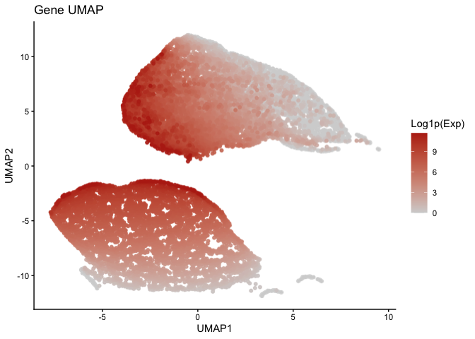<!-- -->

``` r
p2
```

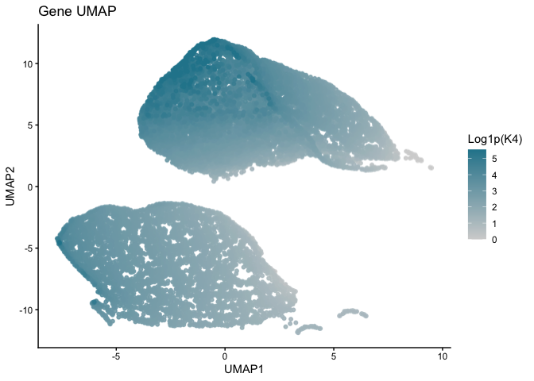<!-- -->

``` r
p3
```

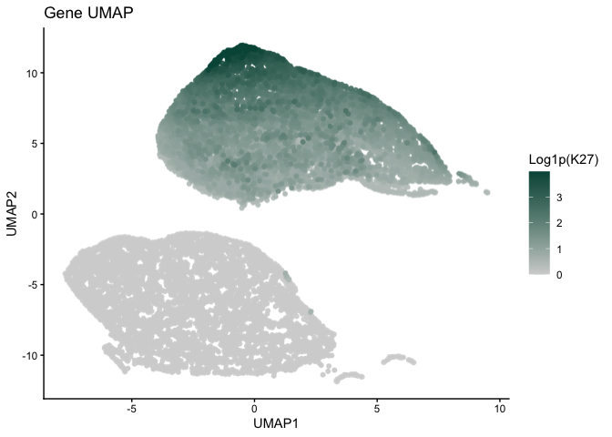<!-- -->

``` r
ggsave(file.path(outputDir_plots, "gene_umaps.pdf"),
       plot = p_umaps,
       device = "pdf",
       units = "mm",
       width = 330,
       height = 100)
```

# Functional enrichment in gene-groups

``` r
km <- kmeans(
  umap_df[, c("UMAP1", "UMAP2")],
  centers = 2,
  nstart = 50
)

umap_df$cluster <- factor(km$cluster)

ggplot(umap_df, aes(UMAP1, UMAP2, color = cluster)) +
  geom_point(size = 1, alpha = 0.8) +
  theme_classic()
```

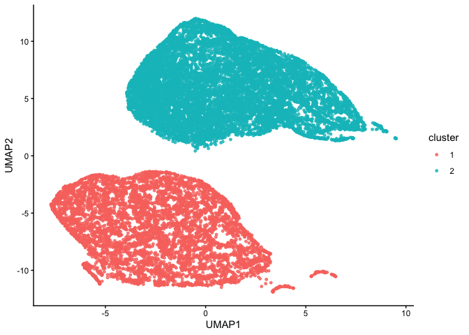<!-- -->

``` r
umap_df %>%
  group_by(cluster) %>%
  summarise(
    n_genes = n(),
    mean_expr = mean(expression),
    mean_k4 = mean(gene_activity_k4),
    mean_k27 = mean(gene_activity_k27)
  )
```

    ## # A tibble: 2 × 5
    ##   cluster n_genes mean_expr mean_k4 mean_k27
    ##   <fct>     <int>     <dbl>   <dbl>    <dbl>
    ## 1 1          6772      5.60    2.43 0.000793
    ## 2 2         12214      4.13    3.18 1.31

``` r
umap_df <- umap_df %>%
  mutate(
    cluster_label = case_when(
      cluster == 1 ~ "H3K27me3-low",
      cluster == 2 ~ "H3K27me3-enriched"
    )
  )
```

``` r
genes_cl1 <- umap_df %>%
  filter(cluster_label == "H3K27me3-low") %>%
  pull(gene)

genes_cl2 <- umap_df %>%
  filter(cluster_label == "H3K27me3-enriched") %>%
  pull(gene)

background_genes <- umap_df$gene

ego_cl1 <- enrichGO(
  gene = genes_cl1,
  universe = background_genes,
  OrgDb = org.Mm.eg.db,
  keyType = "SYMBOL",
  ont = "BP",
  pAdjustMethod = "BH",
  readable = TRUE
)

ego_cl2 <- enrichGO(
  gene = genes_cl2,
  universe = background_genes,
  OrgDb = org.Mm.eg.db,
  keyType = "SYMBOL",
  ont = "BP",
  pAdjustMethod = "BH",
  readable = TRUE
)

ego_cl1_simpl <- simplify(
  ego_cl1,
  cutoff = 0.7,
  by = "p.adjust",
  select_fun = min
)

ego_cl2_simpl <- simplify(
  ego_cl2,
  cutoff = 0.7,
  by = "p.adjust",
  select_fun = min
)
```

``` r
df_go <- bind_rows(
  as.data.frame(ego_cl1_simpl) %>%
    mutate(cluster = "H3K27me3-low cluster"),

  as.data.frame(ego_cl2_simpl) %>%
    mutate(cluster = "H3K27me3-enriched cluster")
) %>%
  group_by(cluster) %>%
  slice_min(p.adjust, n = 20) %>%
  ungroup() %>%
  mutate(
    log10padj = -log10(p.adjust),
    Description = forcats::fct_reorder(Description, log10padj)
  )

p_enrich <- ggplot(df_go, aes(log10padj, Description, fill = cluster)) +
  geom_col(
    color = "black",
    linewidth = 0.2,
    alpha = 0.5
  ) +
  facet_wrap(~ cluster, scales = "free_y") +
  scale_fill_manual(values = c(
    "H3K27me3-low cluster" = "grey",
    "H3K27me3-enriched cluster" = "#005446"
  )) +
  theme_classic(base_size = 12) +
  labs(
    x = "-log10 adjusted p-value",
    y = NULL,
    fill = NULL
  ) +
  theme(
    legend.position = "none",
    strip.background = element_blank(),
    strip.text = element_text(face = "bold")
  )

p_enrich
```

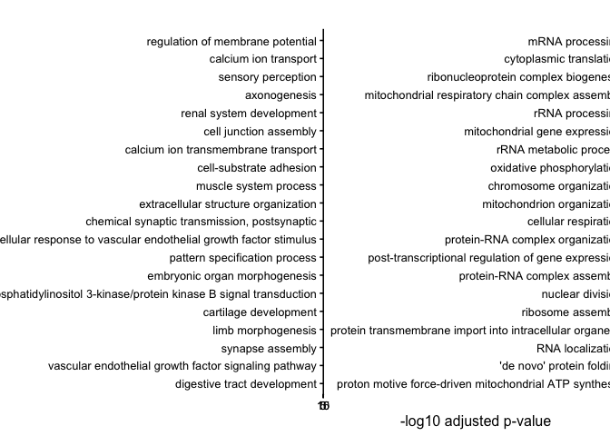<!-- -->

``` r
ggsave(file.path(outputDir_plots, "gene_umaps_enrichment.pdf"),
       plot = p_enrich,
       device = "pdf",
       units = "mm",
       width = 330,
       height = 100)
```

# Represenative tracks

No images for some tracks in the md, as too heavy to render. \## Region
1 - sc K27 \### All tracks

``` r
roi="chr11-47475915-65875498"

cov_plot_rna_k27_sc <- BigwigTrack(
                     bigwig = bw_paths[["D1888T0593_Zygote_5_rH3K27me3_pA_Cell6"]],
                     region = roi,
                     smooth = 10000,
                     type = "coverage",
                     y_label = "Normalised signal") +
                     scale_fill_manual(values = mypal[1]) +
                     theme(legend.position = "none")
cov_plot_rna_k27_sc[["data"]][["bw"]] <- "sc_rna"

cov_plot_rna_k27_sc_heatmap <- BigwigTrack(
                     bigwig = bw_paths[["D1888T0593_Zygote_5_rH3K27me3_pA_Cell6"]],
                     region = roi,
                     smooth = 10000,
                     ymax = 0.1,
                     type = "heatmap",
                     y_label = "Normalised signal") +
                     theme(legend.position = "none") +
  theme(legend.position = "none") +
  scale_fill_gradientn(
    colors = c("white", mypal[1]),
    values = c(0, 1), 
    breaks = c(0, 1)
  )

cov_plot_k27_sc <- BigwigTrack(
                     bigwig = bw_paths[["L548_Zygote_5_rH3K27me3_pA_Cell6"]],
                     region = roi,
                     smooth = 20000,
                     type = "coverage",
                     y_label = "Normalised signal") +
                     scale_fill_manual(values = mypal[3]) +
                     theme(legend.position = "none")
cov_plot_k27_sc[["data"]][["bw"]] <- "sc_k27"

cov_plot_k27 <- CoveragePlot(
  object = seurat_k27,
  region = roi,
  annotation = FALSE,
  peaks = FALSE,
  window = 20000,
  extend.upstream = 0,
  extend.downstream = 0
) + scale_fill_manual(values = c(mypal[3], mypal[3]))
cov_plot_k27[[1]][["data"]][["group"]] <- "pb_h3k27me3"

tile_plot <- TilePlot(object = seurat_k27,
                        region = roi,
                        tile.size = 20000) + scale_fill_gradient(low = "white", high = "#005043")

gene_plot <- AnnotationPlot(
  object = seurat_k27,
  region = roi
)

p_k27_sc <- CombineTracks(plotlist = list(cov_plot_rna_k27_sc_heatmap,
                                          cov_plot_rna_k27_sc,
                                          cov_plot_k27_sc,
                                          cov_plot_k27_pb,
                                          tile_plot,
                                          gene_plot),
                    heights = c(8,15,15,15,15,8)) & 
                    theme(axis.title.y = element_text(size = 7))

p_k27_sc
```

``` r
ggsave(file.path(outputDir_plots, "all_zygote_tracks_k27_sc.pdf"),
       plot = p_k27_sc,
       device = "pdf",
       units = "mm",
       width = 200,
       height = 80)
```

### Zoom on RNA

``` r
roi="chr11-59207000-59233000"
cov_plot_rna_k27_sc_zoom <- BigwigTrack(
                     bigwig = bw_paths[["D1888T0593_Zygote_5_rH3K27me3_pA_Cell6"]],
                     region = roi,
                     smooth = 500,
                     type = "coverage",
                     y_label = "Normalised signal") +
                     scale_fill_manual(values = mypal[1]) +
                     theme(legend.position = "none")
cov_plot_rna_k27_sc_zoom[["data"]][["bw"]] <- "sc_rna"

gene_plot <- AnnotationPlot(
  object = seurat_k27,
  region = roi
)


p_k27_rna_zoom <- CombineTracks(plotlist = list(cov_plot_rna_k27_sc_zoom,
                                   gene_plot),
                    heights = c(15,8)) & 
                    theme(axis.title.y = element_text(size = 7))

p_k27_rna_zoom
```

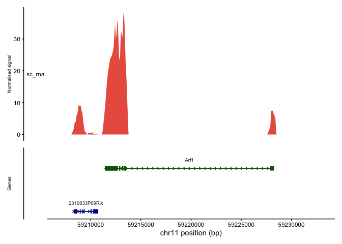<!-- -->

``` r
genes <- c("2310033P09Rik", "Arf1")
subobj <- subset(seurat, subset = mark == "h3k27me3")
DefaultAssay(subobj) <- "RNA_fl"

df <- data.frame(
  ident = Idents(subobj),
  expr1 = FetchData(subobj, vars = genes[1])[, 1],
  expr2 = FetchData(subobj, vars = genes[2])[, 1]
) %>%
  pivot_longer(
    cols = c(expr1, expr2),
    names_to = "which_gene",
    values_to = "value"
  ) %>%
  mutate(
    gene = factor(ifelse(which_gene == "expr1", genes[1], genes[2]), levels = genes)
  )

r1_rna_boxes <- ggplot(df, aes(x = ident, y = value)) +
  geom_boxplot(fill = mypal[1], outlier.shape = NA) +
  geom_jitter(width = 0.25, size = 1.5, alpha = 1, color = "black") +
  facet_wrap(~ gene, nrow = 1, scales = "free_y") +
  theme_classic() +
  expand_limits(y = 0) +
  labs(x = NULL, y = "RNA_fl expression") +
  theme(
    axis.text.x = element_text(angle = 45, hjust = 1, size = 12),
    strip.text = element_text(size = 12)
  )

r1_rna_boxes 
```

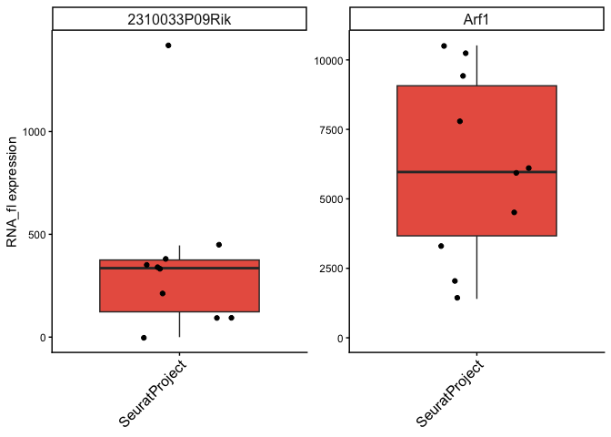<!-- -->

``` r
ggsave(file.path(outputDir_plots, "p_k27_rna_zoom.pdf"),
       plot = p_k27_rna_zoom,
       device = "pdf",
       units = "mm",
       width = 150,
       height = 40)

ggsave(file.path(outputDir_plots, "k27_rna_boxes.pdf"),
       plot = r1_rna_boxes,
       device = "pdf",
       units = "mm",
       width = 60,
       height = 60)
```

## Region 2 - sc K4

### All tracks

``` r
roi="chr9-35957773-42209777"

cov_plot_rna_k4_sc <- BigwigTrack(
                     bigwig = bw_paths[["D1888T0586_Zygote_4_rH3K4me1_pA_Cell5"]],
                     region = roi,
                     smooth = 10000,
                     type = "coverage",
                     y_label = "Normalised signal") +
                     scale_fill_manual(values = mypal[1]) +
                     theme(legend.position = "none")
cov_plot_rna_k4_sc[["data"]][["bw"]] <- "sc_rna"

cov_plot_rna_k4_sc_heatmap <- BigwigTrack(
                     bigwig = bw_paths[["D1888T0586_Zygote_4_rH3K4me1_pA_Cell5"]],
                     region = roi,
                     smooth = 10000,
                     ymax = 0.1,
                     type = "heatmap",
                     y_label = "Normalised signal") +
                     theme(legend.position = "none") +
  theme(legend.position = "none") +
  scale_fill_gradientn(
    colors = c("white", mypal[1]),
    values = c(0, 1), 
    breaks = c(0, 1)
  )

cov_plot_k4_sc <- BigwigTrack(
                     bigwig = bw_paths[["L548_Zygote_4_rH3K4me1_pA_Cell5"]],
                     region = roi,
                     smooth = 20000,
                     type = "coverage",
                     y_label = "Normalised signal") +
                     scale_fill_manual(values = mypal[2]) +
                     theme(legend.position = "none")
cov_plot_k4_sc[["data"]][["bw"]] <- "sc_k4"

cov_plot_k4 <- CoveragePlot(
  object = seurat_k4,
  region = roi,
  annotation = FALSE,
  peaks = FALSE,
  window = 20000,
  extend.upstream = 0,
  extend.downstream = 0
) + scale_fill_manual(values = c(mypal[2], mypal[2]))
cov_plot_k4[[1]][["data"]][["group"]] <- "pb_h3k4me1"

tile_plot <- TilePlot(object = seurat_k4,
                        region = roi,
                        tile.size = 20000) + scale_fill_gradient(low = "white", high = "#195c6c")

gene_plot <- AnnotationPlot(
  object = seurat_k4,
  region = roi
)

p_k4_sc <- CombineTracks(plotlist = list(cov_plot_rna_k4_sc_heatmap,
                                         cov_plot_rna_k4_sc,
                                   cov_plot_k4_sc,
                                   cov_plot_k4,
                                   tile_plot,
                                   gene_plot),
                    heights = c(8,15,15,15,15,8)) & 
                    theme(axis.title.y = element_text(size = 7))
p_k4_sc
```

``` r
ggsave(file.path(outputDir_plots, "all_zygote_tracks_k4_sc.pdf"),
       plot = p_k4_sc,
       device = "pdf",
       units = "mm",
       width = 200,
       height = 80)
```

### Zoom on RNA

``` r
roi="chr9-36705000-36768000"

cov_plot_rna_k4_sc_zoom <- BigwigTrack(
                     bigwig = bw_paths[["D1888T0593_Zygote_5_rH3K27me3_pA_Cell6"]],
                     region = roi,
                     smooth = 500,
                     type = "coverage",
                     y_label = "Normalised signal") +
                     scale_fill_manual(values = mypal[1]) +
                     theme(legend.position = "none")
cov_plot_rna_k4_sc_zoom[["data"]][["bw"]] <- "sc_rna"

gene_plot <- AnnotationPlot(
  object = seurat_k27,
  region = roi
)

p_k4_rna_zoom <- CombineTracks(plotlist = list(cov_plot_rna_k4_sc_zoom,
                                   gene_plot),
                    heights = c(15,8)) & 
                    theme(axis.title.y = element_text(size = 7))

p_k4_rna_zoom
```

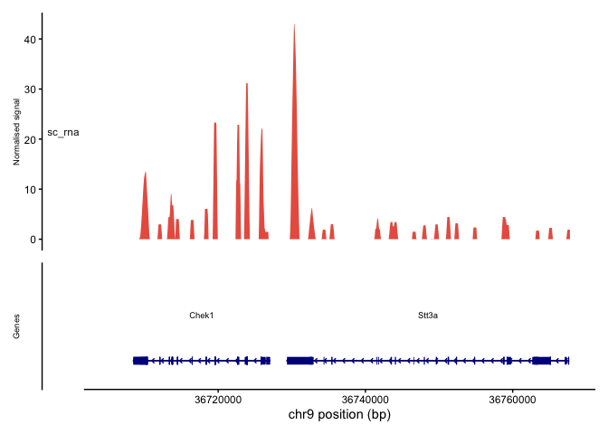<!-- -->

``` r
genes <- c("Chek1", "Stt3a")
subobj <- subset(seurat, subset = mark == "h3k4me1")
DefaultAssay(subobj) <- "RNA_fl"

df <- data.frame(
  ident = Idents(subobj),
  expr1 = FetchData(subobj, vars = genes[1])[, 1],
  expr2 = FetchData(subobj, vars = genes[2])[, 1]
) %>%
  pivot_longer(
    cols = c(expr1, expr2),
    names_to = "which_gene",
    values_to = "value"
  ) %>%
  mutate(
    gene = factor(ifelse(which_gene == "expr1", genes[1], genes[2]), levels = genes)
  )

r2_rna_boxes <- ggplot(df, aes(x = ident, y = value)) +
  geom_boxplot(fill = mypal[1], outlier.shape = NA) +
  geom_jitter(width = 0.25, size = 1.5, alpha = 1, color = "black") +
  facet_wrap(~ gene, nrow = 1, scales = "free_y") +
  theme_classic() +
  expand_limits(y = 0) +
  labs(x = NULL, y = "RNA_fl expression") +
  theme(
    axis.text.x = element_text(angle = 45, hjust = 1, size = 12),
    strip.text = element_text(size = 12)
  )

r2_rna_boxes 
```

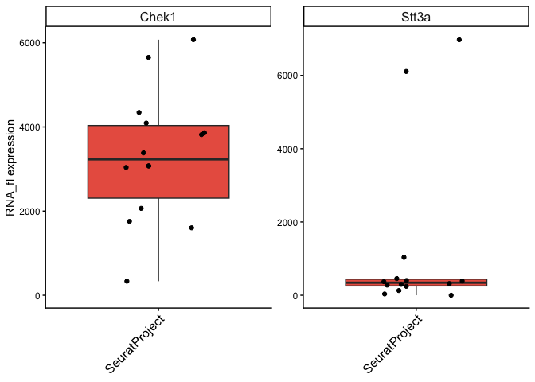<!-- -->

``` r
ggsave(file.path(outputDir_plots, "p_k4_rna_zoom.pdf"),
       plot = p_k4_rna_zoom,
       device = "pdf",
       units = "mm",
       width = 150,
       height = 40)

ggsave(file.path(outputDir_plots, "r2_k4_rna_boxes.pdf"),
       plot = r2_rna_boxes,
       device = "pdf",
       units = "mm",
       width = 60,
       height = 60)
```

## Region 3 - validation by other technos

``` r
roi="chr1-117798042-130093578"

cov_plot_rna <- BigwigTrack(
                     bigwig = bw_paths[["D1888_Zygotes_all_rH3K4me1_RNA_pseudobulk"]],
                     region = roi,
                     smooth = 10000,
                     type = "coverage",
                     y_label = "Normalised signal") +
                     scale_fill_manual(values = mypal[1]) 
                     theme(legend.position = "none")

cov_plot_rna[["data"]][["bw"]] <- "pseudobulk_rna"


cov_plot_rna_heatmap <- BigwigTrack(
                     bigwig = bw_paths[["D1888_Zygotes_all_rH3K4me1_RNA_pseudobulk"]],
                     region = roi,
                     smooth = 10000,
                     ymax = 0.1,
                     type = "heatmap",
                     y_label = "Normalised signal") +
                     theme(legend.position = "none") +
  theme(legend.position = "none") +
  scale_fill_gradientn(
    colors = c("white", mypal[1]),
    values = c(0, 1),    
    breaks = c(0, 1)
  )

cov_plot_rna_heatmap[["data"]][["bw"]] <- "yes_no_rna"


cov_plot_k4_pb <- CoveragePlot(
  object = seurat_k4,
  region = roi,
  annotation = FALSE,
  peaks = FALSE,
  window = 20000,
  extend.upstream = 0,
  extend.downstream = 0
) + scale_fill_manual(values = c(mypal[2], mypal[2]))
cov_plot_k4_pb[[1]][["data"]][["group"]] <- "pseudobulk_k4me1"

cov_plot_k4_tacit <- BigwigTrack(
                     bigwig = bw_paths[["GSM7645420_H3K4me1_zygote.mm10"]],
                     region = roi,
                     smooth = 20000,
                     type = "coverage",
                     y_label = "Normalised signal") +
                     scale_fill_manual(values = mypal[2]) +
                     theme(legend.position = "none")
cov_plot_k4_tacit[["data"]][["bw"]] <- "pb_h3k4me1_TACIT"

cov_plot_k27_pb <- CoveragePlot(
  object = seurat_k27,
  region = roi,
  annotation = FALSE,
  peaks = FALSE,
  window = 20000,
  extend.upstream = 0,
  extend.downstream = 0
) + scale_fill_manual(values = c(mypal[3], mypal[3]))
cov_plot_k27_pb[[1]][["data"]][["group"]] <- "pseudobulk_k27me3"

cov_plot_k27_tacit <- BigwigTrack(
                     bigwig = bw_paths[["GSM7645437_H3K27me3_zygote.mm10"]],
                     region = roi,
                     smooth = 20000,
                     type = "coverage",
                     y_label = "Normalised signal") +
                     scale_fill_manual(values = mypal[3]) +
                     theme(legend.position = "none")
cov_plot_k27_tacit[["data"]][["bw"]] <- "pb_h3k27me3_TACIT"


cov_plot_k27_bulk <- BigwigTrack(
                     bigwig = bw_paths[["D1535_D1480C05_H3K27me3_bulk_r1"]],
                     region = roi,
                     smooth = 20000,
                     type = "coverage",
                     y_label = "Normalised signal") +
                     scale_fill_manual(values = mypal[3]) +
                     theme(legend.position = "none")
cov_plot_k27_bulk[["data"]][["bw"]] <- "bulk_h3k27me3_C&T"

gene_plot <- AnnotationPlot(
  object = seurat_k4,
  region = roi
)

p_all_6 <- CombineTracks(plotlist = list(cov_plot_rna_heatmap,
                                   cov_plot_rna,
                                   cov_plot_k4_pb,
                                   cov_plot_k4_tacit,
                                   cov_plot_k27_pb,
                                   cov_plot_k27_tacit,
                                   cov_plot_k27_bulk,
                                   gene_plot),
                    heights = c(8,15,15,15,15,15,15,8)) & 
                    theme(axis.title.y = element_text(size = 7))
```

``` r
ggsave(file.path(outputDir_plots, "r3_zygote_tracks_6.pdf"),
       plot = p_all_6,
       device = "pdf",
       units = "mm",
       width = 200,
       height = 110)
```
