# 3.1_multiome_mouse_mammary_gland_preprocessing
Anna Schwager
2026-02-03

# Python setup

``` r
library(reticulate)
use_condaenv(
  "snap_py310",
  conda = "/Users/annaschwager/miniforge3/bin/conda",
  required = TRUE
)

py_config()
```

    python:         /Users/annaschwager/miniforge3/envs/snap_py310/bin/python
    libpython:      /Users/annaschwager/miniforge3/envs/snap_py310/lib/libpython3.10.dylib
    pythonhome:     /Users/annaschwager/miniforge3/envs/snap_py310:/Users/annaschwager/miniforge3/envs/snap_py310
    version:        3.10.19 | packaged by conda-forge | (main, Oct 22 2025, 22:46:49) [Clang 19.1.7 ]
    numpy:          /Users/annaschwager/miniforge3/envs/snap_py310/lib/python3.10/site-packages/numpy
    numpy_version:  1.26.4

    NOTE: Python version was forced by use_python() function

``` python
import sys
import numpy as np
import pandas as pd
from pathlib import Path
import scanpy as sc
import snapatac2 as snap
import skmisc

print("sys.executable:", sys.executable)
```

    sys.executable: /Users/annaschwager/miniforge3/envs/snap_py310/bin/python

``` python
print("scanpy:", sc.__version__)
```

    scanpy: 1.11.5

``` python
print("snapatac2:", snap.__version__)
```

    snapatac2: 2.8.0

# R setup

``` r
here::i_am("scripts/3.1_multiome_mouse_mammary_gland_preprocessing.qmd")
mainDir = here::here()
source(knitr::purl(file.path(mainDir,"scripts/global_variables.Rmd"), quiet=TRUE))
source(knitr::purl(file.path(mainDir, "scripts/functions.Rmd"), quiet=TRUE))

set.seed(123)
```

# Setting directories and input files

``` r
inputDir_local = file.path(inputDir, "mm10", "mouse_mammary_gland", "one_cell_multiome")

outputDir_local = file.path(outputDir, "3.1_multiome_mouse_mammary_gland_preprocessing") ; if(!file.exists(outputDir_local)){dir.create(outputDir_local)}
outputDir_objects = file.path(outputDir_local, "objects") ; if(!file.exists(outputDir_objects)){dir.create(outputDir_objects)}
outputDir_plots = file.path(outputDir_local, "plots") ; if(!file.exists(outputDir_plots)){dir.create(outputDir_plots)}
outputDir_tables = file.path(outputDir_local, "tables") ; if(!file.exists(outputDir_tables)){dir.create(outputDir_tables)}
snap_dir <- file.path(outputDir_objects, "snap_export") ; if(!file.exists(snap_dir )){dir.create(snap_dir)}


ld <- list.dirs(inputDir_local)

fragpaths <- list.files(ld[grepl("/.*fragmentFiles", ld)], full.names = TRUE)
fragpaths_k4 <- fragpaths[grepl(".*/h3k4me1/.*fragmentFiles/.*tsv.gz$", fragpaths)]
names(fragpaths_k4) <- ifelse(grepl("L539", fragpaths_k4), 
                              "exp1", 
                              ifelse(grepl("N167", fragpaths_k4), 
                                     "exp2",
                              ifelse(grepl("N168", fragpaths_k4), 
                                     "exp3",
                              ifelse(grepl("N253", fragpaths_k4), 
                                     "exp4_5",
                                     NA))))


fragpaths_k27 <- fragpaths[grepl(".*/h3k27me3/.*fragmentFiles/.*tsv.gz$", fragpaths)]
names(fragpaths_k27) <- ifelse(grepl("L539", fragpaths_k27), 
                              "exp1", 
                              ifelse(grepl("N167", fragpaths_k27), 
                                     "exp2",
                              ifelse(grepl("N168", fragpaths_k27), 
                                     "exp3",
                              ifelse(grepl("N253", fragpaths_k27), 
                                     "exp4_5",
                                     NA))))

fragpaths <- list(fragpaths_k27, fragpaths_k4)
names(fragpaths) <- c("h3k27me3", "h3k4me1")

rnapaths <- list.dirs(ld[grepl("/.*flash", ld)], full.names = TRUE)
rnapaths_umi <- unique(rnapaths[grepl("/.*10XlikeMatrix_umi$", rnapaths)])
names(rnapaths_umi) <- ifelse(grepl("D1888", rnapaths_umi), 
                              "exp1", 
                              ifelse(grepl("N173", rnapaths_umi), 
                                     "exp2_exp3",
                              ifelse(grepl("P108", rnapaths_umi), 
                                     "exp4_5",
                                     NA)))
rnapaths_umi <- c(
  exp1 = unname(rnapaths_umi["exp1"]),
  exp2 = unname(rnapaths_umi["exp2_exp3"]),
  exp3 = unname(rnapaths_umi["exp2_exp3"]),
  exp4_5 = unname(rnapaths_umi["exp4_5"])
)

rnapaths_fl <- unique(rnapaths[grepl("/.*10XlikeMatrix_read$", rnapaths)])
names(rnapaths_fl) <- ifelse(grepl("D1888", rnapaths_fl), 
                              "exp1", 
                              ifelse(grepl("N173", rnapaths_fl), 
                                     "exp2_exp3",
                              ifelse(grepl("P108", rnapaths_fl), 
                                     "exp4_5",
                                     NA)))
rnapaths_fl <- c(
  exp1 = unname(rnapaths_fl["exp1"]),
  exp2 = unname(rnapaths_fl["exp2_exp3"]),
  exp3 = unname(rnapaths_fl["exp2_exp3"]),
  exp4_5 = unname(rnapaths_fl["exp4_5"])
)

rnapaths <- list(rnapaths_umi, rnapaths_fl)
names(rnapaths) <- c("umi", "full_length")
```

# Loading annotation & metadata

``` r
consensus_peaks <- list("h3k27me3" = toGRanges(file.path(annotDir, "CREneg_peaks_h3k27me3.bed"), format="BED", header=FALSE),
                        "h3k4me1" = toGRanges(file.path(annotDir, "CREneg_peaks_h3k4me1.bed"), format="BED", header=FALSE))

ref_inhouse <- read.delim(file.path(annotDir, "Landragin2025_CreN_mammary_gland_markers.txt"))
ref_visvader <- read.delim(file.path(annotDir, "Visvader2010_mammary_gland_markers.txt"))
```

``` r
meta_paths <- list.files(ld[grepl("/metadata", ld)], full.names = TRUE)


names(meta_paths) <- ifelse(grepl("exp1_3", meta_paths), 
                              "exp1_3", 
                              ifelse(grepl("exp4_5", meta_paths), 
                                     "exp4_5",
                                     NA))

metadata <- lapply(meta_paths, function(path) {
  df <- read.csv(path)
  rownames(df) <- df$BC_RNA
  df
})
```

# Creating the object

``` r
rna_seurat_list <- lapply(rnapaths, function(pathvec) {
  lapply(pathvec, function(p) {
    rna.data <- Read10X(data.dir = p)
    CreateSeuratObject(counts = rna.data,
                       min.cells = 1,
                       min.features = -1,
                       project = "mouse_mammary_gland")
  })
})

#remove the _umi_Counts.tsv.gz from the UMI RNA cell barcodes so that they match the full length RNA barcodes

rna_seurat_list[["umi"]] <- lapply(rna_seurat_list[["umi"]], function(seurat) {
  colnames(seurat) <- sub("_umi.*", "", colnames(seurat))
  return(seurat)
})


# add metadata and change colnames to BC_epi
exp_to_md <- c(exp1 = "exp1_3", exp2 = "exp1_3", exp3 = "exp1_3",
               exp4_5 = "exp4_5")

rna_seurat_list <- lapply(rna_seurat_list, function(sublist) {
  out <- lapply(names(sublist), function(expname) {
    seurat <- sublist[[expname]]

    md_name <- exp_to_md[expname]
    if (is.na(md_name)) return(seurat)
    md <- metadata[[md_name]]
    if (is.null(md)) return(seurat)

    # keep only cells whose BC_RNA is in metadata (remove cells not from this experiment)
    keep_cells <- intersect(colnames(seurat), rownames(md))
    if (!length(keep_cells)) return(seurat)
    seurat <- subset(seurat, cells = keep_cells)

    # add metadata
    seurat <- AddMetaData(seurat, metadata = md[keep_cells, , drop = FALSE])

    # rename to BC_epi 
    if ("BC_epi" %in% colnames(seurat@meta.data)) {
      newnames <- seurat@meta.data$BC_epi
      ok <- !is.na(newnames) & nzchar(newnames)
      colnames(seurat)[ok] <- newnames[ok]
    }

    seurat
  })
  names(out) <- names(sublist)
  out
})
```

``` r
seurat_list <- lapply(names(fragpaths), function(mark) {
  lapply(names(fragpaths[[mark]]), function(exp_id) {
    
    message(paste0("### Processing ", mark, " / ", exp_id))
    
    fragpath <- fragpaths[[mark]][[exp_id]]
    
    message("### Counting fragments")
    total_counts <- CountFragments(fragpath)
    barcodes <- total_counts$CB

    message("### Creating fragment object")
    frags <- CreateFragmentObject(path = fragpath, cells = barcodes)
    
    message("### Making 50k bin matrix")
    bin50k_kmatrix <- GenomeBinMatrix(
      frags,
      genome = mm10,
      cells = NULL,
      binsize = 50000,
      process_n = 10000,
      sep = c(":", "_"),
      verbose = TRUE)
    
    message("### Making 5k bin matrix")
    bin5k_kmatrix <- GenomeBinMatrix(
      frags,
      genome = mm10,
      cells = NULL,
      binsize = 5000,
      process_n = 30000,
      sep = c(":", "_"),
      verbose = TRUE)
    
    message("### Making peak matrix")
    peak_matrix <- FeatureMatrix(
      frags,
      features = consensus_peaks[[mark]],
      cells = NULL,
      sep = c("-", "-"),
      verbose = TRUE)
  
    message("### Creating chromatin assay")
    chrom_assay <- CreateChromatinAssay(
      counts = bin5k_kmatrix,
      sep = c(":", "_"),
      genome = "mm10",
      fragments = fragpath,
      min.cells = 1,
      min.features = -1)
    
    message("### Creating Seurat object")
    seurat <- CreateSeuratObject(
      counts = chrom_assay,
      assay = paste0("bin_5k_", mark, ""))
    
    message("### Adding other bins")
    
    chrom_assay50 <- CreateChromatinAssay(
    counts = bin50k_kmatrix,
    sep = c(":", "_"),
    genome = "mm10",
    fragments = fragpath,
    min.cells = 1,
    min.features = -1)
    
    assay_name <- paste0("bin_50k_", mark)
    seurat[[assay_name]] <- chrom_assay50
    
    message("### Adding peak assay")
    
    assay_name <- paste0("peaks_", mark)
    seurat[[assay_name]] <- CreateChromatinAssay(
      counts = peak_matrix, genome = "mm10")
    
    message("### Adding gene activity matrix")
    Annotation(seurat) <- annotations_mm10
    
    ga_matrix <- GeneActivity(seurat,
                              assay = paste0("bin_5k_", mark),
                              extend.upstream = 5000,
                              extend.downstream = 0,
                              process_n = 3000)
    assay_name <- paste0("ga_", mark)
    seurat[[assay_name]] <- CreateAssayObject(counts = ga_matrix)
    
    message("### Adding RNA assays")
    seurat <- AddMetaData(seurat, rna_seurat_list[["umi"]][[exp_id]]@meta.data)
    seurat[["RNA_umi"]] <- rna_seurat_list[["umi"]][[exp_id]]@assays[["RNA"]]
    seurat$nCount_RNA_umi <- seurat$nCount_RNA
    seurat$nFeature_RNA_umi <- seurat$nFeature_RNA
    
    seurat <- AddMetaData(seurat, rna_seurat_list[["full_length"]][[exp_id]]@meta.data)
    seurat[["RNA_fl"]] <- rna_seurat_list[["full_length"]][[exp_id]]@assays[["RNA"]]
    seurat$nCount_RNA_fl <- seurat$nCount_RNA
    seurat$nFeature_RNA_fl <- seurat$nFeature_RNA
    
    seurat <- AddMetaData(seurat, total_counts)
    seurat <- FRiP(seurat, assay = paste0("peaks_", mark), total.fragments = "frequency_count")
    seurat$orig.ident <- exp_id
    seurat$mark <- mark
    
    return(seurat)
  }) |> setNames(names(fragpaths[[mark]]))
}) |> setNames(names(fragpaths))


saveRDS(seurat_list, file.path(outputDir_objects, "seurat_list_step0.rds"))
```

``` r
seurat_k27 <- merge(seurat_list[["h3k27me3"]][["exp1"]], 
                c(seurat_list[["h3k27me3"]][["exp2"]], seurat_list[["h3k27me3"]][["exp3"]], seurat_list[["h3k27me3"]][["exp4_5"]]))
seurat_k4 <-  merge(seurat_list[["h3k4me1"]][["exp1"]], 
                c(seurat_list[["h3k4me1"]][["exp2"]], seurat_list[["h3k4me1"]][["exp3"]], seurat_list[["h3k4me1"]][["exp4_5"]]))


seurat <- merge(seurat_k27, seurat_k4)

seurat <- JoinLayers(seurat, assay = "RNA_umi")
seurat <- JoinLayers(seurat, assay = "RNA_fl")

saveRDS(seurat, file.path(outputDir_objects, "seurat_step0.rds"))
```

# Reload step 0

``` r
seurat <- readRDS(file.path(outputDir_objects, "seurat_step0.rds"))
seurat_list <- readRDS(file.path(outputDir_objects, "seurat_list_step0.rds"))
```

# Technical QC

## Weighted histograms

### H3K27me3

``` r
for (s in seurat_list[["h3k27me3"]]) {
  exp <- s@meta.data[["Exp"]][1]
  mark <- s@meta.data[["mark"]][1]

  p1 <- plot_weighted_hist(s) + ggtitle(paste0(exp, "_", mark, " DNA fragments"))
  p2 <- plot_weighted_hist(s, assay = "RNA_umi") + ggtitle(paste0(exp, "_", mark, " RNA UMI reads"))
  p3 <- plot_weighted_hist(s, assay = "RNA_fl") + ggtitle(paste0(exp, "_", mark, " RNA full length reads"))

  print(p1)
  print(p2)
  print(p3)
}
```

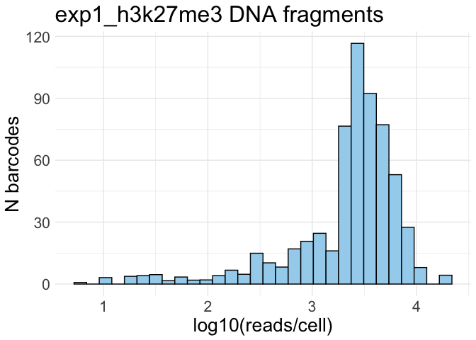

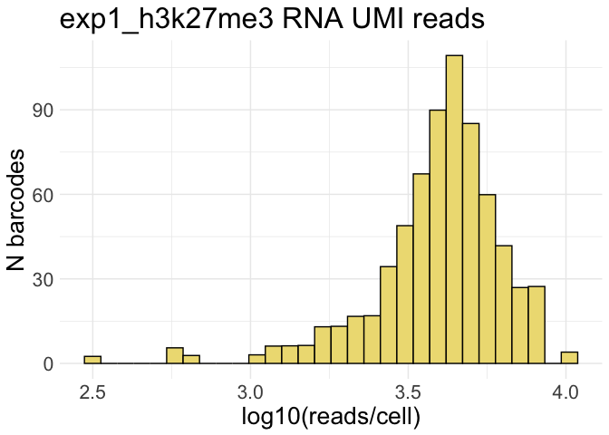

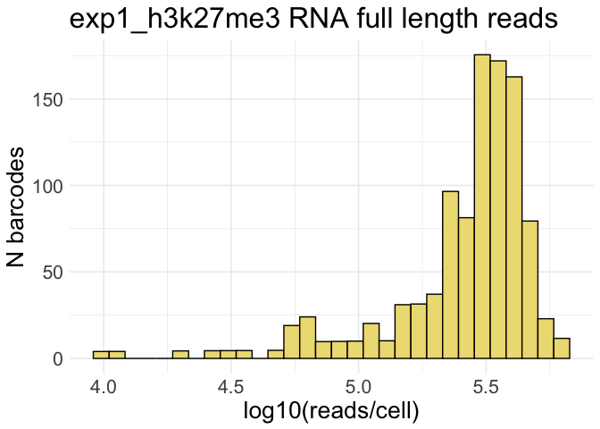

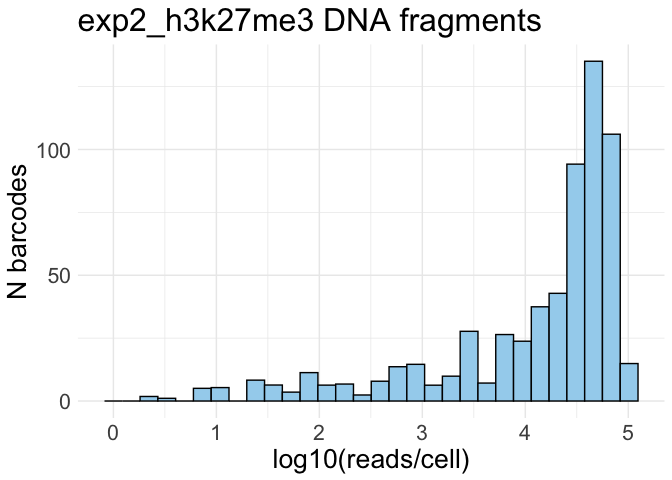

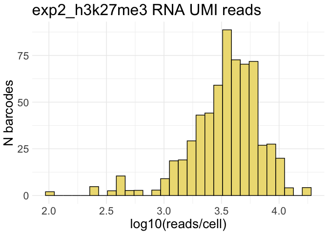

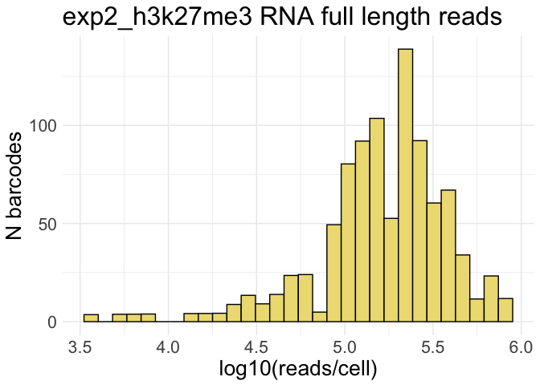

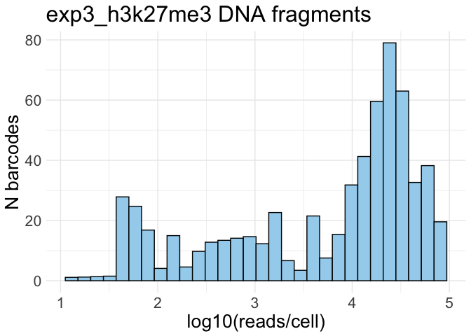

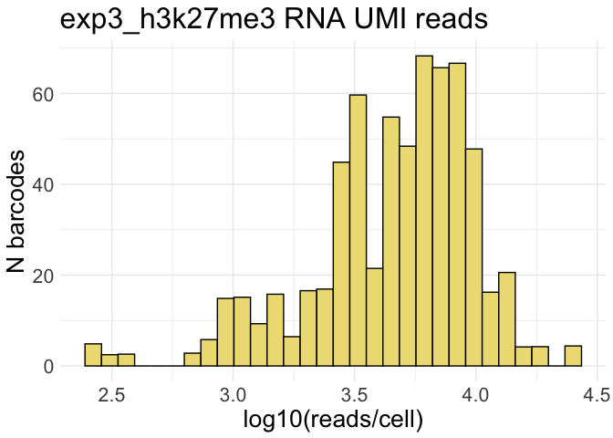

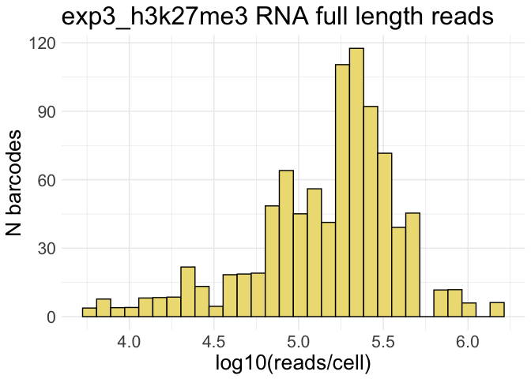

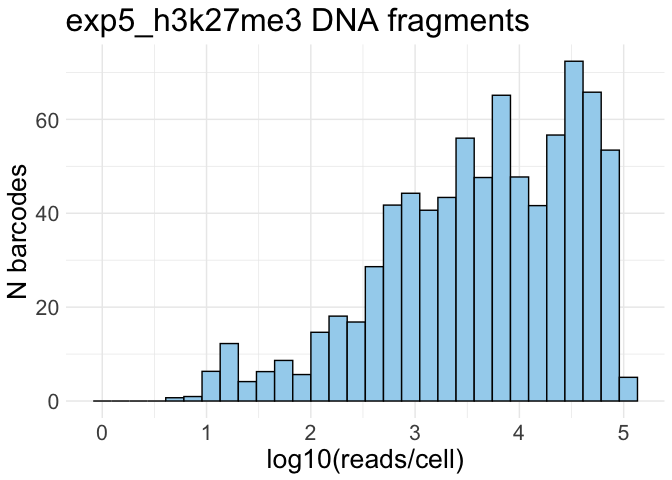

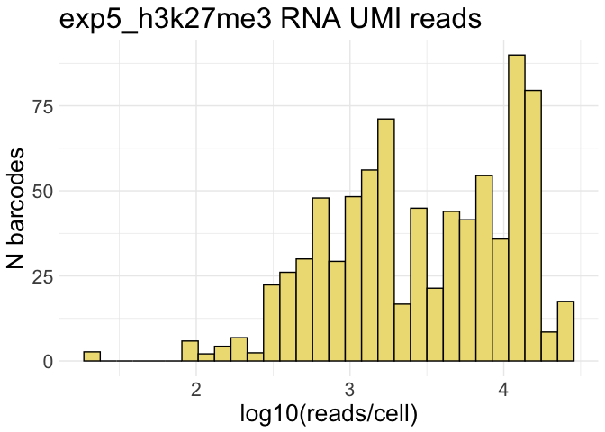

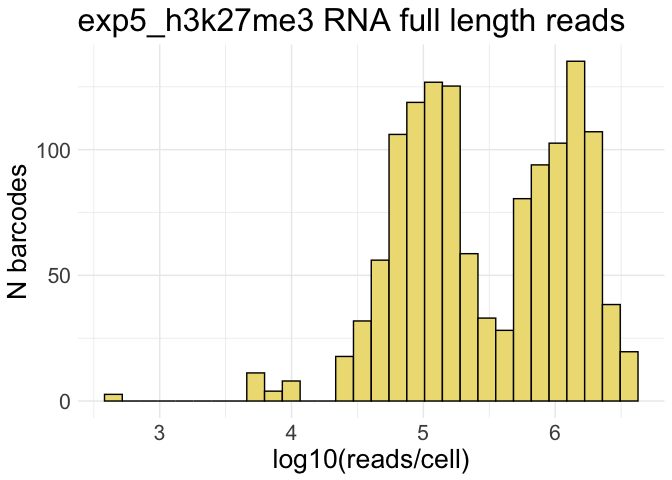

### H3K4me1

``` r
for (s in seurat_list[["h3k4me1"]]) {
  exp <- s@meta.data[["Exp"]][1]
  mark <- s@meta.data[["mark"]][1]

  p1 <- plot_weighted_hist(s) + ggtitle(paste0(exp, "_", mark, " DNA fragments"))
  p2 <- plot_weighted_hist(s, assay = "RNA_umi") + ggtitle(paste0(exp, "_", mark, " RNA UMI reads"))
  p3 <- plot_weighted_hist(s, assay = "RNA_fl") + ggtitle(paste0(exp, "_", mark, " RNA full length reads"))

  print(p1)
  print(p2)
  print(p3)
}
```

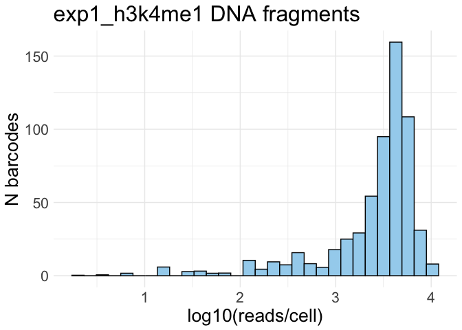

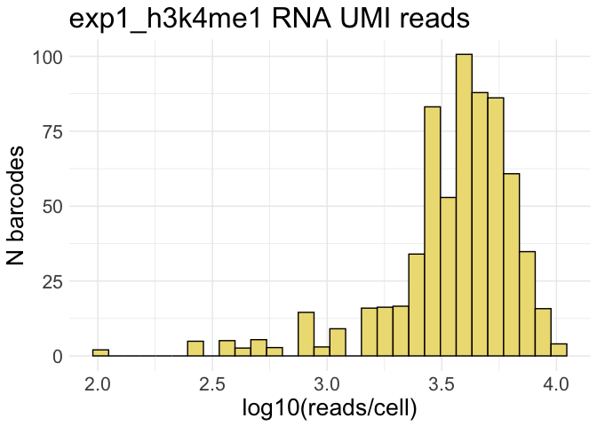

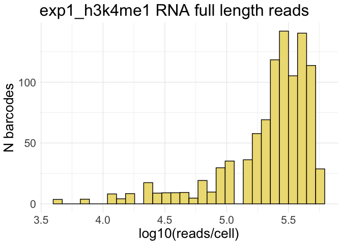

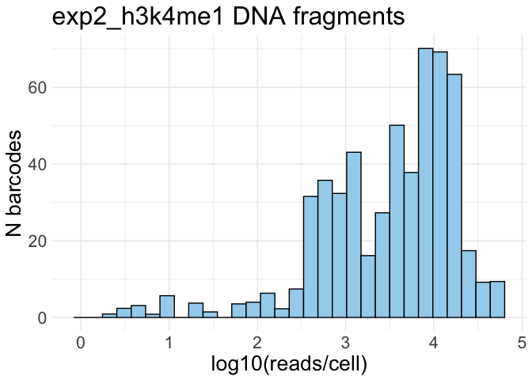

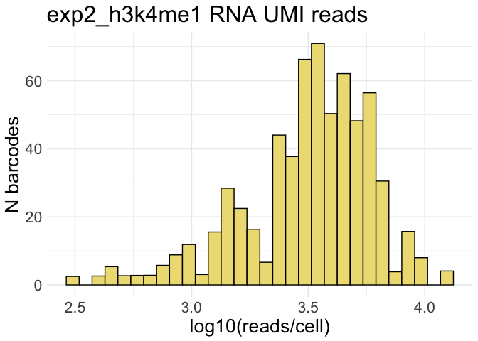

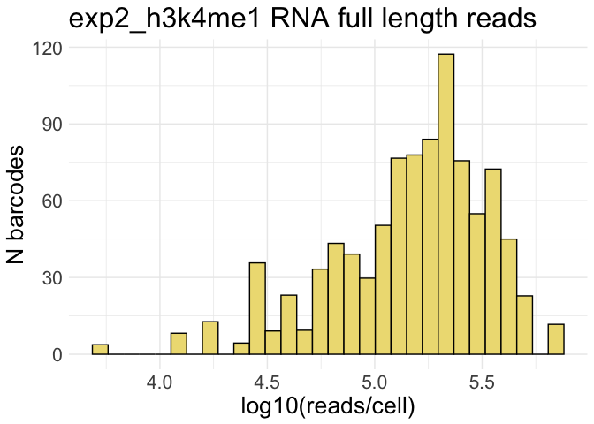

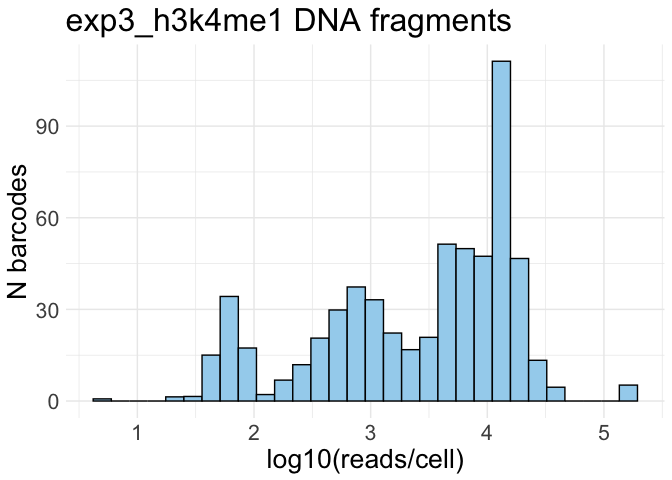

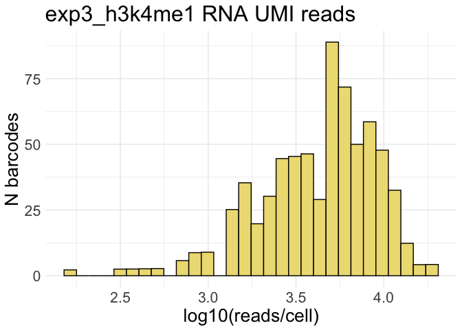

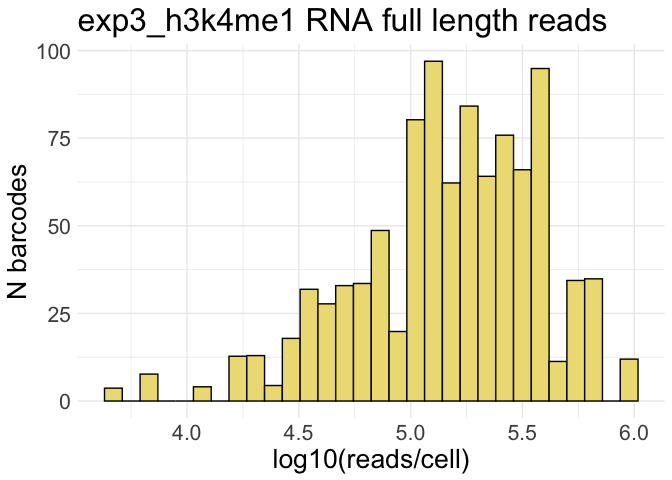

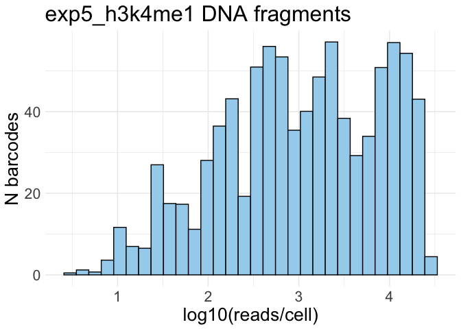

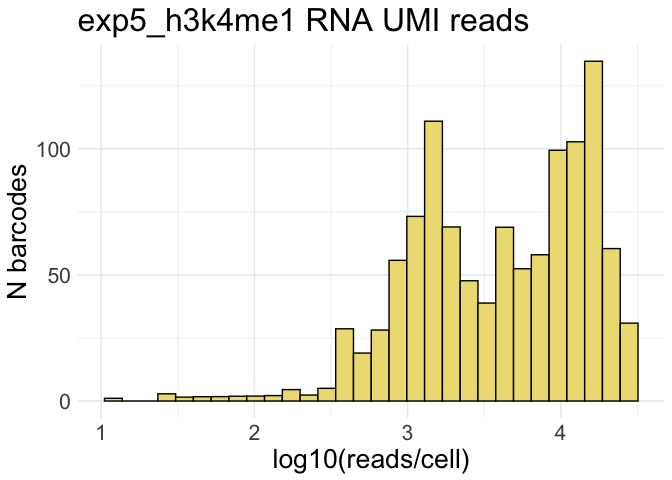

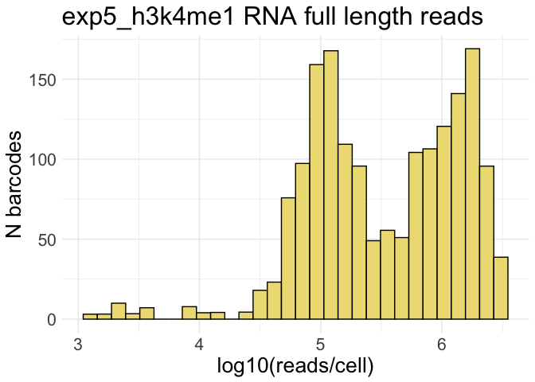

## % MT, N fragments and FRiP

``` r
DefaultAssay(seurat) <- "RNA_fl"
seurat <- PercentageFeatureSet(seurat, pattern = "^mt-*", col.name = "percent.mt")
seurat <- PercentageFeatureSet(seurat, pattern = "^Rpl|^Rps*", col.name = "percent.rb")
seurat@meta.data$log10_fragments <- log10(seurat@meta.data$frequency_count)
```

``` r
VlnPlot(seurat, features = c("percent.mt"),
        group.by = "Exp", pt.size = 0.5) +
        stat_summary(fun.y = median, geom='point', size = 2, colour = "black", position = position_dodge(width = 0.9)) +
        scale_fill_manual(values = mypal)

VlnPlot(seurat, features = c("percent.rb"),
        group.by = "Exp", pt.size = 0.5) +
        stat_summary(fun.y = median, geom='point', size = 2, colour = "black", position = position_dodge(width = 0.9)) +
        scale_fill_manual(values = mypal)

VlnPlot(seurat, "frequency_count",
        group.by = "Exp", pt.size = 0.5) +
        stat_summary(fun.y = median, geom='point', size = 2, colour = "black", position = position_dodge(width = 0.9)) +
        scale_fill_manual(values = mypal)

VlnPlot(seurat, "nCount_RNA_umi",
        group.by = "Exp", pt.size = 0.5, y.max = 10000) +
        stat_summary(fun.y = median, geom='point', size = 2, colour = "black", position = position_dodge(width = 0.9)) +
        scale_fill_manual(values = mypal)

VlnPlot(seurat, "nCount_RNA_fl",
        group.by = "Exp", pt.size = 0.5) +
        stat_summary(fun.y = median, geom='point', size = 2, colour = "black", position = position_dodge(width = 0.9)) +
        scale_fill_manual(values = mypal)

VlnPlot(seurat, "nFeature_RNA_umi",
        group.by = "Exp", pt.size = 0.5) +
        stat_summary(fun.y = median, geom='point', size = 2, colour = "black", position = position_dodge(width = 0.9)) +
        scale_fill_manual(values = mypal)

VlnPlot(seurat, "nFeature_RNA_fl",
        group.by = "Exp", pt.size = 0.5) +
        stat_summary(fun.y = median, geom='point', size = 2, colour = "black", position = position_dodge(width = 0.9)) +
        scale_fill_manual(values = mypal)
```

## Filtering 1

``` r
min_reads_chromatin = 400
max_reads_chromatin = 150000 #filter out one outlier cell with >150k frags
min_feature_rna = 400
max_mt = 35
max_rb = 35

seurat@meta.data[["filtering"]] <- ifelse(seurat@meta.data$frequency_count > min_reads_chromatin &
                                          seurat@meta.data$frequency_count < max_reads_chromatin &
                                          seurat@meta.data$nFeature_RNA_fl > min_feature_rna &
                                          seurat@meta.data$percent.mt < max_mt &
                                          seurat@meta.data$percent.rb < max_rb,
                                                                             'pass', 'fail')
table(seurat@meta.data$filtering)
```


    fail pass 
     710  978 

``` r
seurat <- subset(seurat, subset = filtering == 'pass')
```

# Reload step 1

``` r
saveRDS(seurat, file.path(outputDir_objects, "seurat_step1.rds"))
```

``` r
seurat <- readRDS(file.path(outputDir_objects, "seurat_step1.rds"))
```

# QC plots post filtering 1

## FrIP and N fragments

``` r
p_frip <- VlnPlot(seurat, c("FRiP"),
                  group.by = "Run_epi", split.by = "mark", pt.size = 0) +
                  labs(title = "FRiP") +
                  stat_summary(fun.y = median, geom='point', size = 2, colour = "black", position = position_dodge(width = 0.9)) +
                  scale_fill_manual(values = c(mypal[3], mypal[2]))

p_count <- VlnPlot(seurat, c("frequency_count"),
                   group.by = "Run_epi", split.by = "mark", pt.size = 0) +
                   labs(title = "DNA fragments per cell") +
                   stat_summary(fun.y = median, geom='point', size = 2, colour = "black", position = position_dodge(width = 0.9)) +
                   scale_fill_manual(values = c(mypal[3], mypal[2]))

p_count_rna_umi <- VlnPlot(seurat, c("nCount_RNA_umi"),
                       group.by = "Run_epi", split.by = "mark", pt.size = 0) +
                       labs(title = "RNA counts per cell, UMI") +
                       stat_summary(fun.y = median, geom='point', size = 2, colour = "black", position = position_dodge(width = 0.9)) +
                       scale_fill_manual(values = c(mypal[3], mypal[2]))

p_count_rna_fl <- VlnPlot(seurat, c("nCount_RNA_fl"),
                       group.by = "Run_epi", split.by = "mark", pt.size = 0) +
                       labs(title = "RNA counts per cell, fl") +
                       stat_summary(fun.y = median, geom='point', size = 2, colour = "black", position = position_dodge(width = 0.9)) +
                       scale_fill_manual(values = c(mypal[3], mypal[2]))

p_feature_rna_umi <- VlnPlot(seurat, c("nFeature_RNA_umi"),
                       group.by = "Run_epi", split.by = "mark", pt.size = 0) +
                       labs(title = "RNA features per cell, UMI") +
                       stat_summary(fun.y = median, geom='point', size = 2, colour = "black", position = position_dodge(width = 0.9)) +
                       scale_fill_manual(values = c(mypal[3], mypal[2]))

p_feature_rna_fl <- VlnPlot(seurat, c("nFeature_RNA_fl"),
                       group.by = "Run_epi", split.by = "mark", pt.size = 0) +
                       labs(title = "RNA features per cell, fl") +
                       stat_summary(fun.y = median, geom='point', size = 2, colour = "black", position = position_dodge(width = 0.9)) +
                       scale_fill_manual(values = c(mypal[3], mypal[2]))

p_dna <- p_frip | p_count
p_rna <- p_count_rna_umi | p_feature_rna_umi
p_rna_fl <- p_count_rna_fl | p_feature_rna_fl

p_dna
p_rna
p_rna_fl
```

``` r
seurat$log10_dna_fragments <- log10(seurat$frequency_count)

p_frip <- VlnPlot(seurat, c("FRiP"),
                  split.by = "mark", pt.size = 0) +
                  labs(title = "FRiP") +
                  stat_summary(fun.y = median, geom='point', size = 2,
                               colour = "black", position = position_dodge(width = 0.9)) +
                  scale_fill_manual(values = c(mypal[3], mypal[2]))

p_count <- VlnPlot(seurat, c("log10_dna_fragments"),
                   split.by = "mark", pt.size = 0) +
                   labs(title = "log10(DNA frags/cell)") +
                   stat_summary(fun.y = median, geom='point', size = 2,
                                colour = "black", position = position_dodge(width = 0.9)) +
                   scale_fill_manual(values = c(mypal[3], mypal[2])) +
                   scale_y_continuous(limits = c(0, NA))


p_count_rna_umi <- VlnPlot(seurat, c("nCount_RNA_umi"),
                       split.by = "mark", pt.size = 0) +
                       labs(title = "RNA UMI counts/cell") +
                       stat_summary(fun.y = median, geom='point', size = 2,
                       colour = "black", position = position_dodge(width = 0.9)) +
                       scale_fill_manual(values = c(mypal[3], mypal[2]))

p_count_rna_fl <- VlnPlot(seurat, c("nCount_RNA_fl"),
                       split.by = "mark", pt.size = 0) +
                       labs(title = "RNA counts/cell") +
                       stat_summary(fun.y = median, geom='point', size = 2,
                       colour = "black", position = position_dodge(width = 0.9)) +
                       scale_fill_manual(values = c(mypal[3], mypal[2]))

p_feature_rna_umi <- VlnPlot(seurat, c("nFeature_RNA_umi"),
                       split.by = "mark", pt.size = 0) +
                       labs(title = "RNA UMI features/cell") +
                       stat_summary(fun.y = median, geom='point', size = 2,
                       colour = "black", position = position_dodge(width = 0.9)) +
                       scale_fill_manual(values = c(mypal[3], mypal[2]))

p_feature_rna_fl <- VlnPlot(seurat, c("nFeature_RNA_fl"),
                       split.by = "mark", pt.size = 0) +
                       labs(title = "RNA features/cell") +
                       stat_summary(fun.y = median, geom='point', size = 2,
                       colour = "black", position = position_dodge(width = 0.9)) +
                       scale_fill_manual(values = c(mypal[3], mypal[2]))

p_dna <- p_count | p_frip 
p_rna <- p_count_rna_umi | p_feature_rna_umi
p_rna_fl <- p_count_rna_fl | p_feature_rna_fl

p_dna
p_rna
p_rna_fl
```

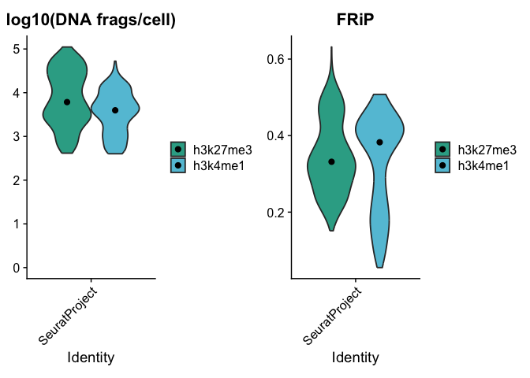

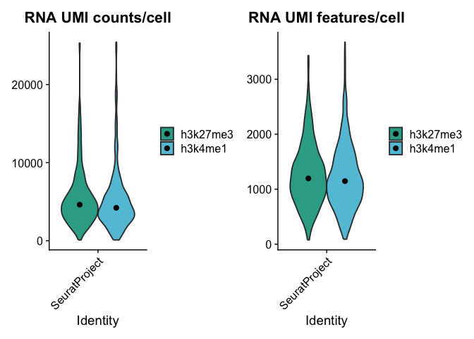

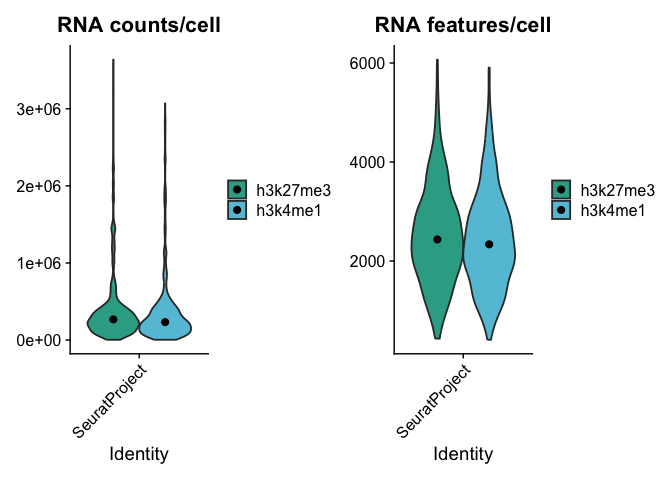

``` r
ggsave(file.path(outputDir_plots, "dna_qc_creneg.pdf"),
       plot = p_dna,
       device = "pdf",
       units = "mm",
       width = 200,
       height = 110)

ggsave(file.path(outputDir_plots, "rna_umi_qc_creneg.pdf"),
       plot = p_rna,
       device = "pdf",
       units = "mm",
       width = 200,
       height = 110)

ggsave(file.path(outputDir_plots, "rna_fl_qc_creneg.pdf"),
       plot = p_rna_fl,
       device = "pdf",
       units = "mm",
       width = 200,
       height = 110)
```

## DNA to RNA reads

``` r
frags_to_rna_umi_reads <- ggplot(seurat@meta.data, aes(x = frequency_count, y = nCount_RNA_umi, color = mark)) +
                             geom_point(alpha = 1, stroke = 0, size = 2) +  
                             labs(x = "N unique DNA fragments",
                                  y =  "N unique RNA UMI reads",
                                title = "DNA fragments vs. RNA UMI reads") +
                              theme_classic() +
                              scale_color_manual(values = c(mypal[3], mypal[2]))

frags_to_rna_fl_reads <- ggplot(seurat@meta.data, aes(x = frequency_count, y = nCount_RNA_fl, color = mark)) +
                             geom_point(alpha = 1, stroke = 0, size = 2) +  
                             labs(x = "N unique DNA fragments",
                                  y =  "N unique RNA reads",
                                title = "DNA fragments vs. RNA all reads") +
                              theme_classic() +
                              scale_color_manual(values = c(mypal[3], mypal[2]))

frags_to_umi_genes <- ggplot(seurat@meta.data, aes(x = frequency_count, y = nFeature_RNA_umi, color = mark)) +
                             geom_point(alpha = 1, stroke = 0, size = 2) +  
                             labs(x = "N unique DNA fragments",
                                  y =  "N unique genes UMI",
                                title = "DNA fragments vs. Genes UMI") +
                              theme_classic() +
                              scale_color_manual(values = c(mypal[3], mypal[2]))

frags_to_fl_genes <- ggplot(seurat@meta.data, aes(x = frequency_count, y = nFeature_RNA_fl, color = mark)) +
                             geom_point(alpha = 1, stroke = 0, size = 2) +  
                             labs(x = "N unique DNA fragments",
                                  y =  "N unique genes all",
                                title = "N DNA fragments vs. Genes all") +
                              theme_classic() +
                              scale_color_manual(values = c(mypal[3], mypal[2]))

p_reads <- frags_to_rna_umi_reads | frags_to_rna_fl_reads
p_genes <- frags_to_umi_genes | frags_to_fl_genes

p_reads
p_genes
```

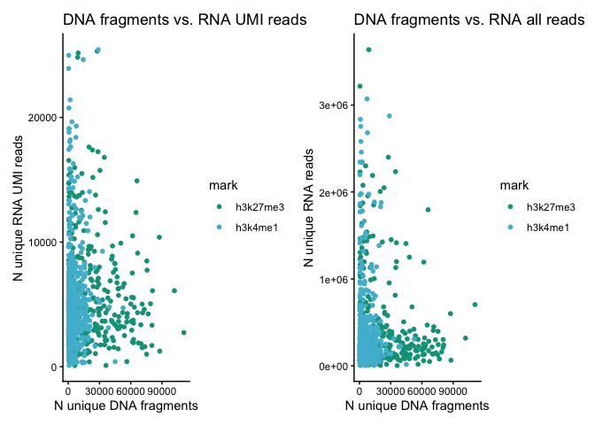

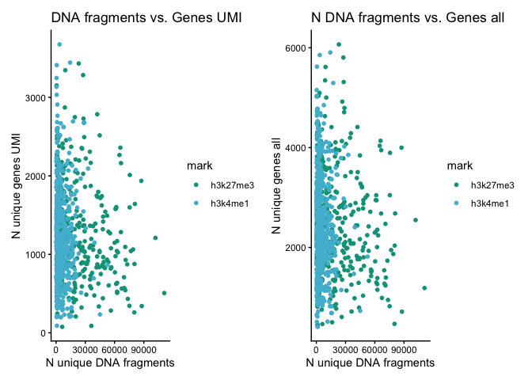

``` r
frags_to_rna_umi_reads_log <- ggplot(seurat@meta.data,
                                     aes(x = log10(frequency_count),
                                         y = log10(nCount_RNA_umi), color = mark)) +
                             geom_point(alpha = 1, stroke = 0, size = 2) +  
                             labs(x = "log10(unique DNA fragments)",
                                  y =  "log10(unique RNA UMI reads)",
                                title = "DNA fragments vs. RNA UMI reads") +
                              theme_classic() +
                              scale_color_manual(values = c(mypal[3], mypal[2])) +
                              coord_cartesian(xlim = c(0, NA), ylim = c(0, NA))

frags_to_rna_fl_reads_log <- ggplot(seurat@meta.data,
                                    aes(x = log10(frequency_count),
                                        y = log10(nCount_RNA_fl), color = mark)) +
                             geom_point(alpha = 1, stroke = 0, size = 2) +  
                             labs(x = "log10(unique DNA fragments)",
                                  y =  "log10(unique RNA reads)",
                                title = "DNA fragments vs. RNA all reads") +
                              theme_classic() +
                              scale_color_manual(values = c(mypal[3], mypal[2]))+
                              coord_cartesian(xlim = c(0, NA), ylim = c(0, NA))

frags_to_umi_genes_log <- ggplot(seurat@meta.data,
                                 aes(x = log10(frequency_count),
                                     y = log10(nFeature_RNA_umi), color = mark)) +
                             geom_point(alpha = 1, stroke = 0, size = 2) +  
                             labs(x = "log10(unique DNA fragments)",
                                  y =  "log10(unique genes UMI)",
                                title = "DNA fragments vs. Genes UMI") +
                              theme_classic() +
                              scale_color_manual(values = c(mypal[3], mypal[2]))+
                              coord_cartesian(xlim = c(0, NA), ylim = c(0, NA))

frags_to_fl_genes_log <- ggplot(seurat@meta.data,
                                aes(x = log10(frequency_count),
                                    y = log10(nFeature_RNA_fl), color = mark)) +
                             geom_point(alpha = 1, stroke = 0, size = 2) +  
                             labs(x = "log10(unique DNA fragments)",
                                  y =  "log10(unique genes all)",
                                title = "N DNA fragments vs. Genes all") +
                              theme_classic() +
                              scale_color_manual(values = c(mypal[3], mypal[2]))+
                              coord_cartesian(xlim = c(0, NA), ylim = c(0, NA))

p_reads_log <- frags_to_rna_umi_reads_log | frags_to_rna_fl_reads_log
p_genes_log <- frags_to_umi_genes_log | frags_to_fl_genes_log

p_reads_log
p_genes_log
```

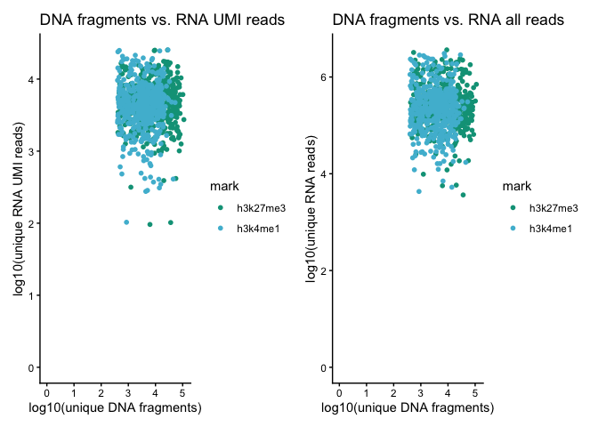

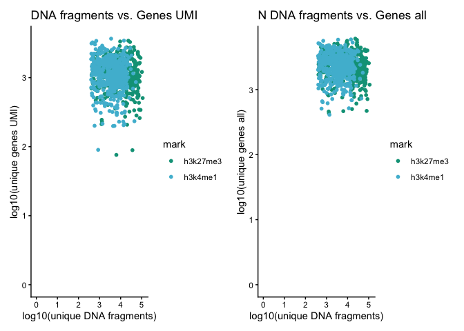

``` r
ggsave(file.path(outputDir_plots, "dna_to_rna_reads_log.pdf"),
       plot = p_reads_log,
       device = "pdf",
       units = "mm",
       width = 200,
       height = 80)

ggsave(file.path(outputDir_plots, "dna_to_rna_genes_log.pdf"),
       plot = p_genes_log,
       device = "pdf",
       units = "mm",
       width = 200,
       height = 80)
```

# Correlation QC

## Generate spectral embedding

Export assay

``` r
k4_assay <- GetAssayData(seurat, assay = "bin_5k_h3k4me1", layer = "counts")

Matrix::writeMM(k4_assay, file.path(snap_dir, "matrix_k4.mtx"))
write.table(colnames(k4_assay), file.path(snap_dir, "barcodes_k4.tsv"),
            quote = FALSE, sep = "\t", row.names = FALSE, col.names = FALSE)


gr <- StringToGRanges(rownames(k4_assay), sep = c(":", "-"))
bins_df <- data.frame(
  chrom = as.character(seqnames(gr)),
  start = start(gr),
  end   = end(gr),
  name  = rownames(k4_assay),
  stringsAsFactors = FALSE
)
write.table(bins_df, file.path(snap_dir, "features_k4.tsv"),
            quote = FALSE, sep = "\t", row.names = FALSE, col.names = TRUE)
```

``` r
k27_assay <- GetAssayData(seurat, assay = "bin_5k_h3k27me3", layer = "counts")

Matrix::writeMM(k27_assay, file.path(snap_dir, "matrix_k27.mtx"))
write.table(colnames(k27_assay), file.path(snap_dir, "barcodes_k27.tsv"),
            quote = FALSE, sep = "\t", row.names = FALSE, col.names = FALSE)


gr <- StringToGRanges(rownames(k27_assay), sep = c(":", "-"))
bins_df <- data.frame(
  chrom = as.character(seqnames(gr)),
  start = start(gr),
  end   = end(gr),
  name  = rownames(k27_assay),
  stringsAsFactors = FALSE
)
write.table(bins_df, file.path(snap_dir, "features_k27.tsv"),
            quote = FALSE, sep = "\t", row.names = FALSE, col.names = TRUE)
```

Generate spectral embedding

``` python
snap_dir = Path(r.snap_dir) 
X = sc.read_mtx(snap_dir / "matrix_k4.mtx").X.tocsr().transpose()  
barcodes = pd.read_csv(snap_dir / "barcodes_k4.tsv", header=None, sep="\t")[0].values
feat = pd.read_csv(snap_dir / "features_k4.tsv", sep="\t")

adata_k4 = sc.AnnData(X=X)
adata_k4.obs_names = barcodes
adata_k4.var_names = feat["name"].values
adata_k4.var["chrom"] = feat["chrom"].values
adata_k4.var["start"] = feat["start"].values
adata_k4.var["end"]   = feat["end"].values

adata_k4.X = adata_k4.X.tocsr().astype(np.float64)
adata_k4
```

``` python
snap.pp.select_features(adata_k4, n_features = 300000)
snap.tl.spectral(adata_k4, features = 'selected', distance_metric='cosine')
```

``` python
snap_dir = Path(r.snap_dir) 
X = sc.read_mtx(snap_dir / "matrix_k27.mtx").X.tocsr().transpose()  
barcodes = pd.read_csv(snap_dir / "barcodes_k27.tsv", header=None, sep="\t")[0].values
feat = pd.read_csv(snap_dir / "features_k27.tsv", sep="\t")

adata_k27 = sc.AnnData(X=X)
adata_k27.obs_names = barcodes
adata_k27.var_names = feat["name"].values
adata_k27.var["chrom"] = feat["chrom"].values
adata_k27.var["start"] = feat["start"].values
adata_k27.var["end"]   = feat["end"].values

adata_k27.X = adata_k27.X.tocsr().astype(np.float64)
adata_k27
```

``` python
snap.pp.select_features(adata_k27, n_features = 300000)
snap.tl.spectral(adata_k27, features = 'selected', distance_metric='cosine')
```

Import embedding to Seurat

``` r
emb_k4 <- as.matrix(py$adata_k4$obsm[["X_spectral"]])
rownames(emb_k4) <- py$adata_k4$obs_names$tolist()

seurat[["spectral_k4"]] <- CreateDimReducObject(
  embeddings = emb_k4,
  key       = "speck4_",
  assay     = "bin_5k_h3k4me1"
)


emb_k27 <- as.matrix(py$adata_k27$obsm[["X_spectral"]])
rownames(emb_k27) <- py$adata_k27$obs_names$tolist()

seurat[["spectral_k27"]] <- CreateDimReducObject(
  embeddings = emb_k27,
  key       = "speck27_",
  assay     = "bin_5k_h3k27me3"
)
```

# Reload step 2

``` r
saveRDS(seurat, file.path(outputDir_objects, "seurat_step2.rds"))
```

``` r
seurat <- readRDS(file.path(outputDir_objects, "seurat_step2.rds"))
```

## Calculate correlations

``` r
sce_k4 <- as.SingleCellExperiment(
  subset(seurat, subset = mark == "h3k4me1"),
  assay = "bin_5k_h3k4me1" 
)

sce_k4 <- correlation_and_hierarchical_clust_scExp_cosine(sce_k4, reduction = "SPECTRAL_K4")
sce_k4 <- find_clusters_louvain_scExp(sce_k4, k = 10, use.dimred = "SPECTRAL_K4")

sce_k27 <- as.SingleCellExperiment(
  subset(seurat, subset = mark == "h3k27me3"),
  assay = "bin_5k_h3k27me3" 
)

sce_k27 <- correlation_and_hierarchical_clust_scExp_cosine(sce_k27, reduction = "SPECTRAL_K27")
sce_k27 <- find_clusters_louvain_scExp(sce_k27, k = 10, use.dimred = "SPECTRAL_K27")
```

``` r
cor <- as.matrix(reducedDim(sce_k4, "Cor"))
hc <- metadata(sce_k4)$hc_cor
dend <- as.dendrogram(hc)
cluster <- colData(sce_k4)$cell_cluster
exp <- colData(sce_k4)$Exp
frags <- colData(sce_k4)$log10_fragments
filtering <- colData(sce_k4)$filtering

# Correlation scores (n cells with whom a cell correlates more than by random chance)
limitC  <- 0.8
scores <- apply(cor, 2, function(x) sum(x > limitC))


cluster_levels <- if (is.factor(cluster)) levels(cluster) else sort(unique(cluster))
cluster_colors <- setNames(mypal[seq_along(cluster_levels)], cluster_levels)

exp_levels <- if (is.factor(exp)) levels(exp) else sort(unique(exp))
exp_colors <- setNames(alt_pal[seq_along(exp_levels)], exp_levels)

filt_levels <- if (is.factor(filtering)) levels(filtering) else sort(unique(filtering))
filt_colors <- setNames(mypal[seq_along(filt_levels)], filt_levels)

frags_col_fun <- colorRamp2(range(frags, na.rm = TRUE), c("white", "black"))
cor_score_col_fun <- colorRamp2(range(scores, na.rm = TRUE), c("white", "firebrick"))

top_annot <- HeatmapAnnotation(
  cell_cluster = cluster,
  exp = exp,
  filtering = filtering,
  log10_frags    = frags,
  correlation_score = scores,
  col = list(cell_cluster = cluster_colors,
             exp = exp_colors,
             filtering = filt_colors,
             log10_frags    = frags_col_fun,
             correlation_score = cor_score_col_fun)
)

p_before_k4 <- Heatmap(
  cor,
  name = "Correlation",
  col = colorRamp2(
    c(min(cor), mean(range(cor)), max(cor)),
    c("navy", "white", "firebrick3")),
  cluster_rows = dend,
  cluster_columns = dend,
  show_row_names = FALSE,
  show_column_names = FALSE,
  top_annotation = top_annot,
  show_heatmap_legend = FALSE
)

draw(p_before_k4,
     show_annotation_legend = FALSE)
```

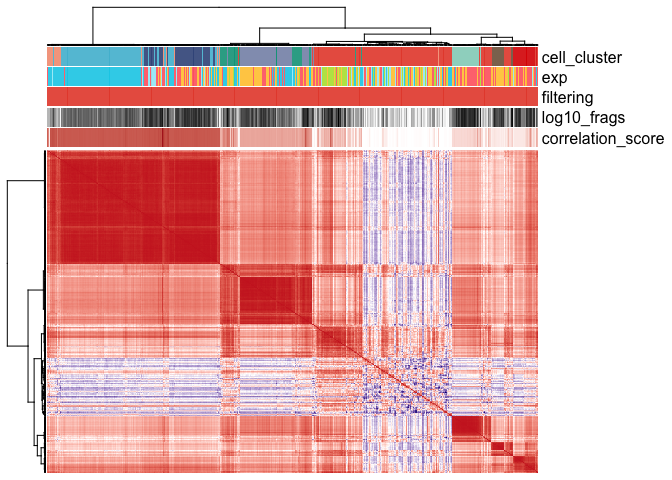

``` r
cor <- as.matrix(reducedDim(sce_k27, "Cor"))
hc <- metadata(sce_k27)$hc_cor
dend <- as.dendrogram(hc)
cluster <- colData(sce_k27)$cell_cluster
exp <- colData(sce_k27)$Exp
frags <- colData(sce_k27)$log10_fragments
filtering <- colData(sce_k27)$filtering

# Correlation scores (n cells with whom a cell correlates more than by random chance)
limitC  <- 0.8
scores <- apply(cor, 2, function(x) sum(x > limitC))


cluster_levels <- if (is.factor(cluster)) levels(cluster) else sort(unique(cluster))
cluster_colors <- setNames(mypal[seq_along(cluster_levels)], cluster_levels)

exp_levels <- if (is.factor(exp)) levels(exp) else sort(unique(exp))
exp_colors <- setNames(alt_pal[seq_along(exp_levels)], exp_levels)

filt_levels <- if (is.factor(filtering)) levels(filtering) else sort(unique(filtering))
filt_colors <- setNames(mypal[seq_along(filt_levels)], filt_levels)

frags_col_fun <- colorRamp2(range(frags, na.rm = TRUE), c("white", "black"))
cor_score_col_fun <- colorRamp2(range(scores, na.rm = TRUE), c("white", "firebrick"))

top_annot <- HeatmapAnnotation(
  cell_cluster = cluster,
  exp = exp,
  filtering = filtering,
  log10_frags    = frags,
  correlation_score = scores,
  col = list(cell_cluster = cluster_colors,
             exp = exp_colors,
             filtering = filt_colors,
             log10_frags    = frags_col_fun,
             correlation_score = cor_score_col_fun)
)

p_before_k27 <- Heatmap(
  cor,
  name = "Correlation",
  col = colorRamp2(
    c(min(cor), mean(range(cor)), max(cor)),
    c("navy", "white", "firebrick3")),
  cluster_rows = dend,
  cluster_columns = dend,
  show_row_names = FALSE,
  show_column_names = FALSE,
  top_annotation = top_annot,
  show_heatmap_legend = FALSE
)

draw(p_before_k27,
     show_annotation_legend = FALSE)
```

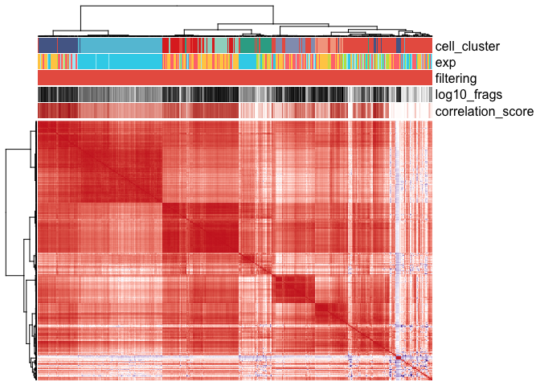

## Remove low correlated cells

``` r
sce_k4_cf <- filter_correlated_cell_scExp(sce_k4,
                                           corr_threshold = 99,
                                           percent_correlation = 2.5,
                                           reduction = "SPECTRAL_K4"
)

sce_k27_cf <- filter_correlated_cell_scExp(sce_k27,
                                           corr_threshold = 99,
                                           percent_correlation = 2,
                                           reduction = "SPECTRAL_K27"
)
```

``` r
cor <- as.matrix(reducedDim(sce_k4_cf,"Cor"))
hc <- metadata(sce_k4_cf)$hc_cor
dend <- as.dendrogram(hc)
cluster <- colData(sce_k4_cf)$cell_cluster
exp <- colData(sce_k4_cf)$Exp
frags <- colData(sce_k4_cf)$log10_fragments
filtering <- colData(sce_k4_cf)$filtering

# Correlation scores (n cells with whom a cell correlates more than by random chance)
limitC  <- 0.85
scores <- apply(cor, 2, function(x) sum(x > limitC))


cluster_levels <- if (is.factor(cluster)) levels(cluster) else sort(unique(cluster))
cluster_colors <- setNames(mypal[seq_along(cluster_levels)], cluster_levels)

exp_levels <- if (is.factor(exp)) levels(exp) else sort(unique(exp))
exp_colors <- setNames(alt_pal[seq_along(exp_levels)], exp_levels)

filt_levels <- if (is.factor(filtering)) levels(filtering) else sort(unique(filtering))
filt_colors <- setNames(mypal[seq_along(filt_levels)], filt_levels)

frags_col_fun <- colorRamp2(range(frags, na.rm = TRUE), c("white", "black"))
cor_score_col_fun <- colorRamp2(range(scores, na.rm = TRUE), c("white", "firebrick"))

top_annot <- HeatmapAnnotation(
  cell_cluster = cluster,
  exp = exp,
  filtering = filtering,
  log10_frags    = frags,
  correlation_score = scores,
  col = list(cell_cluster = cluster_colors,
             exp = exp_colors,
             filtering = filt_colors,
             log10_frags    = frags_col_fun,
             correlation_score = cor_score_col_fun)
)

p_after_k4 <-Heatmap(
  cor,
  name = "Correlation",
  col = colorRamp2(
    c(min(cor), mean(range(cor)), max(cor)),
    c("navy", "white", "firebrick3")),
  cluster_rows = dend,
  cluster_columns = dend,
  show_row_names = FALSE,
  show_column_names = FALSE,
  top_annotation = top_annot,
  show_heatmap_legend = FALSE
)

draw(p_after_k4,
     show_annotation_legend = FALSE)
```

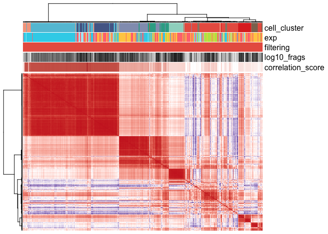

``` r
cor <- as.matrix(reducedDim(sce_k27_cf,"Cor"))
hc <- metadata(sce_k27_cf)$hc_cor
dend <- as.dendrogram(hc)
cluster <- colData(sce_k27_cf)$cell_cluster
exp <- colData(sce_k27_cf)$Exp
frags <- colData(sce_k27_cf)$log10_fragments
filtering <- colData(sce_k27_cf)$filtering

# Correlation scores (n cells with whom a cell correlates more than by random chance)
limitC  <- 0.85
scores <- apply(cor, 2, function(x) sum(x > limitC))


cluster_levels <- if (is.factor(cluster)) levels(cluster) else sort(unique(cluster))
cluster_colors <- setNames(mypal[seq_along(cluster_levels)], cluster_levels)

exp_levels <- if (is.factor(exp)) levels(exp) else sort(unique(exp))
exp_colors <- setNames(alt_pal[seq_along(exp_levels)], exp_levels)

filt_levels <- if (is.factor(filtering)) levels(filtering) else sort(unique(filtering))
filt_colors <- setNames(mypal[seq_along(filt_levels)], filt_levels)

frags_col_fun <- colorRamp2(range(frags, na.rm = TRUE), c("white", "black"))
cor_score_col_fun <- colorRamp2(range(scores, na.rm = TRUE), c("white", "firebrick"))

top_annot <- HeatmapAnnotation(
  cell_cluster = cluster,
  exp = exp,
  filtering = filtering,
  log10_frags    = frags,
  correlation_score = scores,
  col = list(cell_cluster = cluster_colors,
             exp = exp_colors,
             filtering = filt_colors,
             log10_frags    = frags_col_fun,
             correlation_score = cor_score_col_fun)
)

p_after_k27 <-Heatmap(
  cor,
  name = "Correlation",
  col = colorRamp2(
    c(min(cor), mean(range(cor)), max(cor)),
    c("navy", "white", "firebrick3")),
  cluster_rows = dend,
  cluster_columns = dend,
  show_row_names = FALSE,
  show_column_names = FALSE,
  top_annotation = top_annot,
  show_heatmap_legend = FALSE
)

draw(p_after_k27,
     show_annotation_legend = FALSE)
```

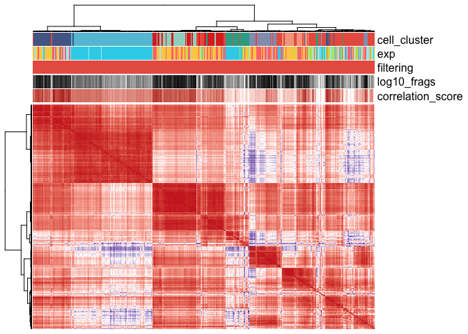

Filtering out poor-correlated cells

``` r
cells_k4_cf  <- colnames(sce_k4_cf)
cells_k27_cf  <- colnames(sce_k27_cf)

seurat <- subset(seurat, cells = union(cells_k4_cf, cells_k27_cf))
```

# Reload step 3

``` r
saveRDS(seurat, file.path(outputDir_objects, "seurat_step3.rds"))
```

``` r
seurat <- readRDS(file.path(outputDir_objects, "seurat_step3.rds"))
```
