# 3.2_multiome_mouse_mammary_gland_analysis
Anna Schwager
2026-02-04

# Python setup

``` r
library(reticulate)
use_condaenv(
  "snap_py310",
  conda = "/Users/annaschwager/miniforge3/bin/conda",
  required = TRUE
)

py_config()
```

    python:         /Users/annaschwager/miniforge3/envs/snap_py310/bin/python
    libpython:      /Users/annaschwager/miniforge3/envs/snap_py310/lib/libpython3.10.dylib
    pythonhome:     /Users/annaschwager/miniforge3/envs/snap_py310:/Users/annaschwager/miniforge3/envs/snap_py310
    version:        3.10.19 | packaged by conda-forge | (main, Oct 22 2025, 22:46:49) [Clang 19.1.7 ]
    numpy:          /Users/annaschwager/miniforge3/envs/snap_py310/lib/python3.10/site-packages/numpy
    numpy_version:  1.26.4

    NOTE: Python version was forced by use_python() function

``` python
import sys
import numpy as np
import pandas as pd
from pathlib import Path
import scanpy as sc
import snapatac2 as snap
import skmisc

print("sys.executable:", sys.executable)
```

    sys.executable: /Users/annaschwager/miniforge3/envs/snap_py310/bin/python

``` python
print("scanpy:", sc.__version__)
```

    scanpy: 1.11.5

``` python
print("snapatac2:", snap.__version__)
```

    snapatac2: 2.8.0

# R setup

``` r
here::i_am("scripts/3.2_multiome_mouse_mammary_gland_analysis.qmd")
mainDir = here::here()
source(knitr::purl(file.path(mainDir,"scripts/global_variables.Rmd"), quiet=TRUE))
source(knitr::purl(file.path(mainDir, "scripts/functions.Rmd"), quiet=TRUE))

set.seed(123)
```

# Setting directories and input files

``` r
inputDir_local = file.path(outputDir, "3.1_multiome_mouse_mammary_gland_preprocessing", "objects")

outputDir_local = file.path(outputDir, "3.2_multiome_mouse_mammary_gland_analysis") ; if(!file.exists(outputDir_local)){dir.create(outputDir_local)}
outputDir_objects = file.path(outputDir_local, "objects") ; if(!file.exists(outputDir_objects)){dir.create(outputDir_objects)}
outputDir_plots = file.path(outputDir_local, "plots") ; if(!file.exists(outputDir_plots)){dir.create(outputDir_plots)}
outputDir_tables = file.path(outputDir_local, "tables") ; if(!file.exists(outputDir_tables)){dir.create(outputDir_tables)}

snap_dir <- file.path(outputDir_objects, "snap_export") ; if(!file.exists(snap_dir )){dir.create(snap_dir)}
```

# Load annotation

``` r
ref_inhouse <- read.delim(file.path(annotDir, "Landragin2025_CreN_mammary_gland_markers.txt"))
ref_visvader <- read.delim(file.path(annotDir, "Visvader2010_mammary_gland_markers.txt"))
```

# Load object

``` r
seurat <- readRDS(file.path(inputDir_local, "seurat_step3.rds"))
seurat_list <- readRDS(file.path(inputDir_local, "seurat_list_step0.rds"))
```

Epigenomic only objects for the coverage plots

``` r
seurat_k27 <- merge(seurat_list[["h3k27me3"]][["exp1"]],
                    c(seurat_list[["h3k27me3"]][["exp2"]],
                      seurat_list[["h3k27me3"]][["exp3"]],
                      seurat_list[["h3k27me3"]][["exp4_5"]]))

seurat_k4 <- merge(seurat_list[["h3k4me1"]][["exp1"]],
                    c(seurat_list[["h3k4me1"]][["exp2"]],
                      seurat_list[["h3k4me1"]][["exp3"]],
                      seurat_list[["h3k4me1"]][["exp4_5"]]))

valid_cells <- colnames(seurat)
seurat_k27 <- subset(seurat_k27, cells = intersect(colnames(seurat_k27), valid_cells))
seurat_k4  <- subset(seurat_k4,  cells = intersect(colnames(seurat_k4),  valid_cells))
```

# Exporting data from Seurat to SnapATAC2

## RNA

``` r
rna_assay <- GetAssayData(seurat, assay = "RNA_fl", layer = "counts")

Matrix::writeMM(rna_assay, file.path(snap_dir, "matrix_rna_fl.mtx"))
write.table(colnames(rna_assay), file.path(snap_dir, "barcodes_rna_fl.tsv"),
            quote = FALSE, sep = "\t", row.names = FALSE, col.names = FALSE)

genes_df <- data.frame(
  name  = rownames(rna_assay),
  stringsAsFactors = FALSE
)
write.table(genes_df, file.path(snap_dir, "features_rna_fl.tsv"),
            quote = FALSE, sep = "\t", row.names = FALSE, col.names = TRUE)
```

## H3K4me1

``` r
k4_assay <- GetAssayData(seurat, assay = "bin_5k_h3k4me1", layer = "counts")

Matrix::writeMM(k4_assay, file.path(snap_dir, "matrix_k4.mtx"))
write.table(colnames(k4_assay), file.path(snap_dir, "barcodes_k4.tsv"),
            quote = FALSE, sep = "\t", row.names = FALSE, col.names = FALSE)


gr <- StringToGRanges(rownames(k4_assay), sep = c(":", "-"))
bins_df <- data.frame(
  chrom = as.character(seqnames(gr)),
  start = start(gr),
  end   = end(gr),
  name  = rownames(k4_assay),
  stringsAsFactors = FALSE
)
write.table(bins_df, file.path(snap_dir, "features_k4.tsv"),
            quote = FALSE, sep = "\t", row.names = FALSE, col.names = TRUE)
```

## H3K27me3

``` r
k27_assay <- GetAssayData(seurat, assay = "bin_5k_h3k27me3", layer = "counts")

Matrix::writeMM(k27_assay, file.path(snap_dir, "matrix_k27.mtx"))
write.table(colnames(k27_assay), file.path(snap_dir, "barcodes_k27.tsv"),
            quote = FALSE, sep = "\t", row.names = FALSE, col.names = FALSE)


gr <- StringToGRanges(rownames(k27_assay), sep = c(":", "-"))
bins_df <- data.frame(
  chrom = as.character(seqnames(gr)),
  start = start(gr),
  end   = end(gr),
  name  = rownames(k27_assay),
  stringsAsFactors = FALSE
)
write.table(bins_df, file.path(snap_dir, "features_k27.tsv"),
            quote = FALSE, sep = "\t", row.names = FALSE, col.names = TRUE)
```

# Spectral embeddings generation

## RNA

``` python
snap_dir = Path(r.snap_dir) 
X = sc.read_mtx(snap_dir / "matrix_rna_fl.mtx").X.tocsr().transpose()
barcodes = pd.read_csv(snap_dir / "barcodes_rna_fl.tsv",
                       header=None, sep="\t")[0].values
feat = pd.read_csv(snap_dir / "features_rna_fl.tsv", sep="\t")

adata_rna_fl = sc.AnnData(X=X)
adata_rna_fl.obs_names = barcodes
adata_rna_fl.var_names = feat["name"].values
adata_rna_fl.X = adata_rna_fl.X.tocsr().astype(np.float64)

adata_rna_fl
```

``` python
sc.pp.highly_variable_genes(adata_rna_fl, flavor='seurat_v3', n_top_genes=3000)
adata_rna_fl = adata_rna_fl[:, adata_rna_fl.var.highly_variable]

sc.pp.normalize_total(adata_rna_fl, target_sum=1e4)
sc.pp.log1p(adata_rna_fl)

adata_rna_fl
```

``` python
snap.tl.spectral(adata_rna_fl, features=None)
```

## H3K4me1

``` python
X = sc.read_mtx(snap_dir / "matrix_k4.mtx").X.tocsr().transpose()  
barcodes = pd.read_csv(snap_dir / "barcodes_k4.tsv", header=None, sep="\t")[0].values
feat = pd.read_csv(snap_dir / "features_k4.tsv", sep="\t")

adata_k4 = sc.AnnData(X=X)
adata_k4.obs_names = barcodes
adata_k4.var_names = feat["name"].values
adata_k4.var["chrom"] = feat["chrom"].values
adata_k4.var["start"] = feat["start"].values
adata_k4.var["end"]   = feat["end"].values

adata_k4.X = adata_k4.X.tocsr().astype(np.float64)
adata_k4
```

``` python
snap.pp.select_features(adata_k4, n_features = 300000)
snap.tl.spectral(adata_k4, features = 'selected', distance_metric='cosine')
```

## H3K27me3

``` python
X = sc.read_mtx(snap_dir / "matrix_k27.mtx").X.tocsr().transpose()  
barcodes = pd.read_csv(snap_dir / "barcodes_k27.tsv", header=None, sep="\t")[0].values
feat = pd.read_csv(snap_dir / "features_k27.tsv", sep="\t")

adata_k27 = sc.AnnData(X=X)
adata_k27.obs_names = barcodes
adata_k27.var_names = feat["name"].values
adata_k27.var["chrom"] = feat["chrom"].values
adata_k27.var["start"] = feat["start"].values
adata_k27.var["end"]   = feat["end"].values

adata_k27.X = adata_k27.X.tocsr().astype(np.float64)
adata_k27
```

``` python
snap.pp.select_features(adata_k27, n_features = 500000)
snap.tl.spectral(adata_k27, features = 'selected', distance_metric='cosine')
```

# Import embeddings to Seurat

``` r
emb_rna_fl <- as.matrix(py$adata_rna_fl$obsm[["X_spectral"]])
rownames(emb_rna_fl) <- py$adata_rna_fl$obs_names$tolist()

emb_k4 <- as.matrix(py$adata_k4$obsm[["X_spectral"]])
rownames(emb_k4) <- py$adata_k4$obs_names$tolist()

emb_k27 <- as.matrix(py$adata_k27$obsm[["X_spectral"]])
rownames(emb_k27) <- py$adata_k27$obs_names$tolist()
```

``` r
seurat[["spectral_rna_fl"]] <- CreateDimReducObject(
  embeddings = emb_rna_fl,
  key       = "specrnafl_",
  assay     = "RNA_fl" 
)

seurat[["spectral_k4"]] <- CreateDimReducObject(
  embeddings = emb_k4,
  key       = "speck4_",
  assay     = "bin_2k_h3k4me1"
)

seurat[["spectral_k27"]] <- CreateDimReducObject(
  embeddings = emb_k27,
  key       = "speck27_",
  assay     = "bin_2k_h3k27me3" 
)
```

# Reload step 2

``` r
saveRDS(seurat, file.path(outputDir_objects, "seurat_step2.rds"))
```

``` r
seurat <- readRDS(file.path(outputDir_objects, "seurat_step2.rds"))
```

# RNA clustering and annotation

## SCT transform

``` r
seurat <- SCTransform(seurat, assay = "RNA_fl", new.assay.name = "SCT_fl", vars.to.regress = c("nCount_RNA_fl"))
```

## UMAP and clustering

``` r
seurat <- RunUMAP(seurat,
                  assay = "RNA_fl",
                  seed.use = 42,
                  dims = 1:length(colnames(seurat@reductions[["spectral_rna_fl"]])),
                  reduction = "spectral_rna_fl",
                  reduction.name = "UMAP_spectral_rna_fl")


DimPlot(seurat, cols = mypal, 
        reduction = "UMAP_spectral_rna_fl",
        group.by = c("Exp", "facs_phenotype"),
        combine = TRUE)
```

## Batch correction

``` r
seurat <- RunHarmony(
  object        = seurat,
  group.by.vars = c("Exp"),
  reduction.use = "spectral_rna_fl",
  reduction.save = "spectral_rna_fl_harmony",
  project.dim    = FALSE,
  plot_convergence = TRUE
)

DimPlot(seurat, reduction = "spectral_rna_fl_harmony",
        group.by = c("Exp", "facs_phenotype"),
        cols = mypal)
```

## Reclustering post batch-correction

``` r
seurat <- RunUMAP(seurat,
                  assay = "RNA_fl",
                  seed.use = 42,
                  metric = "cosine",
                  n.neighbors = 50,
                  min.dist = 0.6,
                  spread = 1.5,
                  dims = 1:length(colnames(seurat@reductions[["spectral_rna_fl_harmony"]])),
                  reduction = "spectral_rna_fl_harmony",
                  reduction.name = "UMAP_spectral_rna_fl_harmony")

seurat <- FindNeighbors(seurat,
                        reduction = "spectral_rna_fl_harmony",
                        cluster.name = "spectral_rna_fl_harmony_clusters",
                        graph.name = "spectral_rna_fl_harmony_snn",
                        k.param = 8)

seurat <- FindClusters(seurat,
                       graph.name   = "spectral_rna_fl_harmony_snn",
                       resolution = 0.1,
                       cluster.name = "spectral_rna_fl_harmony_clusters",
                       algorithm = 4)
```

# Reload step 3

``` r
saveRDS(seurat, file.path(outputDir_objects, "seurat_step3.rds"))
```

``` r
seurat <- readRDS(file.path(outputDir_objects, "seurat_step3.rds"))
```

``` r
DimPlot(seurat, cols = mypal, 
        reduction = "UMAP_spectral_rna_fl_harmony",
        group.by = c("Exp", "spectral_rna_fl_harmony_clusters"),
        combine = TRUE)
```

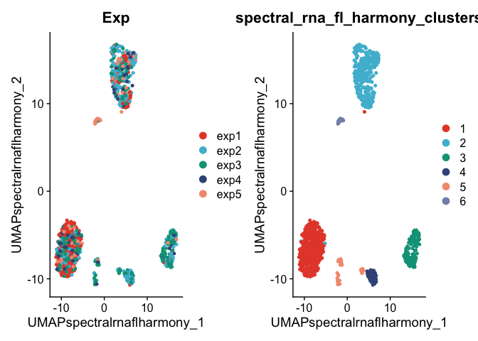

``` r
DimPlot(seurat, cols = mypal, 
        reduction = "UMAP_spectral_rna_fl_harmony",
        group.by = c("facs_phenotype", "facs_phenotype_expanded"),
        combine = TRUE)
```

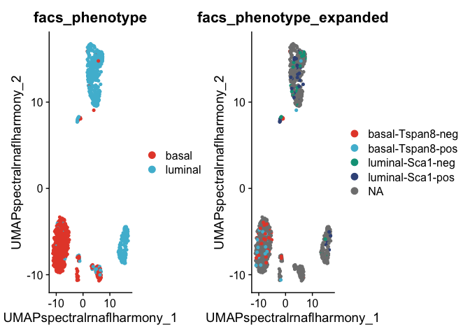

# Cell type scores

``` r
AddCellTypeScore <- function(seurat_obj,
                             marker_table,
                             cell_type,
                             assay = "SCT_fl",
                             layer = "data",
                             score_name = "cell_type_score") {

  marker_genes <- marker_table %>%
    filter(Type == cell_type) %>%
    pull(Gene) %>%
    unique()
  

  expr_matrix <- GetAssayData(seurat_obj, assay = assay, layer = layer)
  
  marker_genes_present <- intersect(marker_genes, rownames(expr_matrix))
  
  if (length(marker_genes_present) == 0) {
    warning(paste0("No marker genes found in assay for cell type: ", cell_type))
    seurat_obj[[score_name]] <- NA
    return(seurat_obj)
  }
  
  score_vector <- Matrix::colMeans(expr_matrix[marker_genes_present, , drop = FALSE])
  
  seurat_obj[[score_name]] <- score_vector
  
  return(seurat_obj)
}
```

Landragin

``` r
seurat <- AddCellTypeScore(seurat_obj = seurat,
                 marker_table = ref_inhouse,
                 cell_type = "Basal",
                 assay = "SCT_fl",
                 score_name = "basal_score_Landragin")

seurat <- AddCellTypeScore(seurat_obj = seurat,
                 marker_table = ref_inhouse,
                 cell_type = "Luminal H-S",
                 assay = "SCT_fl",
                 score_name = "hs_score_Landragin")

seurat <- AddCellTypeScore(seurat_obj = seurat,
                 marker_table = ref_inhouse,
                 cell_type = "LP",
                 assay = "SCT_fl",
                 score_name = "lp_score_Landragin")
```

Visvader

``` r
seurat <- AddCellTypeScore(seurat_obj = seurat,
                 marker_table = ref_visvader,
                 cell_type = "Basal",
                 assay = "SCT_fl",
                 score_name = "basal_score_Visvader")

seurat <- AddCellTypeScore(seurat_obj = seurat,
                 marker_table = ref_visvader,
                 cell_type = "Luminal H-S",
                 assay = "SCT_fl",
                 score_name = "hs_score_Visvader")

seurat <- AddCellTypeScore(seurat_obj = seurat,
                 marker_table = ref_visvader,
                 cell_type = "LP",
                 assay = "SCT_fl",
                 score_name = "lp_score_Visvader")
```

# RNA annotation

``` r
DimPlot(seurat, cols = mypal, 
        reduction = "UMAP_spectral_rna_fl_harmony",
        group.by = c("spectral_rna_fl_harmony_clusters", "facs_phenotype"))
```

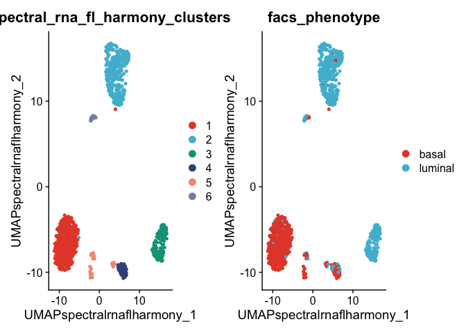

``` r
VlnPlot(seurat, c("basal_score_Landragin", "lp_score_Landragin", "hs_score_Landragin"),
                   group.by = c("spectral_rna_fl_harmony_clusters"), pt.size = 0.5, cols = mypal) +
                   stat_summary(fun.y = median, geom='point', size = 2, colour = "black", position = position_dodge(width = 0.9)) 
```

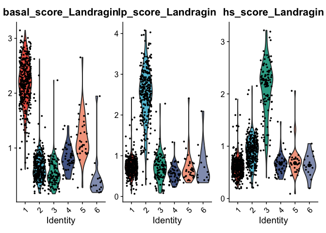

``` r
VlnPlot(seurat, c("basal_score_Visvader", "lp_score_Visvader", "hs_score_Visvader"),
                   group.by = c("spectral_rna_fl_harmony_clusters"), pt.size = 0.5, cols = mypal) +
                   stat_summary(fun.y = median, geom='point', size = 2, colour = "black", position = position_dodge(width = 0.9)) 
```

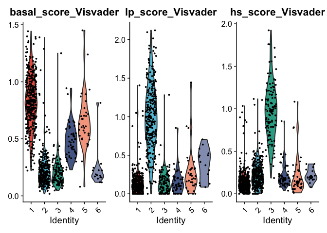

1 = basal 2 = LP 3 = HS 4-6 = smth else

``` r
DefaultAssay(seurat) <- "SCT_fl"
PrepSCTFindMarkers(seurat, assay = "SCT_fl")
```

    An object of class Seurat 
    3234344 features across 870 samples within 14 assays 
    Active assay: SCT_fl (19283 features, 3000 variable features)
     3 layers present: counts, data, scale.data
     13 other assays present: bin_5k_h3k27me3, bin_50k_h3k27me3, bin_2k_h3k27me3, peaks_h3k27me3, ga_h3k27me3, RNA_umi, RNA_fl, bin_5k_h3k4me1, bin_50k_h3k4me1, bin_2k_h3k4me1, peaks_h3k4me1, ga_h3k4me1, SCT_umi
     9 dimensional reductions calculated: spectral_k4, spectral_k27, spectral_rna_fl, spectral_rna_umi, spectral_k4_rna, spectral_k27_rna, UMAP_spectral_rna_fl, spectral_rna_fl_harmony, UMAP_spectral_rna_fl_harmony

``` r
Idents(seurat) <- "spectral_rna_fl_harmony_clusters"

c4_markers <- FindMarkers(seurat, ident.1 = "4")
c5_markers <- FindMarkers(seurat, ident.1 = "5")
c6_markers <- FindMarkers(seurat, ident.1 = "6")
```

``` r
marker_list <- list(
  "4" = c4_markers,
  "5" = c5_markers,
  "6" = c6_markers
)

top_genes <- lapply(marker_list, function(x) {
  rownames(head(x[order(x$p_val_adj, decreasing = FALSE), ], 10))
})
top_genes <- unique(unlist(top_genes))

DotPlot(
  seurat,
  features = top_genes,
  group.by = "spectral_rna_fl_harmony_clusters",
  assay    = "SCT_fl"
) + RotatedAxis()
```

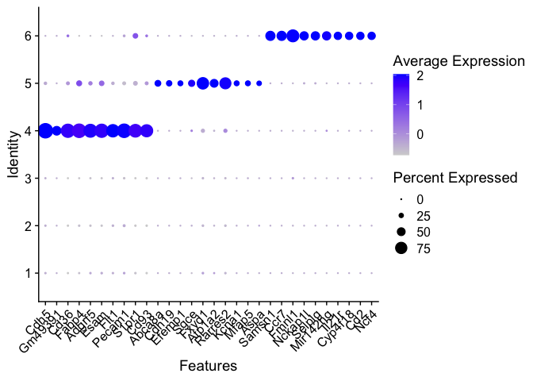

4 = endothelium 5 = peripheral glia 6 = immune

``` r
tmp_vector <- seurat@meta.data[["spectral_rna_fl_harmony_clusters"]]

annot_rna <- case_when(
  tmp_vector == 1 ~ "basal",
  tmp_vector == 2 ~ "LP",
  tmp_vector == 3 ~ "HS",
  tmp_vector == 4 ~ "endothelium",
  tmp_vector == 5 ~ "peripheral_glia",
  tmp_vector == 6 ~ "immune"
)

seurat@meta.data[["annot_rna"]] <- annot_rna
```

# Reload step 4

``` r
saveRDS(seurat, file.path(outputDir_objects, "seurat_step4.rds"))
```

``` r
seurat <- readRDS(file.path(outputDir_objects, "seurat_step4.rds"))
```

``` r
cols <- c(
   basal   = "#E64B35",
   HS      = "#754f75",
   LP      = "#ba8cba",
   luminal = "#ba8cba",
   "basal-Tspan8-neg" = "#E64B35",
   "basal-Tspan8-pos" = "#B09C85E5",
   "luminal-Sca1-neg" = "#ba8cba",
   "luminal-Sca1-pos" = "#91D1C2E5",
   peripheral_glia = "#3C5488E5",
   immune = "#F39B7FE5",
   endothelium = "#91D1C2E5"
 )
```

``` r
DimPlot(seurat, cols = cols, 
        reduction = "UMAP_spectral_rna_fl_harmony",
        group.by = c("annot_rna"))
```

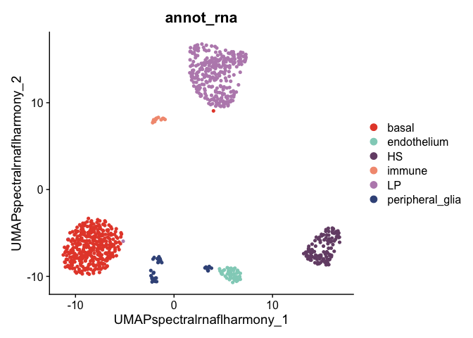

``` r
DimPlot(seurat, cols = cols, 
        reduction = "UMAP_spectral_rna_fl_harmony",
        group.by = c("facs_phenotype"),
        combine = TRUE)
```

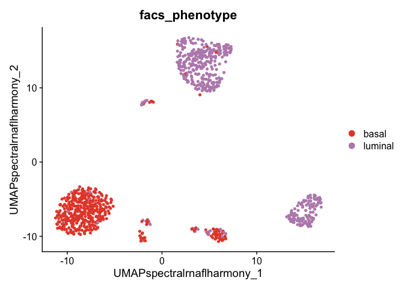

# K4 clustering

``` r
seurat <- RunUMAP(seurat,
                  assay = "bin_5k_h3k4me1",
                  seed.use = 42,
                  metric = "cosine",
                  n.neighbors = 30,
                  min.dist = 0.3,
                  spread = 1.5,
                  repulsion.strength = 1,
                  dims = 1:length(colnames(seurat@reductions[["spectral_k4"]])),
                  reduction = "spectral_k4",
                  reduction.name = "UMAP_spectral_k4")

seurat <- FindNeighbors(seurat,
                        reduction = "spectral_k4",
                        cluster.name = "spectral_k4_clusters",
                        graph.name = "spectral_k4_snn",
                        dims = 1:length(colnames(seurat@reductions[["spectral_k4"]])),
                        k.param = 10)

seurat <- FindClusters(seurat,
                       resolution = 0.1,
                       cluster.name = "spectral_k4_clusters",
                       graph.name = "spectral_k4_snn",
                       algorithm = 4)

DimPlot(seurat, cols = mypal, 
        reduction = "UMAP_spectral_k4",
        group.by = c("Exp", "facs_phenotype","annot_rna", "spectral_k4_clusters"),
        combine = TRUE)

FeaturePlot(seurat, 
        reduction = "UMAP_spectral_k4",
        features = c("frequency_count", "FRiP"),
        combine = TRUE)
```

## Batch correction

``` r
seurat <- RunHarmony(
  object        = seurat,
  group.by.vars = c("Exp"),
  reduction.use = "spectral_k4",
  reduction.save = "spectral_k4_harmony",
  project.dim    = FALSE,
  plot_convergence = TRUE
)
```

## Reclustering post batch-correction

``` r
seurat <- RunUMAP(seurat,
                  assay = "bin_5k_h3k4me1",
                  seed.use = 5,
                  metric = "cosine",
                  n.neighbors = 50,
                  min.dist = 0.6,
                  spread = 1.5,
                  dims = 1:length(colnames(seurat@reductions[["spectral_k4"]])),
                  reduction = "spectral_k4_harmony",
                  reduction.name = "UMAP_spectral_k4_harmony")

seurat <- FindNeighbors(seurat,
                        reduction = "spectral_k4_harmony",
                        cluster.name = "spectral_k4_harmony_clusters",
                        graph.name = "spectral_k4_harmony_snn",
                        dims = 1:length(colnames(seurat@reductions[["spectral_k4"]])),
                        k.param = 10)

seurat <- FindClusters(seurat,
                       graph.name   = "spectral_k4_harmony_snn",
                       resolution = 0.2,
                       cluster.name = "spectral_k4_harmony_clusters",
                       algorithm = 4)

DimPlot(seurat, cols = mypal, 
        reduction = "UMAP_spectral_k4_harmony",
        group.by = c("Exp", "facs_phenotype",
                     "spectral_k4_harmony_clusters", "annot_rna"),
        combine = TRUE)
```

# K27 clustering

``` r
seurat <- RunUMAP(seurat,
                  assay = "bin_10k_h3k27me3",
                  seed.use = 42,
                  dims = 1:length(colnames(seurat@reductions[["spectral_k27"]])),
                  reduction = "spectral_k27",
                  reduction.name = "UMAP_spectral_k27")

seurat <- FindNeighbors(seurat,
                        dims = 1:length(colnames(seurat@reductions[["spectral_k27"]])),
                        reduction = "spectral_k27",
                        cluster.name = "spectral_k27_clusters",
                        graph.name = "spectral_k27_snn",
                        k.param = 10)

seurat <- FindClusters(seurat,
                       resolution = 0.2,
                       cluster.name = "spectral_k27_clusters",
                       graph.name = "spectral_k27_snn",
                       algorithm = 4)

DimPlot(seurat, cols = mypal, 
        reduction = "UMAP_spectral_k27",
        group.by = c("Exp", "facs_phenotype","annot_rna", "spectral_k27_clusters"),
        combine = TRUE)
```

## Batch correction

``` r
seurat <- RunHarmony(
  object        = seurat,
  group.by.vars = c("Exp"),
  reduction.use = "spectral_k27",
  reduction.save = "spectral_k27_harmony",
  project.dim    = FALSE,
  plot_convergence = TRUE
)
```

## Reclustering post batch-correction

``` r
seurat <- RunUMAP(seurat,
                  assay = "bin_10k_h3k27me3",
                  seed.use = 42,
                  metric = "cosine",
                  dims = 1:length(colnames(seurat@reductions[["spectral_k27"]])),
                  reduction = "spectral_k27_harmony",
                  reduction.name = "UMAP_spectral_k27_harmony")

seurat <- FindNeighbors(seurat,
                        reduction = "spectral_k27_harmony",
                        dims = 1:length(colnames(seurat@reductions[["spectral_k27"]])),
                        cluster.name = "spectral_k27_harmony_clusters",
                        graph.name = "spectral_k27_harmony_snn",
                        k.param = 10)

seurat <- FindClusters(seurat,
                       graph.name   = "spectral_k27_harmony_snn",
                       resolution = 0.2,
                       cluster.name = "spectral_k27_harmony_clusters",
                       algorithm = 4)

DimPlot(seurat, cols = mypal, 
        reduction = "UMAP_spectral_k27_harmony",
        group.by = c("Exp", "facs_phenotype",
                     "annot_rna", "spectral_k27_harmony_clusters"),
        combine = TRUE)
```

# Reload step 5

``` r
saveRDS(seurat, file.path(outputDir_objects, "seurat_step5.rds"))
```

``` r
seurat <- readRDS(file.path(outputDir_objects, "seurat_step5.rds"))
```

# UMAP all populations

``` r
DimPlot(seurat, cols = mypal, 
        reduction = "UMAP_spectral_rna_fl_harmony",
        group.by = c("facs_phenotype", "annot_rna"),
        combine = TRUE)
```

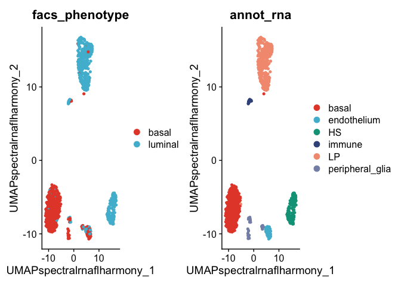

``` r
DimPlot(seurat, cols = mypal, 
        reduction = "UMAP_spectral_k4_harmony",
        group.by = c("spectral_k4_harmony_clusters", "annot_rna"),
        combine = TRUE)
```

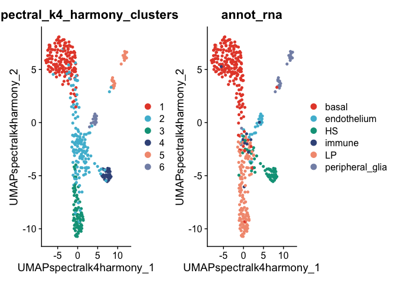

``` r
DimPlot(seurat, cols = mypal, 
        reduction = "UMAP_spectral_k27_harmony",
        group.by = c("spectral_k27_harmony_clusters", "annot_rna"),
        combine = TRUE)
```

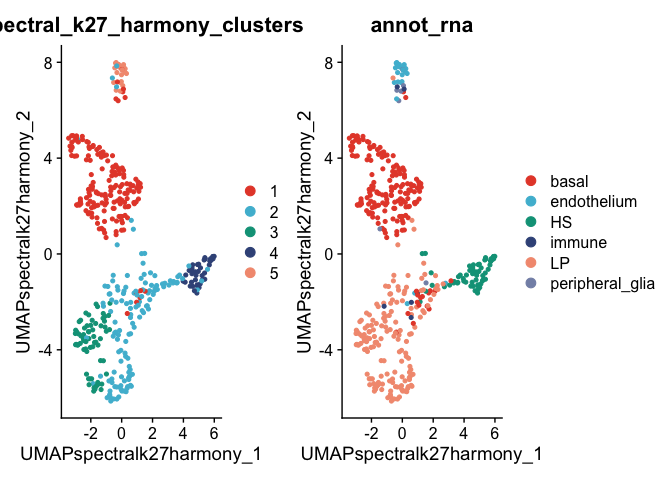

# Removing non-epithelial populations

``` r
seurat <- subset(seurat, annot_rna %in% c("basal", "HS", "LP"))
```

# Re-clustering with epithelial cells only

## RNA

``` r
seurat <- RunUMAP(seurat,
                  assay = "RNA_fl",
                  seed.use = 77,
                  metric = "cosine",
                  n.neighbors = 40,
                  min.dist = 0.6,
                  spread = 1.5,
                  dims = 1:length(colnames(seurat@reductions[["spectral_rna_fl_harmony"]])),
                  reduction = "spectral_rna_fl_harmony",
                  reduction.name = "UMAP_spectral_rna_fl_harmony")

seurat <- FindNeighbors(seurat,
                        reduction = "spectral_rna_fl_harmony",
                        cluster.name = "spectral_rna_fl_harmony_clusters",
                        graph.name = "spectral_rna_fl_harmony_snn")

seurat <- FindClusters(seurat,
                       graph.name   = "spectral_rna_fl_harmony_snn",
                       resolution = 0.1,
                       cluster.name = "spectral_rna_fl_harmony_clusters",
                       algorithm = 4)

DimPlot(seurat, cols = mypal, 
        reduction = "UMAP_spectral_rna_fl_harmony",
        group.by = c("annot_rna", "facs_phenotype", "spectral_rna_fl_harmony_clusters", "Exp"),
        combine = TRUE)
```

## K4

``` r
seurat <- RunUMAP(seurat,
                  assay = "bin_5k_h3k4me1",
                  seed.use = 23,
                  metric = "cosine",
                  n.neighbors = 50,
                  min.dist = 0.2,
                  dims = 1:length(colnames(seurat@reductions[["spectral_k4"]])),
                  reduction = "spectral_k4_harmony",
                  reduction.name = "UMAP_spectral_k4_harmony")

seurat <- FindNeighbors(seurat,
                        reduction = "spectral_k4_harmony",
                        cluster.name = "spectral_k4_harmony_clusters",
                        graph.name = "spectral_k4_harmony_snn",
                        k.param = 15)

seurat <- FindClusters(seurat,
                       graph.name   = "spectral_k4_harmony_snn",
                       resolution = 0.1,
                       cluster.name = "spectral_k4_harmony_clusters",
                       algorithm = 4)


DimPlot(seurat, cols = mypal, 
        reduction = "UMAP_spectral_k4_harmony",
        group.by = c("spectral_k4_harmony_clusters", "annot_rna", "Exp", "facs_phenotype"),
        combine = TRUE)

FeaturePlot(seurat, 
        reduction = "UMAP_spectral_k4_harmony",
        features = c("frequency_count", "FRiP"),
        combine = TRUE)
```

## K27

``` r
seurat <- RunUMAP(seurat,
                  assay = "bin_5k_h3k27me3",
                  seed.use = 42,
                  metric = "cosine",
                  n.neighbors = 50,
                  min.dist = 0.2,
                  dims = 1:length(colnames(seurat@reductions[["spectral_k27"]])),
                  reduction = "spectral_k27_harmony",
                  reduction.name = "UMAP_spectral_k27_harmony")

seurat <- FindNeighbors(seurat,
                        reduction = "spectral_k27_harmony",
                        dims = 1:length(colnames(seurat@reductions[["spectral_k27"]])),
                        cluster.name = "spectral_k27_harmony_clusters",
                        graph.name = "spectral_k27_harmony_snn",
                        k.param = 15)

seurat <- FindClusters(seurat,
                       graph.name   = "spectral_k27_harmony_snn",
                       resolution = 0.1,
                       cluster.name = "spectral_k27_harmony_clusters",
                       algorithm = 4)

DimPlot(seurat, cols = mypal, 
        reduction = "UMAP_spectral_k27_harmony",
        group.by = c("spectral_k27_harmony_clusters", "annot_rna", "Exp", "facs_phenotype"),
        combine = TRUE)

FeaturePlot(seurat, 
        reduction = "UMAP_spectral_k27_harmony",
        features = c("frequency_count", "FRiP"),
        combine = TRUE)
```

# Annotation

``` r
seurat <- AddCellTypeScore(seurat_obj = seurat,
                 marker_table = ref_inhouse,
                 cell_type = "Basal",
                 assay = "ga_h3k27me3",
                 score_name = "basal_score_Landragin_k27")

seurat <- AddCellTypeScore(seurat_obj = seurat,
                 marker_table = ref_inhouse,
                 cell_type = "Luminal H-S",
                 assay = "ga_h3k27me3",
                 score_name = "hs_score_Landragin_k27")

seurat <- AddCellTypeScore(seurat_obj = seurat,
                 marker_table = ref_inhouse,
                 cell_type = "LP",
                 assay = "ga_h3k27me3",
                 score_name = "lp_score_Landragin_k27")

seurat <- AddCellTypeScore(seurat_obj = seurat,
                 marker_table = ref_inhouse,
                 cell_type = "Basal",
                 assay = "ga_h3k4me1",
                 score_name = "basal_score_Landragin_k4")

seurat <- AddCellTypeScore(seurat_obj = seurat,
                 marker_table = ref_inhouse,
                 cell_type = "Luminal H-S",
                 assay ="ga_h3k4me1",
                 score_name = "hs_score_Landragin_k4")

seurat <- AddCellTypeScore(seurat_obj = seurat,
                 marker_table = ref_inhouse,
                 cell_type = "LP",
                 assay = "ga_h3k4me1",
                 score_name = "lp_score_Landragin_k4")

seurat <- AddCellTypeScore(seurat_obj = seurat,
                 marker_table = ref_visvader,
                 cell_type = "Basal",
                 assay = "ga_h3k27me3",
                 score_name = "basal_score_Visvader_k27")

seurat <- AddCellTypeScore(seurat_obj = seurat,
                 marker_table = ref_visvader,
                 cell_type = "Luminal H-S",
                 assay = "ga_h3k27me3",
                 score_name = "hs_score_Visvader_k27")

seurat <- AddCellTypeScore(seurat_obj = seurat,
                 marker_table = ref_visvader,
                 cell_type = "LP",
                 assay = "ga_h3k27me3",
                 score_name = "lp_score_Visvader_k27")

seurat <- AddCellTypeScore(seurat_obj = seurat,
                 marker_table = ref_visvader,
                 cell_type = "Basal",
                 assay = "ga_h3k4me1",
                 score_name = "basal_score_Visvader_k4")

seurat <- AddCellTypeScore(seurat_obj = seurat,
                 marker_table = ref_visvader,
                 cell_type = "Luminal H-S",
                 assay = "ga_h3k4me1",
                 score_name = "hs_score_Visvader_k4")

seurat <- AddCellTypeScore(seurat_obj = seurat,
                 marker_table = ref_visvader,
                 cell_type = "LP",
                 assay = "ga_h3k4me1",
                 score_name = "lp_score_Visvader_k4")
```

``` r
DimPlot(seurat, cols = mypal, 
        reduction = "UMAP_spectral_k4_harmony",
        group.by = c("spectral_k4_harmony_clusters", "annot_rna"))

seurat_nograph <- seurat
seurat_nograph@graphs <- list()
seurat_nograph@neighbors <- list()

cells_k4 <- WhichCells(seurat, expression = !is.na(spectral_k4_harmony_clusters))

VlnPlot(subset(seurat_nograph, cells = cells_k4), c("basal_score_Landragin_k4", "lp_score_Landragin_k4", "hs_score_Landragin_k4"),
                   group.by = c("spectral_k4_harmony_clusters"), pt.size = 0.5, cols = mypal)
                  

VlnPlot(subset(seurat_nograph, cells = cells_k4), c("basal_score_Visvader_k4", "lp_score_Visvader_k4", "hs_score_Visvader_k4"),
                   group.by = c("spectral_k4_harmony_clusters"), pt.size = 0.5, cols = mypal)
```

``` r
DimPlot(seurat, cols = mypal, 
        reduction = "UMAP_spectral_k27_harmony",
        group.by = c("spectral_k27_harmony_clusters", "annot_rna"))

cells_k27 <- WhichCells(seurat, expression = !is.na(spectral_k27_harmony_clusters))

VlnPlot(subset(seurat_nograph, cells = cells_k27), c("basal_score_Landragin_k27", "lp_score_Landragin_k27", "hs_score_Landragin_k27"),
                   group.by = c("spectral_k27_harmony_clusters"), pt.size = 0.5, cols = mypal) 

VlnPlot(subset(seurat_nograph, cells = cells_k27), c("basal_score_Visvader_k27", "lp_score_Visvader_k27", "hs_score_Visvader_k27"),
                   group.by = c("spectral_k27_harmony_clusters"), pt.size = 0.5, cols = mypal) 
```

``` r
tmp_vector <- seurat@meta.data[["spectral_rna_fl_harmony_clusters"]]

annot_rna <- case_when(
  tmp_vector == 1 ~ "basal",
  tmp_vector == 2 ~ "LP",
  tmp_vector == 3 ~ "HS",
)

seurat@meta.data[["annot_rna"]] <- annot_rna

tmp_vector <- seurat@meta.data[["spectral_k4_harmony_clusters"]]

annot_k4 <- case_when(
  tmp_vector == 1 ~ "basal",
  tmp_vector == 2 ~ "LP",
  tmp_vector == 3 ~ "HS",
)

seurat@meta.data[["annot_k4"]] <- annot_k4


tmp_vector <- seurat@meta.data[["spectral_k27_harmony_clusters"]]

annot_k27 <- case_when(
  tmp_vector == 1 ~ "LP",
  tmp_vector == 2 ~ "basal",
  tmp_vector == 3 ~ "HS",
)


seurat@meta.data[["annot_k27"]] <- annot_k27
```

Discordant annot

``` r
annot_k4 <- seurat@meta.data[["annot_k4"]]
annot_k27 <- seurat@meta.data[["annot_k27"]]
annot_rna <- seurat@meta.data[["annot_rna"]]

annot_chrom <- ifelse(!is.na(annot_k4), annot_k4, annot_k27)

discordant_annot <- dplyr::case_when(
  annot_rna == "basal" & annot_chrom == "basal" ~ "basal",
  annot_rna == "LP"    & annot_chrom == "LP"    ~ "LP",
  annot_rna == "HS"    & annot_chrom == "HS"    ~ "HS",
  ## discordant categories 
  annot_rna == "basal" & annot_chrom == "LP"    ~ "discordant_basal_lp",
  annot_rna == "basal" & annot_chrom == "HS"    ~ "discordant_basal_hs",
  annot_rna == "LP"    & annot_chrom == "basal" ~ "discordant_lp_basal",
  annot_rna == "HS"    & annot_chrom == "basal" ~ "discordant_HS_basal",
  annot_rna == "LP"    & annot_chrom == "HS" ~ "discordant_LP_HS",
  annot_rna == "HS"    & annot_chrom == "LP" ~ "discordant_HS_LP"
)

seurat@meta.data[["discordant_annot"]] <- discordant_annot
```

# Reload step 6

``` r
saveRDS(seurat, file.path(outputDir_objects, "seurat_step6.rds"))
```

``` r
seurat <- readRDS(file.path(outputDir_objects, "seurat_step6.rds"))
```

``` r
DimPlot(seurat, cols = mypal, 
        reduction = "UMAP_spectral_rna_fl_harmony",
        group.by = c("spectral_rna_fl_harmony_clusters", "annot_rna"))
```

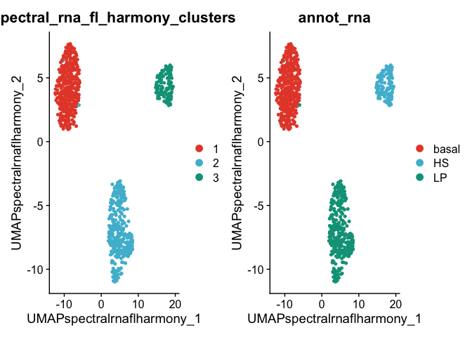

``` r
VlnPlot(seurat, c("basal_score_Landragin", "lp_score_Landragin", "hs_score_Landragin"),
                   group.by = c("spectral_rna_fl_harmony_clusters"), pt.size = 0.5, cols = mypal) +
                   stat_summary(fun.y = median, geom='point', size = 2, colour = "black", position = position_dodge(width = 0.9)) 
```

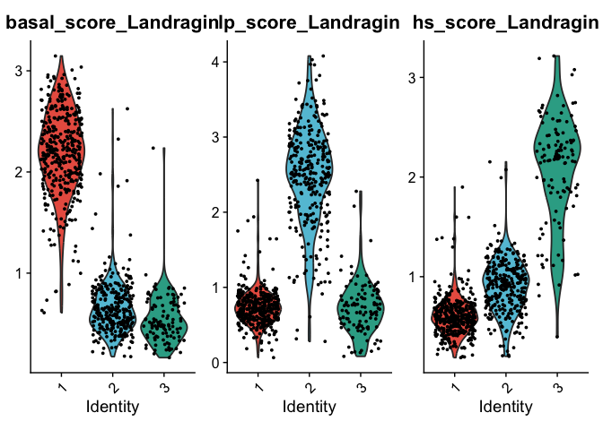

``` r
VlnPlot(seurat, c("basal_score_Visvader", "lp_score_Visvader", "hs_score_Visvader"),
                   group.by = c("spectral_rna_fl_harmony_clusters"), pt.size = 0.5, cols = mypal) +
                   stat_summary(fun.y = median, geom='point', size = 2, colour = "black", position = position_dodge(width = 0.9)) 
```

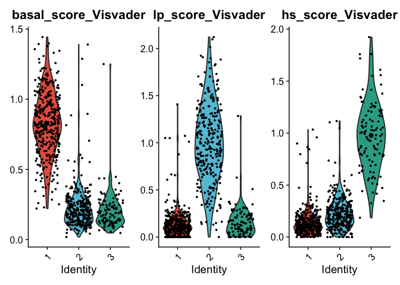

``` r
DimPlot(seurat, cols = mypal, 
        reduction = "UMAP_spectral_k4_harmony",
        group.by = c("spectral_k4_harmony_clusters", "annot_k4"))
```

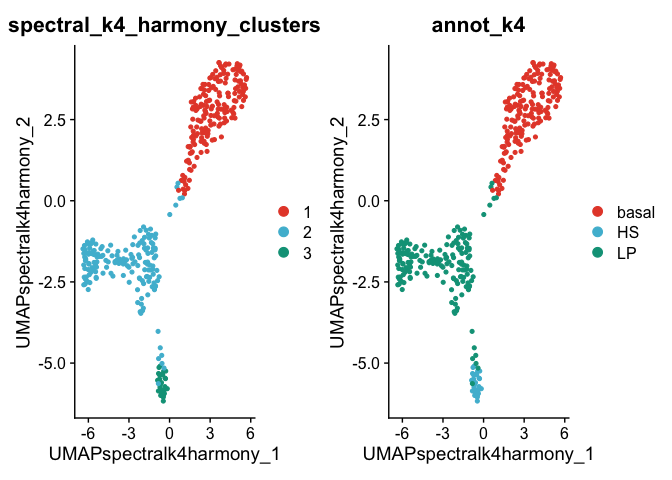

``` r
seurat_nograph <- seurat
seurat_nograph@graphs <- list()
seurat_nograph@neighbors <- list()

cells_k4 <- WhichCells(seurat, expression = !is.na(spectral_k4_harmony_clusters))

VlnPlot(subset(seurat_nograph, cells = cells_k4), c("basal_score_Landragin_k4", "lp_score_Landragin_k4", "hs_score_Landragin_k4"),
                   group.by = c("spectral_k4_harmony_clusters"), pt.size = 0.5, cols = mypal)
```

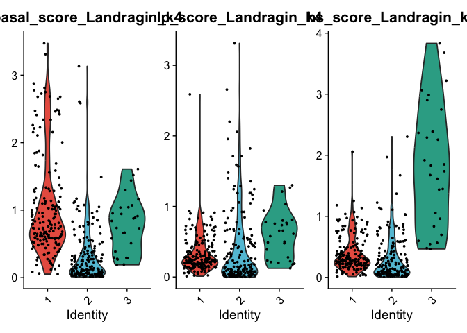

``` r
VlnPlot(subset(seurat_nograph, cells = cells_k4), c("basal_score_Visvader_k4", "lp_score_Visvader_k4", "hs_score_Visvader_k4"),
                   group.by = c("spectral_k4_harmony_clusters"), pt.size = 0.5, cols = mypal)
```

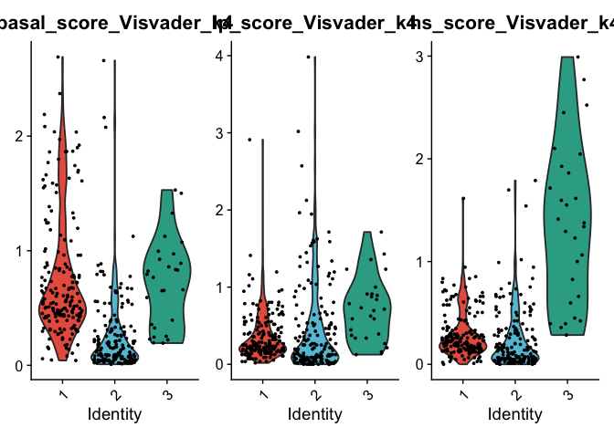

``` r
DimPlot(seurat, cols = mypal, 
        reduction = "UMAP_spectral_k27_harmony",
        group.by = c("spectral_k27_harmony_clusters", "annot_k27"))
```

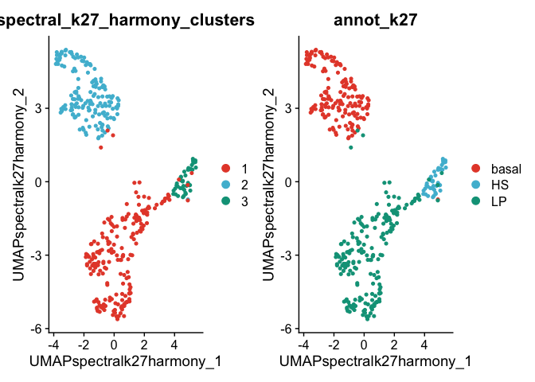

``` r
cells_k27 <- WhichCells(seurat, expression = !is.na(spectral_k27_harmony_clusters))

VlnPlot(subset(seurat_nograph, cells = cells_k27), c("basal_score_Landragin_k27", "lp_score_Landragin_k27", "hs_score_Landragin_k27"),
                   group.by = c("spectral_k27_harmony_clusters"), pt.size = 0.5, cols = mypal) 
```

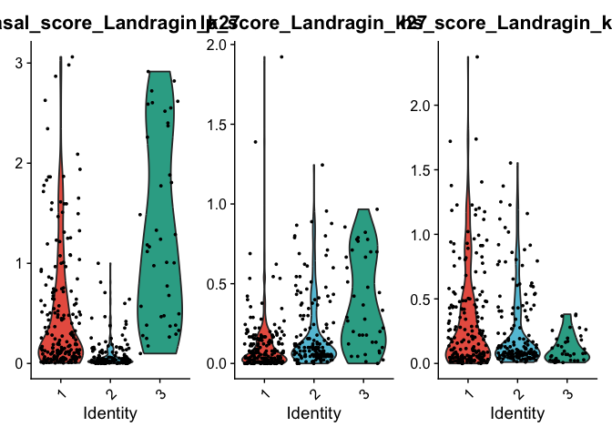

``` r
VlnPlot(subset(seurat_nograph, cells = cells_k27), c("basal_score_Visvader_k27", "lp_score_Visvader_k27", "hs_score_Visvader_k27"),
                   group.by = c("spectral_k27_harmony_clusters"), pt.size = 0.5, cols = mypal) 
```

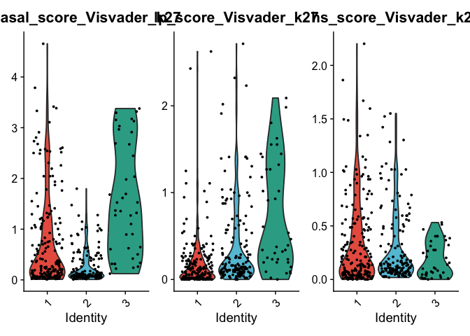

``` r
cols <- c(
   basal   = "#E64B35",
   HS      = "#754f75",
   LP      = "#ba8cba",
   luminal = "#e0d0e0",
   "basal-Tspan8-neg" = "#E64B35",
   "basal-Tspan8-pos" = "#B09C85E5",
   "luminal-Sca1-neg" = "#ba8cba",
   "luminal-Sca1-pos" = "#91D1C2E5",
   discordant_basal_lp = "#3C5488E5",
   discordant_lp_basal = "grey40",
   discordant_HS_LP = "#8491B4E5",
   discordant_HS_basal = "grey"
 )
```

# UMAP epith

``` r
DimPlot(seurat, cols = cols, 
        reduction = "UMAP_spectral_k4_harmony",
        group.by = c("annot_k4", "annot_rna", "facs_phenotype",
                     "facs_phenotype_expanded"),
        combine = TRUE)
```

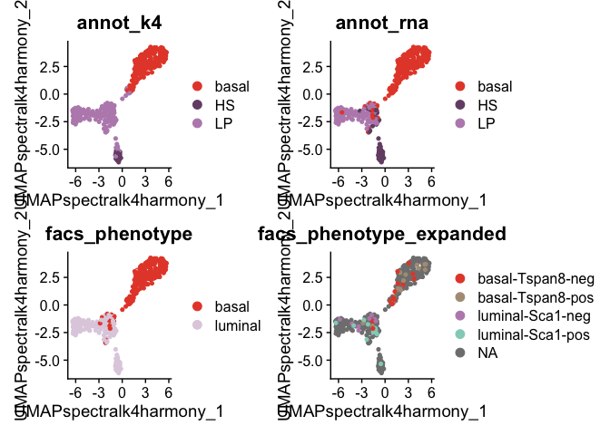

``` r
DimPlot(seurat, cols = cols, 
        reduction = "UMAP_spectral_k27_harmony",
        group.by = c("annot_k27", "annot_rna", "facs_phenotype",
                     "facs_phenotype_expanded"),
        combine = TRUE)
```

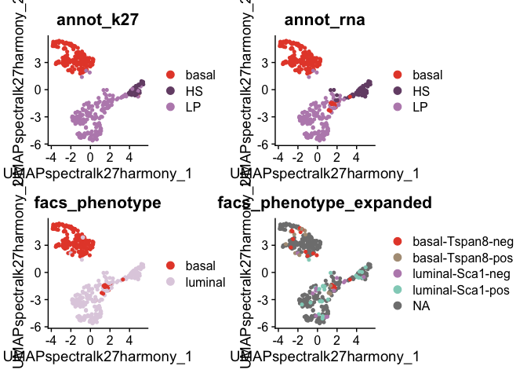

# Noodle plot

``` r
seurat_nograph <- DietSeurat(
  seurat,
  graphs = FALSE
)


s_k4  <- subset(seurat_nograph, subset = mark == "h3k4me1")
s_k27 <- subset(seurat_nograph, subset = mark == "h3k27me3")
```

## RNA -\> K4

``` r
df1 <- seurat@reductions[["UMAP_spectral_k4_harmony"]]@cell.embeddings %>% as.data.frame()
df2 <- seurat@reductions[["UMAP_spectral_rna_fl_harmony"]]@cell.embeddings %>% as.data.frame()

# Extract information about cell type or cluster
df1$cluster <- as.vector(s_k4@meta.data[["annot_k4"]])
df2$cluster <- as.vector(seurat@meta.data[["annot_rna"]])

# Add the info about the mark
df1$mark <- "H3K4me1"
df2$mark <- "RNA"

df1 <- df1 %>%
  rename(umap_1 = UMAPspectralk4harmony_1,
         umap_2 = UMAPspectralk4harmony_2)

df2 <- df2 %>%
  rename(umap_1 = UMAPspectralrnaflharmony_1,
         umap_2 = UMAPspectralrnaflharmony_2)


df1$umap_1 <- df1$umap_1 + 50
df1$umap_2 <- df1$umap_2
df2$umap_2 <- df2$umap_2/2

# Create a list and bind dataframes into one
dat.umap.lst <- list(df2, df1)
dat.umap.long <- dat.umap.lst %>% bind_rows()
dat.umap.long$cell <- c(rownames(df2), rownames(df1))

# Define color palette for clusters

connected_umap_k4 <- ggplot(dat.umap.long, aes(x = umap_1, y = umap_2, color = cluster, group = cell)) +             
   geom_path(alpha = 0.1) +
   geom_point(alpha = 1) +
   scale_color_manual(values = cols) +
   theme_classic() + ggtitle("RNA -> H3K4me1")
connected_umap_k4
```

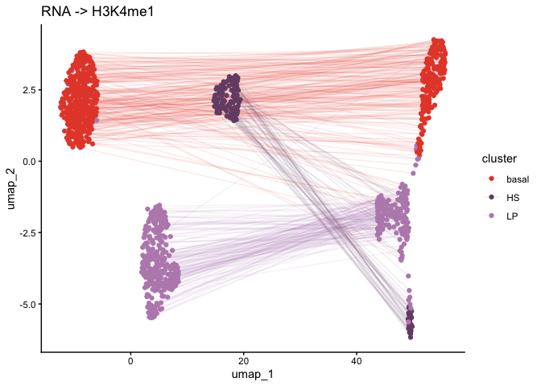

## RNA -\> K27

``` r
df1 <- seurat@reductions[["UMAP_spectral_k27_harmony"]]@cell.embeddings %>% as.data.frame()
df2 <- seurat@reductions[["UMAP_spectral_rna_fl_harmony"]]@cell.embeddings %>% as.data.frame()

# Extract information about cell type or cluster
df1$cluster <- as.vector(s_k27@meta.data[["annot_k27"]])
df2$cluster <- as.vector(seurat@meta.data[["annot_rna"]])

# Add the info about the mark
df1$mark <- "H3K27me3"
df2$mark <- "RNA"

df1 <- df1 %>%
  rename(umap_1 = UMAPspectralk27harmony_1,
         umap_2 = UMAPspectralk27harmony_2)

df2 <- df2 %>%
  rename(umap_1 = UMAPspectralrnaflharmony_1,
         umap_2 = UMAPspectralrnaflharmony_2)


df1$umap_1 <- df1$umap_1 + 50
df1$umap_2 <- df1$umap_2
df2$umap_2 <- df2$umap_2/2

# Create a list and bind dataframes into one
dat.umap.lst <- list(df2, df1)
dat.umap.long <- dat.umap.lst %>% bind_rows()
dat.umap.long$cell <- c(rownames(df2), rownames(df1))

# Define color palette for clusters

connected_umap_k27 <- ggplot(dat.umap.long, aes(x = umap_1, y = umap_2, color = cluster, group = cell)) +
                  geom_path(alpha = 0.1) +           
                  geom_point(alpha = 1) +
                  scale_color_manual(values = cols) +
                  theme_classic() + ggtitle("RNA -> H3K27me3")
connected_umap_k27
```

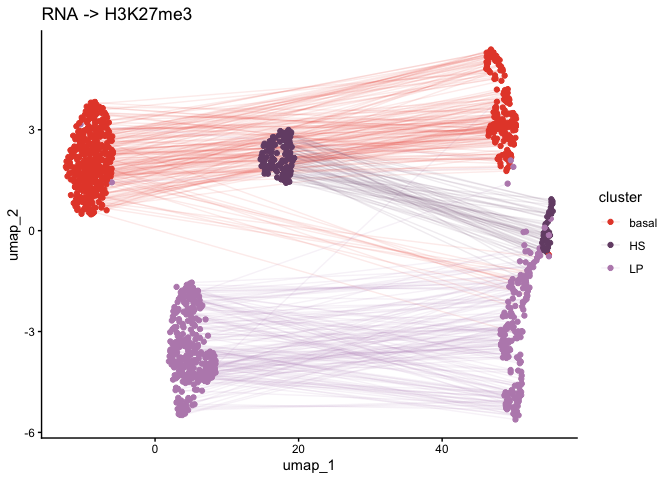

``` r
ggsave(file.path(outputDir_plots, "connected_umap_k4.pdf"),
       plot = connected_umap_k4,
       device = "pdf",
       units = "mm",
       width = 200,
       height = 100)

ggsave(file.path(outputDir_plots, "connected_umap_k27.pdf"),
       plot = connected_umap_k27,
       device = "pdf",
       units = "mm",
       width = 200,
       height = 100)
```

# Alluvial plot

``` r
df <- seurat@meta.data %>%
  transmute(
    facs_phenotype = as.character(facs_phenotype),
    annot_rna      = as.character(annot_rna),
    annot_k4       = as.character(annot_k4)
  ) %>%
  mutate(across(everything(), ~ replace_na(.x, "NA"))) %>%
  dplyr::count(facs_phenotype, annot_rna, annot_k4, name = "n")

df_noNA <- df %>%
  dplyr::filter(
    facs_phenotype != "NA",
    annot_rna      != "NA",
    annot_k4       != "NA"
  )

p_all_k4_nona <- ggplot(df_noNA,
                        aes(axis1 = facs_phenotype, axis2 = annot_rna, axis3 = annot_k4, y = n)) +
                        scale_x_discrete(limits = c("FACS", "RNA", "H3K4me1"), expand = c(.05, .05)) +
                        geom_alluvium(aes(fill = facs_phenotype), alpha = 0.8, width = 1/12) +
                        geom_stratum(width = 1/10, color = "grey40") +
                        geom_text(stat = "stratum", aes(label = after_stat(stratum)), size = 3) +
                        labs(x = NULL, y = "Cells") +
                        theme_classic() + 
                        scale_fill_manual(values = cols, drop = FALSE)

p_all_k4_nona
```

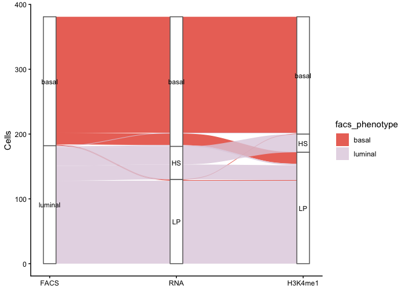

``` r
order_levels <- c("basal", "LP", "HS")

cm_k4 <- df %>%
  dplyr::filter(annot_rna != "NA", annot_k4 != "NA") %>%
  dplyr::mutate(
    annot_rna = factor(annot_rna, levels = order_levels),
    annot_k4  = factor(annot_k4,  levels = order_levels)
  ) %>%
  dplyr::group_by(annot_rna, annot_k4) %>%
  dplyr::summarise(n = sum(n), .groups = "drop") %>%
  tidyr::complete(
    annot_rna,
    annot_k4,
    fill = list(n = 0)
  )


p_cm_k4 <- ggplot(cm_k4, aes(x = annot_rna, y = annot_k4, fill = n)) +
  geom_tile(color = "black", linewidth = 0.4) +   # black outline
  geom_text(aes(label = n)) +
  scale_fill_gradient(low = "white", high = mypal[1]) +
  labs(
    x = "RNA annotation",
    y = "H3K4me1 annotation",
    fill = "N cells"
  ) +
  theme_classic()

p_cm_k4
```

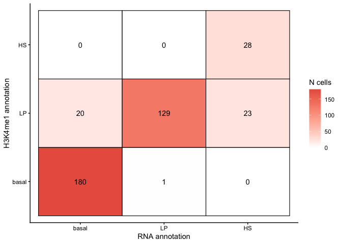

``` r
df <- seurat@meta.data %>%
  transmute(
    facs_phenotype = as.character(facs_phenotype),
    annot_rna      = as.character(annot_rna),
    annot_k27       = as.character(annot_k27)
  ) %>%
  mutate(across(everything(), ~ replace_na(.x, "NA"))) %>%
  dplyr::count(facs_phenotype, annot_rna, annot_k27, name = "n")

df_noNA <- df %>%
  dplyr::filter(
    facs_phenotype != "NA",
    annot_rna      != "NA",
    annot_k27      != "NA"
  )

p_all_k27_nona <- ggplot(df_noNA,
                         aes(axis1 = facs_phenotype, axis2 = annot_rna, axis3 = annot_k27, y = n)) +
                              scale_x_discrete(limits = c("FACS", "RNA", "H3K27me3"), expand = c(.05, .05)) +
                              geom_alluvium(aes(fill = facs_phenotype), alpha = 0.8, width = 1/12) +
                              geom_stratum(width = 1/10, color = "grey40") +
                              geom_text(stat = "stratum", aes(label = after_stat(stratum)), size = 3) +
                              labs(x = NULL, y = "Cells") +
                              theme_classic() + 
                              scale_fill_manual(values = cols, drop = FALSE)

p_all_k27_nona
```

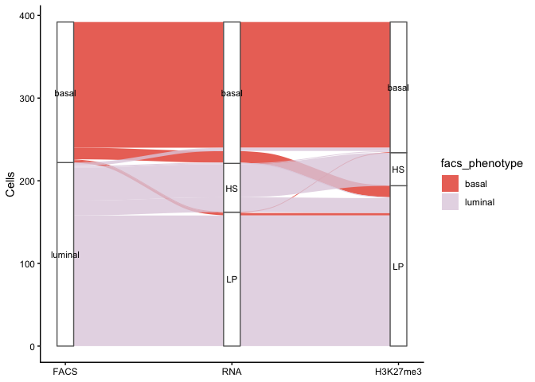

``` r
order_levels <- c("basal", "LP", "HS")

cm_k27 <- df %>%
  dplyr::filter(annot_rna != "NA", annot_k27 != "NA") %>%
  dplyr::mutate(
    annot_rna = factor(annot_rna, levels = order_levels),
    annot_k4  = factor(annot_k27,  levels = order_levels)
  ) %>%
  dplyr::group_by(annot_rna, annot_k27) %>%
  dplyr::summarise(n = sum(n), .groups = "drop") %>%
  tidyr::complete(
    annot_rna,
    annot_k27,
    fill = list(n = 0)
  )

p_cm_k27 <- ggplot(cm_k27, aes(x = annot_rna, y = annot_k27, fill = n)) +
  geom_tile(color = "black", linewidth = 0.4) + 
  geom_text(aes(label = n)) +
  scale_fill_gradient(low = "white", high = mypal[1]) +
  labs(
    x = "RNA annotation",
    y = "H3K27me3 annotation",
    fill = "N cells"
  ) +
  theme_classic()

p_cm_k27
```

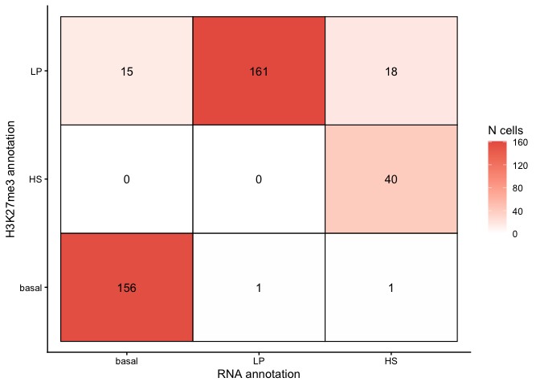

``` r
df <- df %>%
  dplyr::filter(
    facs_phenotype != "NA",
    annot_rna      != "NA"
  )

cm_facs <- df %>%
  dplyr::filter(annot_rna != "NA", facs_phenotype != "NA") %>%
  dplyr::group_by(annot_rna, facs_phenotype) %>%
  dplyr::summarise(n = sum(n), .groups = "drop") %>%
  tidyr::complete(
    annot_rna,
    facs_phenotype,
    fill = list(n = 0)
  )


p_cm_facs <- ggplot(cm_facs, aes(x = annot_rna, y = facs_phenotype, fill = n)) +
  geom_tile(color = "black", linewidth = 0.4) +   # black outline
  geom_text(aes(label = n)) +
  scale_fill_gradient(low = "white", high = mypal[1]) +
  labs(
    x = "RNA annotation",
    y = "FACS phenotype",
    fill = "N cells"
  ) +
  theme_classic()

p_cm_facs
```

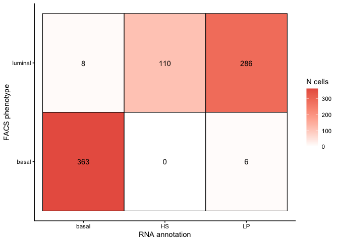

``` r
ggsave(file.path(outputDir_plots, "alluvial_k27.pdf"),
       plot = p_all_k27_nona,
       device = "pdf",
       units = "mm",
       width = 120,
       height = 120)

ggsave(file.path(outputDir_plots, "alluvial_k4.pdf"),
       plot = p_all_k4_nona,
       device = "pdf",
       units = "mm",
       width = 120,
       height = 120)


ggsave(file.path(outputDir_plots, "cm_k4.pdf"),
       plot = p_cm_k4,
       device = "pdf",
       units = "mm",
       width = 82,
       height = 60)

ggsave(file.path(outputDir_plots, "cm_k27.pdf"),
       plot = p_cm_k27,
       device = "pdf",
       units = "mm",
       width = 82,
       height = 60)

ggsave(file.path(outputDir_plots, "cm_facs.pdf"),
       plot = p_cm_facs,
       device = "pdf",
       units = "mm",
       width = 82,
       height = 50)
```

# FACS populations

## Broad

``` r
p_facs <- DimPlot(seurat, cols = cols, 
          reduction = "UMAP_spectral_rna_fl_harmony",
          group.by = c("facs_phenotype"),
          combine = TRUE)

p_facs 
```

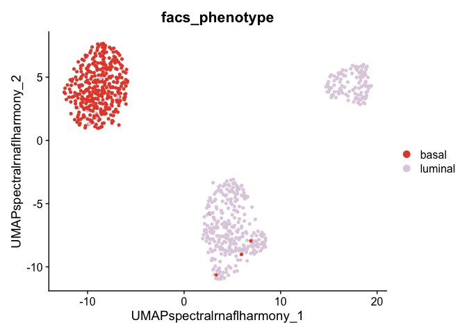

``` r
ggsave(file.path(outputDir_plots, "umap_facs_all.pdf"),
       plot = p_facs,
       device = "pdf",
       units = "mm",
       width = 115,
       height = 85)
```

## Detailed

``` r
emb <- as.data.frame(Embeddings(seurat, "UMAP_spectral_rna_fl_harmony"))
emb$cell <- rownames(emb)

meta <- seurat@meta.data
meta$cell <- rownames(meta)

df <- merge(emb, meta, by = "cell")


p_rna_facs <- ggplot(df, aes(
  x = UMAPspectralrnaflharmony_1,
  y = UMAPspectralrnaflharmony_2
)) +
  geom_point(color = "grey90", size = 1.5) +

  geom_point(
    data = subset(df, is.na(CD24_Brilliant.Violet.421.A.Compensated)),
    aes(fill = facs_phenotype_expanded),
    color = "black",        
    shape = 21,              
    stroke = 0.5,            
    size = 2.5              
  ) +
  scale_fill_manual(values = cols, name = "FACS phenotype") +

  theme_classic() +
  labs(
    x = "UMAP 1",
    y = "UMAP 2"
  )

p_rna_facs_tspan <- ggplot(df, aes(
  x = UMAPspectralrnaflharmony_1,
  y = UMAPspectralrnaflharmony_2
)) +
  geom_point(color = "grey90", size = 1.5) +
  geom_point(
    data = subset(
      df,
      is.na(CD24_Brilliant.Violet.421.A.Compensated) &
      facs_phenotype_expanded %in% c("basal-Tspan8-neg", "basal-Tspan8-pos")
    ),
    aes(fill = facs_phenotype_expanded),
    color = "black",
    shape = 21,
    stroke = 0.5,
    size = 2.5
  ) +
  scale_fill_manual(values = cols, name = "FACS phenotype") +
  theme_classic() +
  labs(x = "UMAP 1", y = "UMAP 2")


p_rna_facs
```

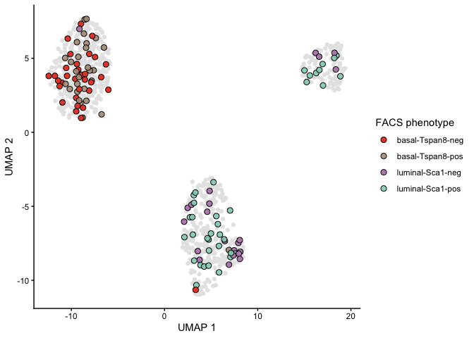

``` r
p_rna_facs_tspan
```

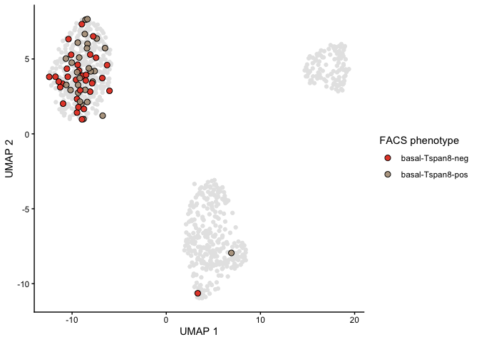

``` r
ggsave(file.path(outputDir_plots, "umap_facs_highlight.pdf"),
       plot = p_rna_facs,
       device = "pdf",
       units = "mm",
       width = 140,
       height = 80)

ggsave(file.path(outputDir_plots, "umap_facs_highlight_tspan.pdf"),
       plot = p_rna_facs_tspan,
       device = "pdf",
       units = "mm",
       width = 110,
       height = 65)
```

## Diff on FACS populations

``` r
DefaultAssay(seurat) <- "ga_h3k27me3"
Idents(seurat) <- "facs_phenotype_expanded"

tspan_pos_markers_k27 <- FindMarkers(seurat, ident.1 = "basal-Tspan8-pos", ident.2 = "basal-Tspan8-neg")
head(tspan_pos_markers_k27)

sca_pos_markers_k27 <- FindMarkers(seurat, ident.1 = "luminal-Sca1-pos", ident.2 = "luminal-Sca1-neg")
head(sca_pos_markers_k27)
```

``` r
DefaultAssay(seurat) <- "ga_h3k4me1"
Idents(seurat) <- "facs_phenotype_expanded"

tspan_pos_markers_k4 <- FindMarkers(seurat, ident.1 = "basal-Tspan8-pos", ident.2 = "basal-Tspan8-neg")
head(tspan_pos_markers_k4)

sca_pos_markers_k4 <- FindMarkers(seurat, ident.1 = "luminal-Sca1-pos", ident.2 = "luminal-Sca1-neg")
head(sca_pos_markers_k4)
```

# Coverage tracks

``` r
seurat_k27 <- AddMetaData(seurat_k27, seurat@meta.data)
seurat_k27 <- subset(seurat_k27,
                    subset = filtering == "pass" & !is.na(filtering))


seurat_k4 <- AddMetaData(seurat_k4, seurat@meta.data)
seurat_k4 <- subset(seurat_k4,
                    subset = filtering == "pass" & !is.na(filtering))


seurat_k27_exp45 <- subset(seurat_k27, subset = Exp %in% c("exp4", "exp5"))
seurat_k4_exp45 <- subset(seurat_k4, subset = Exp %in% c("exp4", "exp5"))

seurat_k27$annot_rna <- factor(
  seurat_k27$annot_rna,
  levels = c("basal", "LP", "HS")
)

seurat_k4$annot_rna <- factor(
  seurat_k4$annot_rna,
  levels = c("basal", "LP", "HS")
)
```

## Basal marker

``` r
gene = "Krt14"

Idents(seurat_k27) <- "annot_rna"
lvls <- levels(Idents(seurat_k27))
cols_k27 <- setNames(rep(mypal[3], length(lvls)), lvls)

cov_plot_k27 <- CoveragePlot(
  object = seurat_k27,
  assay = "bin_5k_h3k27me3",
  region = gene,
  window = 2000,
  annotation = TRUE,
  peaks = FALSE,
  extend.upstream = 80000,
  extend.downstream = 30000) &
  scale_fill_manual(values = cols_k27) 


Idents(seurat_k4) <- "annot_rna"
lvls <- levels(Idents(seurat_k4))
cols_k4 <- setNames(rep(mypal[2], length(lvls)), lvls)

cov_plot_k4 <-CoveragePlot(
  object = seurat_k4,
  assay = "bin_5k_h3k4me1",
  region = gene,
  window = 2000,
  annotation = TRUE,
  peaks = FALSE,
  extend.upstream = 80000,
  extend.downstream = 30000) &
  scale_fill_manual(values = cols_k4) 

cov_plot_k27
```

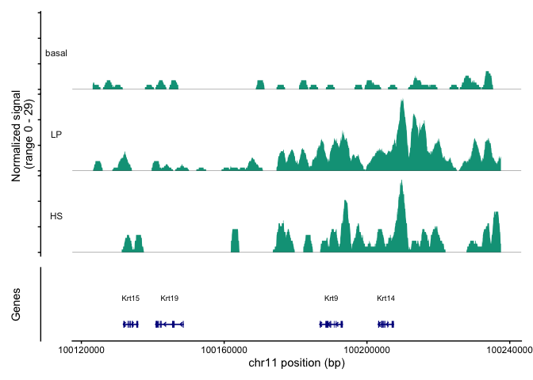

``` r
cov_plot_k4
```

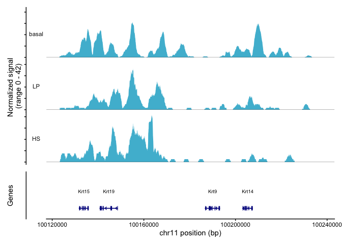

``` r
ggsave(file.path(outputDir_plots, "basal_track_k27.pdf"),
       plot = cov_plot_k27,
       device = "pdf",
       units = "mm",
       width = 200,
       height = 80)

ggsave(file.path(outputDir_plots, "basal_track_k4.pdf"),
       plot = cov_plot_k4,
       device = "pdf",
       units = "mm",
       width = 200,
       height = 80)
```

## LP marker

``` r
gene = "Kit"

Idents(seurat_k27) <- "annot_rna"
lvls <- levels(Idents(seurat_k27))
cols_k27 <- setNames(rep(mypal[3], length(lvls)), lvls)

cov_plot_k27 <- CoveragePlot(
  object = seurat_k27,
  assay = "bin_5k_h3k27me3",
  region = gene,
  window = 2000,
  annotation = TRUE,
  peaks = FALSE,
  extend.upstream = 60000,
  extend.downstream = 50000) &
  scale_fill_manual(values = cols_k27) 


Idents(seurat_k4) <- "annot_rna"
lvls <- levels(Idents(seurat_k4))
cols_k4 <- setNames(rep(mypal[2], length(lvls)), lvls)

cov_plot_k4 <-CoveragePlot(
  object = seurat_k4,
  assay = "bin_5k_h3k4me1",
  region = gene,
  window = 2000,
  annotation = TRUE,
  peaks = FALSE,
  extend.upstream = 60000,
  extend.downstream = 50000) &
  scale_fill_manual(values = cols_k4) 

cov_plot_k27
```

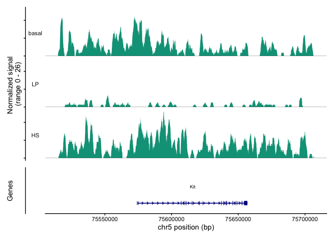

``` r
cov_plot_k4
```

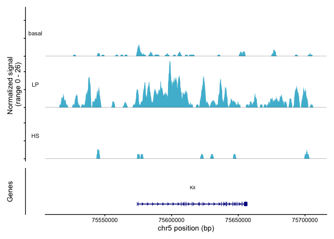

``` r
ggsave(file.path(outputDir_plots, "lp_track_k27.pdf"),
       plot = cov_plot_k27,
       device = "pdf",
       units = "mm",
       width = 200,
       height = 80)

ggsave(file.path(outputDir_plots, "lp_track_k4.pdf"),
       plot = cov_plot_k4,
       device = "pdf",
       units = "mm",
       width = 200,
       height = 80)
```

## HS marker

``` r
gene = "Gpx3"

Idents(seurat_k27) <- "annot_rna"
lvls <- levels(Idents(seurat_k27))
cols_k27 <- setNames(rep(mypal[3], length(lvls)), lvls)

cov_plot_k27 <- CoveragePlot(
  object = seurat_k27,
  assay = "bin_5k_h3k27me3",
  region = gene,
  window = 2000,
  annotation = TRUE,
  peaks = FALSE,
  extend.upstream = 30000,
  extend.downstream = 80000) &
  scale_fill_manual(values = cols_k27) 


Idents(seurat_k4) <- "annot_rna"
lvls <- levels(Idents(seurat_k4))
cols_k4 <- setNames(rep(mypal[2], length(lvls)), lvls)

cov_plot_k4 <-CoveragePlot(
  object = seurat_k4,
  assay = "bin_5k_h3k4me1",
  region = gene,
  window = 2000,
  annotation = TRUE,
  peaks = FALSE,
  extend.upstream = 30000,
  extend.downstream = 80000) &
  scale_fill_manual(values = cols_k4) 

cov_plot_k27
```

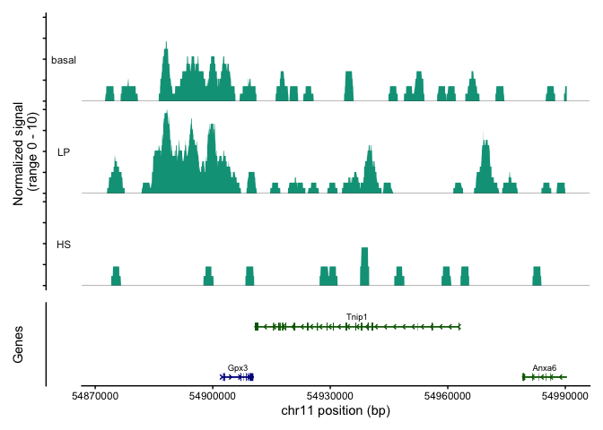

``` r
cov_plot_k4
```

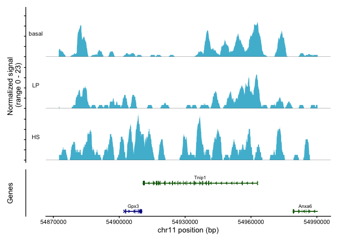

``` r
ggsave(file.path(outputDir_plots, "hs_track_k27.pdf"),
       plot = cov_plot_k27,
       device = "pdf",
       units = "mm",
       width = 200,
       height = 80)

ggsave(file.path(outputDir_plots, "hs_track_k4.pdf"),
       plot = cov_plot_k4,
       device = "pdf",
       units = "mm",
       width = 200,
       height = 80)
```

## Gene expression inside tracks

``` r
seurat$annot_rna <- factor(
  seurat$annot_rna,
  levels = c("basal", "LP", "HS")
)


p_genes <- VlnPlot(
  seurat,
  assay = "SCT_fl",
  features = c("Krt14", "Kit", "Gpx3"),
  group.by = "annot_rna",
  cols = cols
)

p_genes
```

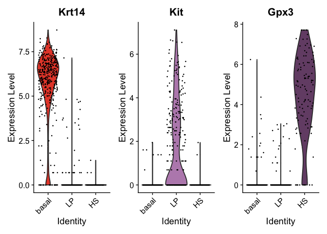

``` r
ggsave(file.path(outputDir_plots, "track_genes.pdf"),
       plot = p_genes,
       device = "pdf",
       units = "mm",
       width = 150,
       height = 70)
```

# Motif calculation

``` r
library(TFBSTools)
library(BSgenome.Mmusculus.UCSC.mm10)
library(JASPAR2020)
library(chromVARmotifs)

data("mouse_pwms_v2")

pfm <- getMatrixSet(
  x = JASPAR2020,
  opts = list(collection = "CORE",
              tax_group = 'vertebrates',
              species = "Mus musculus",  
              all_versions = FALSE)
)

pwm_jaspar_mouse <- toPWM(pfm)
pwm_all <- c(pwm_jaspar_mouse, mouse_pwms_v2)

seurat <- AddMotifs(
  object = seurat,
  assay = "bin_5k_h3k4me1",
  genome = BSgenome.Mmusculus.UCSC.mm10,
  pfm = pwm_all
)

seurat <- AddMotifs(
  object = seurat,
  assay = "bin_5k_h3k27me3",
  genome = BSgenome.Mmusculus.UCSC.mm10,
  pfm = pwm_all
)
```

# MOFA

## Preparation

``` r
for (i in c("SCT_fl"
            )) {
  seurat <- FindTopFeatures(
    seurat,
    assay = i,
    min.cutoff = "q55"
  )
  cat(i, ":", length(VariableFeatures(seurat, assay = i)), "\n")
}

for (i in c("bin_5k_h3k4me1", "bin_5k_h3k27me3"
            )) {
  seurat <- FindTopFeatures(
    seurat,
    assay = i,
    min.cutoff = "q97"
  )
  cat(i, ":", length(VariableFeatures(seurat, assay = i)), "\n")
}
```

``` r
assays_use <- c("SCT_fl", "bin_5k_h3k4me1", "bin_5k_h3k27me3")


features_list <- lapply(assays_use, function(a) {
  VariableFeatures(seurat, assay = a)
})

names(features_list) <- assays_use

views <- lapply(names(features_list), function(a) {
  mat <- GetAssayData(seurat, assay = a, layer = "data")
  feats <- intersect(rownames(mat), features_list[[a]])
  mat[feats, , drop = FALSE]
})
names(views) <- names(features_list)

all_cells <- Reduce(union, lapply(views, colnames))


fill_view <- function(mat, all_cells) {
  mat <- as.matrix(mat)

  full <- matrix(
    NA_real_,                                   
    nrow = nrow(mat),
    ncol = length(all_cells),
    dimnames = list(rownames(mat), all_cells)
  )

  common <- intersect(colnames(mat), all_cells)
  full[, common] <- as.matrix(mat[, common, drop = FALSE])

  full
}

views_full <- lapply(views, fill_view, all_cells = all_cells)
```

``` r
md <- seurat@meta.data
md$sample <- rownames(md)
```

``` r
library(MOFA2)
mofa <- create_mofa(views_full)


cells_mofa <- unlist(samples_names(mofa))
md <- md[cells_mofa, , drop = FALSE]
md$sample <- cells_mofa

samples_metadata(mofa) <- md

model_opts <- get_default_model_options(mofa)

model_opts$num_factors <- 15
model_opts$ard_factors        <- TRUE   
model_opts$ard_weights        <- TRUE     
model_opts$spikeslab_weights  <- TRUE


mofa <- prepare_mofa(mofa,
  model_options = model_opts
)
```

## Training

``` r
mofa <- run_mofa(mofa, use_basilisk = FALSE)
mofa <- run_mofa(mofa, use_basilisk = TRUE)
```

``` r
saveRDS(mofa, file.path(outputDir_objects, "mofa_trained.rds"))
```

## Quick quality check

``` r
plot_variance_explained(mofa) +
                                  scale_fill_gradient(
                                    low = "white",
                                    high = "darkblue",
                                    trans = "sqrt"
                                  )
correlate_factors_with_covariates(mofa, 
  covariates = c("nCount_RNA_fl","nFeature_RNA_fl","frequency_count", "FRiP", "Exp")
  )
```

Factors 1 and 3 are partially technical.

## Import factor values to Seurat

``` r
Z <- MOFA2::get_factors(mofa, factors = "all", as.data.frame = TRUE)

Z <- Z %>%
  select(sample, factor, value) %>%
  pivot_wider(names_from = factor, values_from = value) %>%
  tibble::column_to_rownames("sample")

seurat <- AddMetaData(seurat, Z)

seurat[["mofa"]] <- CreateDimReducObject(
  embeddings = as.matrix(Z),         
  key = "MOFA_",
  assay = "RNA_fl"
)
```

# Reload step 7

``` r
saveRDS(seurat, file.path(outputDir_objects, "seurat_step7.rds"))
```

``` r
seurat <- readRDS(file.path(outputDir_objects, "seurat_step7.rds"))
mofa <- readRDS(file.path(outputDir_objects, "mofa_trained.rds"))
```

``` r
write.csv(seurat@meta.data, file.path(outputDir_tables, "mouse_mammary_gland_metadata_final.csv"))
```

# MOFA factor characterisation

## Variance decomposition

``` r
library(MOFA2)
p_mofa <- plot_variance_explained(mofa) +
                                  scale_fill_gradient(
                                    low = "white",
                                    high = "darkblue",
                                    trans = "sqrt"
                                  )
#square-root scale
p_mofa
```

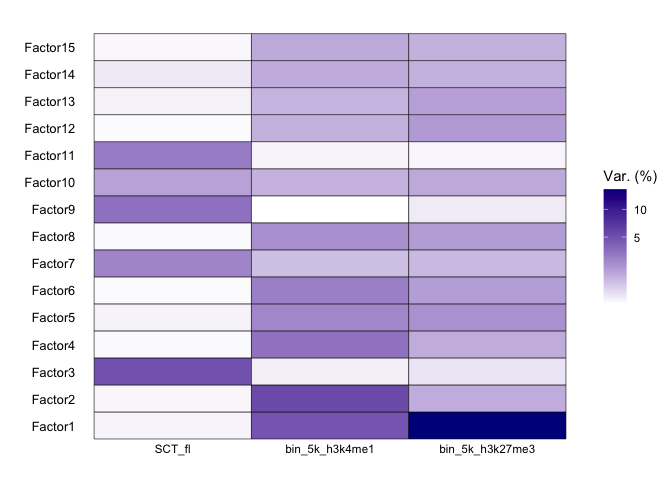

``` r
p_mofa2 <- plot_variance_explained(mofa, plot_total = TRUE)[[2]] +
                                   scale_fill_manual(values = mypal) +
                                   scale_colour_manual(values = mypal) +
                                      theme(
                                        axis.text.x = element_text(angle = 45, hjust = 1, vjust = 1))
p_mofa2
```

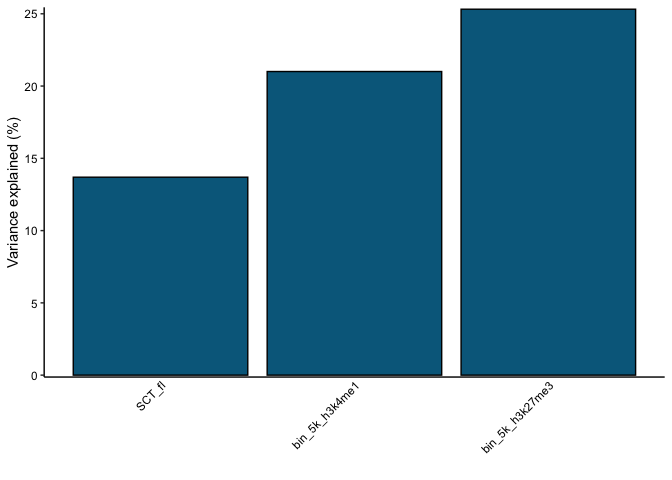

``` r
ggsave(file.path(outputDir_plots, "var_decomp_heat.pdf"),
       plot = p_mofa ,
       device = "pdf",
       units = "mm",
       width = 100,
       height = 120)

ggsave(file.path(outputDir_plots, "var_decomp_bar.pdf"),
       plot = p_mofa2,
       device = "pdf",
       units = "mm",
       width = 60,
       height = 80)
```

``` r
p_covar <- correlate_factors_with_covariates(mofa, 
  covariates = c("nCount_RNA_fl","nFeature_RNA_fl","frequency_count", "FRiP", "Exp")
  )

p_covar
```

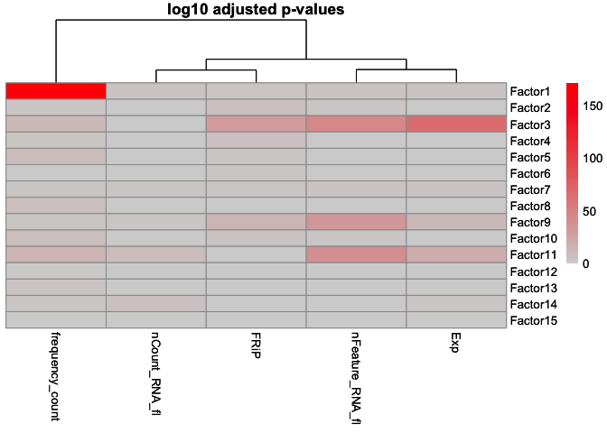

Factors 1 & 3 are partially technical.

``` r
ggsave(file.path(outputDir_plots, "covar_mofa.pdf"),
       plot = p_covar,
       device = "pdf",
       units = "mm",
       width = 80,
       height = 100)
```

## Factor values

``` r
p_factors_p1 <- plot_factor(
  mofa,
  factors = c(1:8),
  dot_size = 2.5,
  group_by = "annot_rna",
  color_by = "annot_rna"
) + scale_fill_manual(values = cols) +
  coord_cartesian(ylim = c(-6, 10))

p_factors_p2 <- plot_factor(
  mofa,
  factors = c(9:15),
  dot_size = 2.5,
  group_by = "annot_rna",
  color_by = "annot_rna"
) + scale_fill_manual(values = cols) +
  coord_cartesian(ylim = c(-8, 8))


p_factors_p1
```

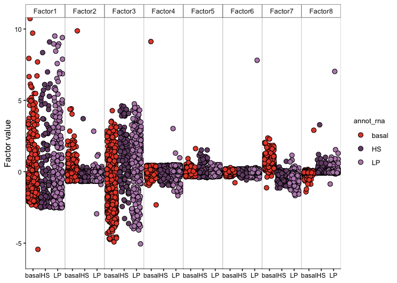

``` r
p_factors_p2
```

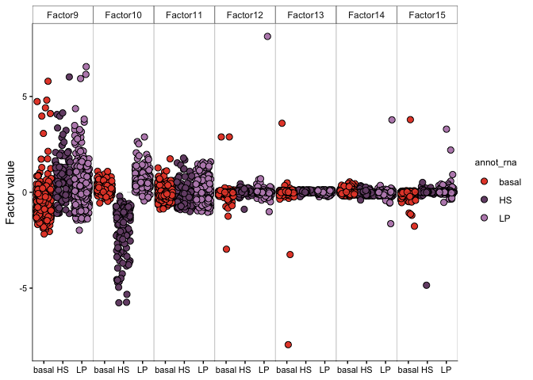

``` r
p_all <- p_factors_p1/p_factors_p2
p_all
```

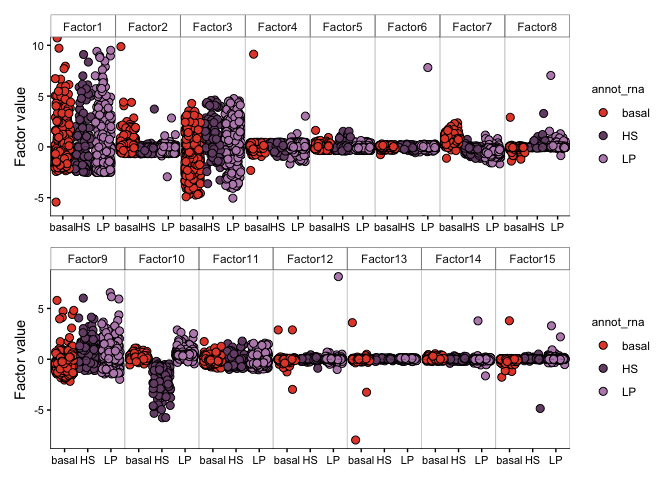

``` r
ggsave(file.path(outputDir_plots, "mofa_factors_all.pdf"),
       plot = p_all,
       device = "pdf",
       units = "mm",
       width = 180,
       height = 150)
```

## Motif enrichment in MOFA factors

``` r
motif.matrix.k4 <- t(as.matrix(seurat[["bin_5k_h3k4me1"]]@motifs@data))
motif.matrix.k27 <- t(as.matrix(seurat[["bin_5k_h3k27me3"]]@motifs@data))

motif.enrichment.pos.k4 <- MOFA2::run_enrichment(mofa,
  view = "bin_5k_h3k4me1", 
  factors = 1:15,
  feature.sets = motif.matrix.k4,
  sign = "positive"
)


motif.enrichment.neg.k4 <- MOFA2::run_enrichment(mofa,
  view = "bin_5k_h3k4me1", 
  factors = 1:15,
  feature.sets = motif.matrix.k4,
  sign = "negative"
)


motif.enrichment.pos.k27 <- MOFA2::run_enrichment(mofa,
  view = "bin_5k_h3k27me3", 
  factors = 1:15,
  feature.sets = motif.matrix.k27,
  sign = "positive"
)


motif.enrichment.neg.k27 <- MOFA2::run_enrichment(mofa,
  view = "bin_5k_h3k27me3", 
  factors = 1:15,
  feature.sets = motif.matrix.k27,
  sign = "negative"
)
```

``` r
rename_enrichment_motifs <- function(enrich, id2name, keep_id = TRUE) {

  rename_ids <- function(ids) {
    nm <- unname(id2name[ids])
    nm <- as.character(nm)

    # treat empty / NULL-like as missing
    nm[nm %in% c("", "NA", "NULL")] <- NA_character_

    # fallback to motif ID
    nm[is.na(nm)] <- ids[is.na(nm)]

    if (keep_id) {
      nm <- paste0(nm, " (", ids, ")")
    }

    make.unique(nm)
  }

  # matrices with pathway IDs as rownames
  old_ids <- rownames(enrich$pval)
  new_ids <- rename_ids(old_ids)

  rownames(enrich$feature.sets)   <- new_ids
  rownames(enrich$pval)           <- new_ids
  rownames(enrich$pval.adj)       <- new_ids
  rownames(enrich$set.statistics) <- new_ids

  enrich$sigPathways <- lapply(enrich$sigPathways, function(x) {
    if (length(x) == 0) return(x)
    rename_ids(x)
  })

  enrich
}

id2name_k4  <- seurat[["bin_5k_h3k4me1"]]@motifs@motif.names
id2name_k27 <- seurat[["bin_5k_h3k27me3"]]@motifs@motif.names

enrichments_k4 <- list(
  pos_k4  = motif.enrichment.pos.k4,
  neg_k4  = motif.enrichment.neg.k4
)

enrichments_k27 <- list(
  pos_k27 = motif.enrichment.pos.k27,
  neg_k27 = motif.enrichment.neg.k27
)

enrichments_k4 <- lapply(
  enrichments_k4,
  rename_enrichment_motifs,
  id2name = id2name_k4,
  keep_id = TRUE
)

enrichments_k27 <- lapply(
  enrichments_k27,
  rename_enrichment_motifs,
  id2name = id2name_k27,
  keep_id = TRUE
)

motif.enrichment.pos.k4  <- enrichments_k4$pos_k4
motif.enrichment.neg.k4  <- enrichments_k4$neg_k4
motif.enrichment.pos.k27 <- enrichments_k27$pos_k27
motif.enrichment.neg.k27 <- enrichments_k27$neg_k27

rm(id2name_k4)
rm(id2name_k27)
rm(motif.matrix.k4)
rm(motif.matrix.k27)
rm(enrichments_k4)
rm(enrichments_k27)
```

``` r
write.csv(
  subset(
    data.frame(
      pathway = rep(rownames(motif.enrichment.pos.k4$pval),
                    times = ncol(motif.enrichment.pos.k4$pval)),
      factor  = rep(colnames(motif.enrichment.pos.k4$pval),
                    each  = nrow(motif.enrichment.pos.k4$pval)),
      pval    = as.vector(motif.enrichment.pos.k4$pval),
      pval_adj = as.vector(motif.enrichment.pos.k4$pval.adj),
      set_statistic = as.vector(motif.enrichment.pos.k4$set.statistics),
      stringsAsFactors = FALSE
    ),
    pval_adj < 0.05
  ),
  file = file.path(outputDir_tables, "motif.enrichment.pos.k4_all_stats_sig.csv"),
  row.names = FALSE
)

write.csv(
  subset(
    data.frame(
      pathway = rep(rownames(motif.enrichment.neg.k4$pval),
                    times = ncol(motif.enrichment.neg.k4$pval)),
      factor  = rep(colnames(motif.enrichment.neg.k4$pval),
                    each  = nrow(motif.enrichment.neg.k4$pval)),
      pval    = as.vector(motif.enrichment.neg.k4$pval),
      pval_adj = as.vector(motif.enrichment.neg.k4$pval.adj),
      set_statistic = as.vector(motif.enrichment.neg.k4$set.statistics),
      stringsAsFactors = FALSE
    ),
    pval_adj < 0.05
  ),
  file = file.path(outputDir_tables, "motif.enrichment.neg.k4_all_stats_sig.csv"),
  row.names = FALSE
)

write.csv(
  subset(
    data.frame(
      pathway = rep(rownames(motif.enrichment.pos.k27$pval),
                    times = ncol(motif.enrichment.pos.k27$pval)),
      factor  = rep(colnames(motif.enrichment.pos.k27$pval),
                    each  = nrow(motif.enrichment.pos.k27$pval)),
      pval    = as.vector(motif.enrichment.pos.k27$pval),
      pval_adj = as.vector(motif.enrichment.pos.k27$pval.adj),
      set_statistic = as.vector(motif.enrichment.pos.k27$set.statistics),
      stringsAsFactors = FALSE
    ),
    pval_adj < 0.05
  ),
  file = file.path(outputDir_tables, "motif.enrichment.pos.k27_all_stats_sig.csv"),
  row.names = FALSE
)

write.csv(
  subset(
    data.frame(
      pathway = rep(rownames(motif.enrichment.neg.k27$pval),
                    times = ncol(motif.enrichment.neg.k27$pval)),
      factor  = rep(colnames(motif.enrichment.neg.k27$pval),
                    each  = nrow(motif.enrichment.neg.k27$pval)),
      pval    = as.vector(motif.enrichment.neg.k27$pval),
      pval_adj = as.vector(motif.enrichment.neg.k27$pval.adj),
      set_statistic = as.vector(motif.enrichment.neg.k27$set.statistics),
      stringsAsFactors = FALSE
    ),
    pval_adj < 0.05
  ),
  file = file.path(outputDir_tables, "motif.enrichment.neg.k27_all_stats_sig.csv"),
  row.names = FALSE
)
```

## Epigenomic only factor - 2

``` r
p_f2_annot_rna <- plot_factor(
  mofa,
  factors = c(2),
  dot_size = 2.5,
  group_by = "annot_rna",
  color_by = "annot_rna"
) + scale_fill_manual(values = cols) +
  coord_cartesian(ylim = c(-2, 10))

p_f2_annot_rna
```

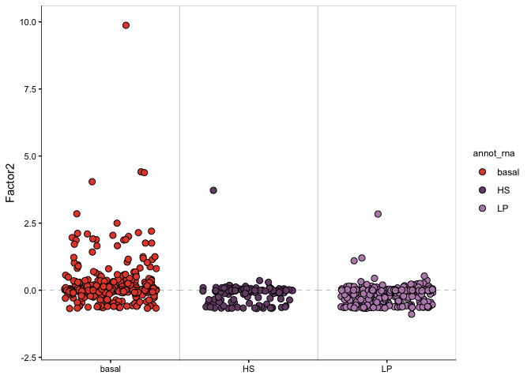

``` r
p_motifs_f2_pos_k4 <- MOFA2::plot_enrichment(motif.enrichment.pos.k4, factor = 2, max.pathways = 10)
p_motifs_f2_neg_k4 <- MOFA2::plot_enrichment(motif.enrichment.neg.k4, factor = 2, max.pathways = 10)

#p_motifs_f2_pos_k27 <- MOFA2::plot_enrichment(motif.enrichment.pos.k27, factor = 2, max.pathways = 25) # no sig 
#p_motifs_f2_neg_k27 <- MOFA2::plot_enrichment(motif.enrichment.neg.k27, factor = 2, max.pathways = 20) # few sig

p_motifs_f2_pos_k4
```

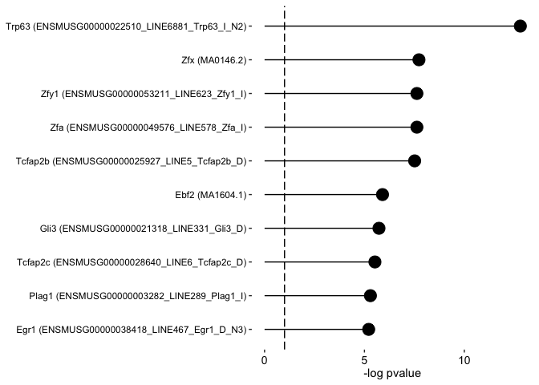

``` r
p_motifs_f2_neg_k4
```

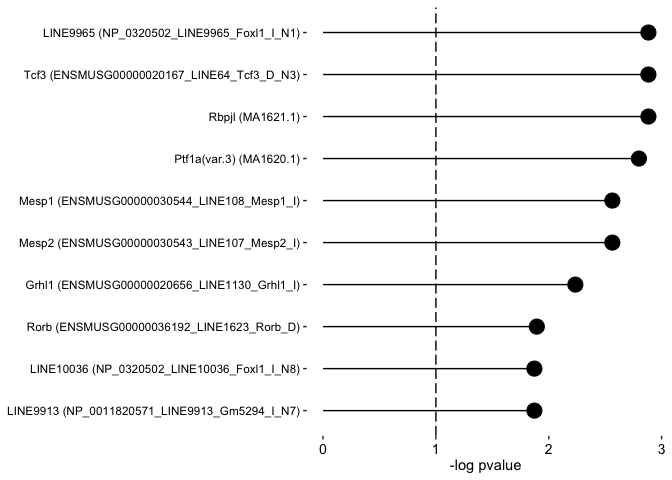

Replot the same, but with adjusted p-values

``` r
df_f2_k4_neg <- data.frame(
  motif  = rownames(motif.enrichment.neg.k4$pval.adj),
  pval_adj = motif.enrichment.neg.k4$pval.adj[, 2],
  pval     = motif.enrichment.neg.k4$pval[, 2]
)

df_f2_k4_neg <- df_f2_k4_neg[order(df_f2_k4_neg$pval_adj), ][1:10, ]

p_f2_k4_neg <- ggplot(df_f2_k4_neg,
       aes(x = -log10(pval_adj),
           y = reorder(motif, pval_adj, decreasing = TRUE))) +
  geom_segment(aes(x = 0, xend = -log10(pval_adj),
                   y = motif, yend = motif)) +
  geom_point(size = 4, shape = 21, fill = mypal[2], colour = "black", stroke = 0.8, alpha =1) +
  geom_vline(xintercept = -log10(0.05), linetype = "dashed") +
  labs(
    x = "-log10(adjusted p-value)",
    y = NULL,
    title = "Motif enrichment (Factor 2, -weights, H3K4me1)"
  ) +
  theme_classic()


df_f2_k4_pos <- data.frame(
  motif  = rownames(motif.enrichment.pos.k4$pval.adj),
  pval_adj = motif.enrichment.pos.k4$pval.adj[, 2],
  pval     = motif.enrichment.pos.k4$pval[, 2]
)

df_f2_k4_pos <- df_f2_k4_pos[order(df_f2_k4_pos$pval_adj), ][1:10, ]

p_f2_k4_pos <- ggplot(df_f2_k4_pos,
       aes(x = -log10(pval_adj),
           y = reorder(motif, pval_adj, decreasing = TRUE))) +
  geom_segment(aes(x = 0, xend = -log10(pval_adj),
                   y = motif, yend = motif)) +
  geom_point(size = 4, shape = 21, fill = mypal[2], colour = "black", stroke = 0.8, alpha =1) +
  geom_vline(xintercept = -log10(0.05), linetype = "dashed") +
  labs(
    x = "-log10(adjusted p-value)",
    y = NULL,
    title = "Motif enrichment (Factor 2, +weights, H3K4me1)"
  ) +
  theme_classic()

p_f2_k4_neg
```

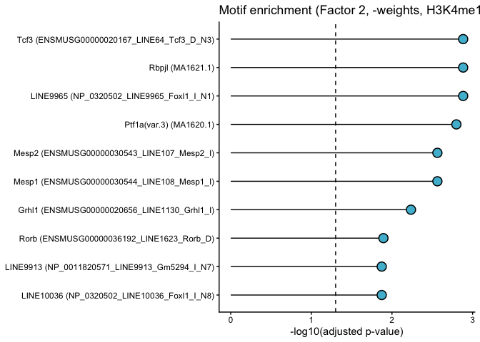

``` r
p_f2_k4_pos
```

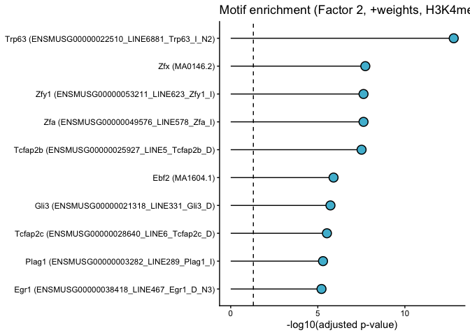

``` r
ggsave(file.path(outputDir_plots, "mofa_dots_f2.pdf"),
       plot = p_f2_annot_rna,
       device = "pdf",
       units = "mm",
       width = 70,
       height = 55)

ggsave(file.path(outputDir_plots, "motifs_f2_pos_k4_mouse.pdf"),
       plot = p_f2_k4_neg,
       device = "pdf",
       units = "mm",
       width = 140,
       height = 65)

ggsave(file.path(outputDir_plots, "motifs_f2_neg_k4_mouse.pdf"),
       plot = p_f2_k4_pos,
       device = "pdf",
       units = "mm",
       width = 140,
       height = 65)
```

## Shared factor - 7

``` r
p_f7_annot_rna <- plot_factor(
  mofa,
  factors = c(7),
  group_by = "annot_rna",
  color_by = "annot_rna",
  dot_size = 2.5
) + scale_fill_manual(values = cols)

p_f7_annot_rna
```

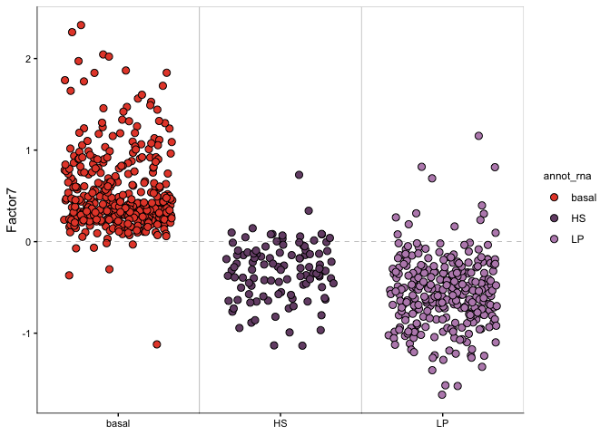

``` r
p_f7_genes_pos <- plot_top_weights(mofa, 
  view = "SCT_fl", 
  factors = 7, 
  sign = "positive",
  nfeatures = 10,
)

p_f7_genes_neg <- plot_top_weights(mofa, 
  view = "SCT_fl", 
  factors = 7, 
  sign = "negative",
  nfeatures = 10,
)

p_motifs_f7_k4_pos <- MOFA2::plot_enrichment(motif.enrichment.pos.k4, factor = 7, max.pathways = 10)
#p_motifs_f7_k4_neg <- MOFA2::plot_enrichment(motif.enrichment.neg.k4, factor = 7, max.pathways = 5) #no sig
p_motifs_f7_k27_pos <- MOFA2::plot_enrichment(motif.enrichment.pos.k27, factor = 7, max.pathways = 10)
p_motifs_f7_k27_neg <- MOFA2::plot_enrichment(motif.enrichment.neg.k27, factor = 7, max.pathways = 10)


p_f7_genes_pos
```

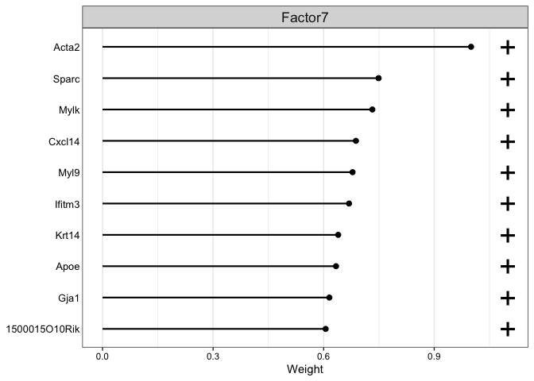

``` r
p_f7_genes_neg
```

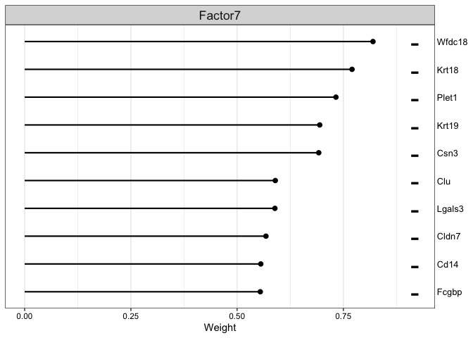

``` r
p_motifs_f7_k4_pos
```

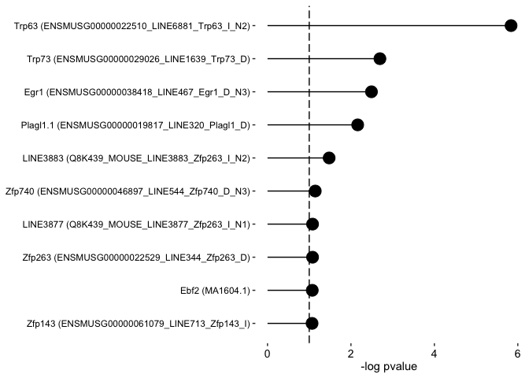

``` r
p_motifs_f7_k27_pos
```

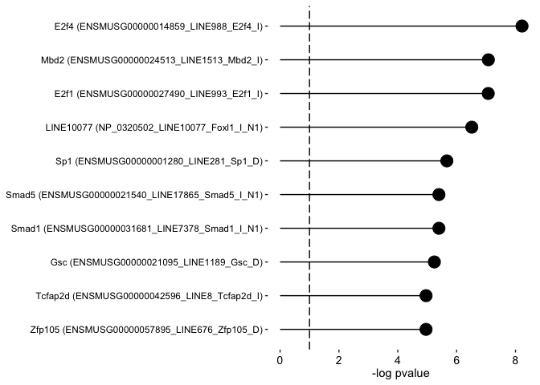

``` r
p_motifs_f7_k27_neg
```

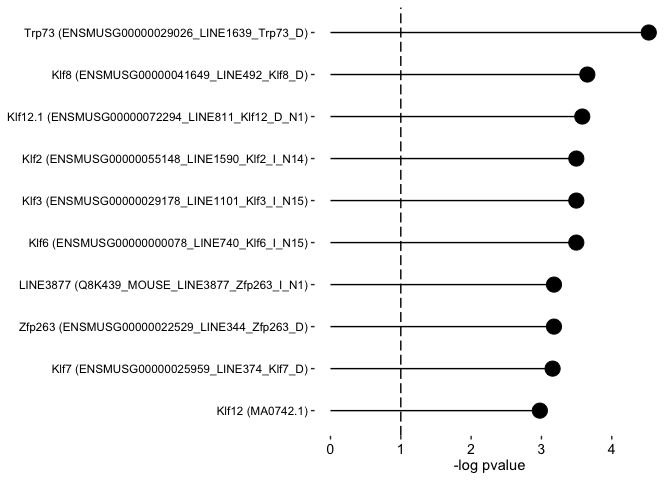

Replot the same, but with adjusted p-values

``` r
df_f7_k4_pos <- data.frame(
  motif  = rownames(motif.enrichment.pos.k4$pval.adj),
  pval_adj = motif.enrichment.pos.k4$pval.adj[, 7],
  pval     = motif.enrichment.pos.k4$pval[, 7]
)

df_f7_k4_pos <- df_f7_k4_pos[order(df_f7_k4_pos$pval_adj), ][1:10, ]

p_f7_k4_pos <- ggplot(df_f7_k4_pos,
       aes(x = -log10(pval_adj),
           y = reorder(motif, pval_adj, decreasing = TRUE))) +
  geom_segment(aes(x = 0, xend = -log10(pval_adj),
                   y = motif, yend = motif)) +
  geom_point(size = 4, shape = 21, fill = mypal[2], colour = "black", stroke = 0.8, alpha =1) +
  geom_vline(xintercept = -log10(0.05), linetype = "dashed") +
  labs(
    x = "-log10(adjusted p-value)",
    y = NULL,
    title = "Motif enrichment (Factor 7, +weights, H3K4me1)"
  ) +
  theme_classic()


df_f7_k27_neg <- data.frame(
  motif  = rownames(motif.enrichment.neg.k27$pval.adj),
  pval_adj = motif.enrichment.neg.k27$pval.adj[, 7],
  pval     = motif.enrichment.neg.k27$pval[, 7]
)

df_f7_k27_neg <- df_f7_k27_neg[order(df_f7_k27_neg$pval_adj), ][1:10, ]

p_f7_k27_neg <- ggplot(df_f7_k27_neg,
       aes(x = -log10(pval_adj),
           y = reorder(motif, pval_adj, decreasing = TRUE))) +
  geom_segment(aes(x = 0, xend = -log10(pval_adj),
                   y = motif, yend = motif)) +
  geom_point(size = 4, shape = 21, fill = mypal[3], colour = "black", stroke = 0.8, alpha =1) +
  geom_vline(xintercept = -log10(0.05), linetype = "dashed") +
  labs(
    x = "-log10(adjusted p-value)",
    y = NULL,
    title = "Motif enrichment (Factor 7, -weights, H3K27me3)"
  ) +
  theme_classic()

p_f7_k27_neg
```

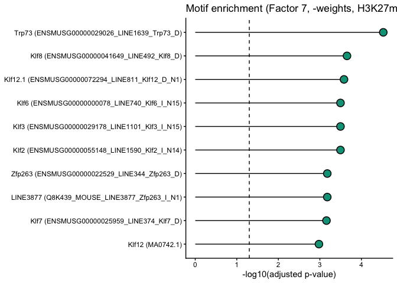

``` r
p_f7_k4_pos
```

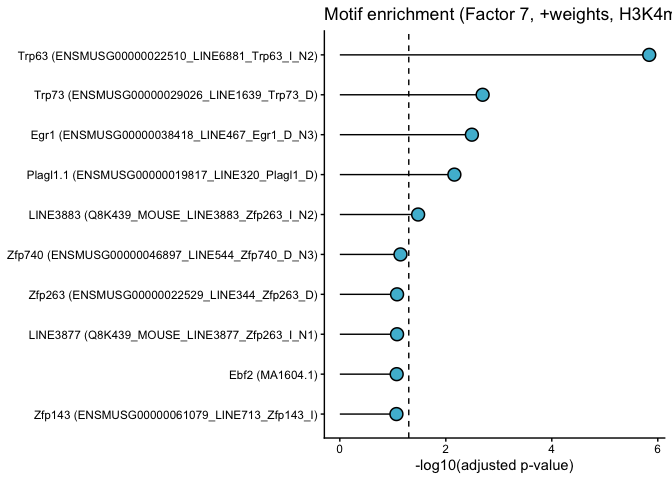

``` r
ggsave(file.path(outputDir_plots, "mofa_dots_f7.pdf"),
       plot = p_f7_annot_rna,
       device = "pdf",
       units = "mm",
       width = 70,
       height = 60)

ggsave(file.path(outputDir_plots, "motifs_f7_k4pos.pdf"),
       plot = p_f7_k4_pos,
       device = "pdf",
       units = "mm",
       width = 140,
       height = 65)

ggsave(file.path(outputDir_plots, "motifs_f7_k27_pos.pdf"),
       plot = p_motifs_f7_k27_pos,
       device = "pdf",
       units = "mm",
       width = 140,
       height = 65)

ggsave(file.path(outputDir_plots, "motifs_f7_k27_neg.pdf"),
       plot = p_f7_k27_neg,
       device = "pdf",
       units = "mm",
       width = 140,
       height = 65)

ggsave(file.path(outputDir_plots, "genes_f7_pos.pdf"),
       plot = p_f7_genes_pos,
       device = "pdf",
       units = "mm",
       width = 70,
       height = 70)

ggsave(file.path(outputDir_plots, "genes_f7_neg.pdf"),
       plot = p_f7_genes_neg,
       device = "pdf",
       units = "mm",
       width = 70,
       height = 70)
```
