# 4.1_multiome_transplantations_preprocessing
Anna Schwager
2026-02-04

# Python setup

``` r
library(reticulate)
use_condaenv(
  "snap_py310",
  conda = "/Users/annaschwager/miniforge3/bin/conda",
  required = TRUE
)

#py_config()
```

``` python
import sys
import numpy as np
import pandas as pd
from pathlib import Path
import scanpy as sc
import snapatac2 as snap
import skmisc

#print("sys.executable:", sys.executable)
#print("scanpy:", sc.__version__)
#print("snapatac2:", snap.__version__)
```

# R setup

``` r
here::i_am("scripts/4.1_multiome_transplantations_preprocessing.qmd")
mainDir = here::here()
source(knitr::purl(file.path(mainDir,"scripts/global_variables.Rmd"), quiet=TRUE))
source(knitr::purl(file.path(mainDir, "scripts/functions.Rmd"), quiet=TRUE))

set.seed(123)
```

# Setting directories and input files

``` r
inputDir_local = file.path(inputDir, "mm10", "transplantations", "one_cell_multiome")
inputDir_mouse_mammary_gland = file.path(outputDir, "3.1_multiome_mouse_mammary_gland_preprocessing", "objects")

outputDir_local = file.path(outputDir, "4.1_multiome_transplantations_preprocessing") ; if(!file.exists(outputDir_local)){dir.create(outputDir_local)}
outputDir_objects = file.path(outputDir_local, "objects") ; if(!file.exists(outputDir_objects)){dir.create(outputDir_objects)}
outputDir_plots = file.path(outputDir_local, "plots") ; if(!file.exists(outputDir_plots)){dir.create(outputDir_plots)}
outputDir_tables = file.path(outputDir_local, "tables") ; if(!file.exists(outputDir_tables)){dir.create(outputDir_tables)}

snap_dir <- file.path(outputDir_objects, "snap_export") ; if(!file.exists(snap_dir )){dir.create(snap_dir)}
```

``` r
ld <- list.dirs(inputDir_local)

fragpaths <- list.files(ld[grepl("/.*fragmentFiles", ld)], full.names = TRUE)
fragpaths <- fragpaths[grepl("/.*fragmentFiles/.*tsv.gz$", fragpaths)]
names(fragpaths) <- sub(".*_(.*?)(?:-cell)?\\.fragments\\.tsv\\.gz$", "\\1", basename(fragpaths))
```

``` r
rnapaths <- list.dirs(ld[grepl("/.*flash", ld)], full.names = TRUE)
rnapaths_umi <- unique(rnapaths[grepl("/.*10XlikeMatrix_umi$", rnapaths)])
rnapaths_fl <- unique(rnapaths[grepl("/.*10XlikeMatrix_read$", rnapaths)])

rnapaths <- list(rnapaths_umi, rnapaths_fl)
names(rnapaths) <- c("umi", "full_length")
```

## Loading annotation

``` r
consensus_peaks <- list("h3k27me3" = toGRanges(file.path(annotDir, "CREneg_peaks_h3k27me3.bed"), format="BED", header=FALSE),
                        "h3k4me1" = toGRanges(file.path(annotDir, "CREneg_peaks_h3k4me1.bed"), format="BED", header=FALSE))

ref_inhouse <- read.delim(file.path(annotDir, "Landragin2025_CreN_mammary_gland_markers.txt"))
ref_visvader <- read.delim(file.path(annotDir, "Visvader2010_mammary_gland_markers.txt"))
```

## Loading FACS metadata

``` r
meta_path <- list.files(ld[grepl("/metadata", ld)], full.names = TRUE)

metadata <- read.csv(meta_path)
rownames(metadata) <- metadata$BC_epi
```

# Object creation

``` r
mark = "h3k4me1"

seurat_list <- lapply(names(fragpaths), function(exp_id) {
    
    message(paste0("### Processing ", exp_id))
    
    fragpath <- fragpaths[[exp_id]]
    
    message("### Counting fragments")
    total_counts <- CountFragments(fragpath)
    barcodes <- total_counts$CB

    message("### Creating fragment object")
    frags <- CreateFragmentObject(path = fragpath, cells = barcodes)
    
    message("### Making 50k bin matrix")
    bin50k_kmatrix <- GenomeBinMatrix(
      frags,
      genome = mm10,
      cells = NULL,
      binsize = 50000,
      process_n = 10000,
      sep = c(":", "_"),
      verbose = TRUE)
    
    bin5k_kmatrix <- GenomeBinMatrix(
      frags,
      genome = mm10,
      cells = NULL,
      binsize = 5000,
      process_n = 30000,
      sep = c(":", "_"),
      verbose = TRUE)
          
    message("### Making peak matrix")
    peak_matrix <- FeatureMatrix(
      frags,
      features = consensus_peaks[[mark]],
      cells = NULL,
      sep = c("-", "-"),
      verbose = TRUE)
    
    message("### Creating chromatin assay")
    chrom_assay <- CreateChromatinAssay(
      counts = bin5k_kmatrix,
      sep = c(":", "_"),
      genome = "mm10",
      fragments = fragpath,
      min.cells = 1,
      min.features = -1)
    
    message("### Creating Seurat object")
    seurat <- CreateSeuratObject(
      counts = chrom_assay,
      assay = "bin_5k_h3k4me1")
    
    message("### Adding peak assay")
    seurat[["peaks_h3k4me1"]] <- CreateChromatinAssay(
      counts = peak_matrix, genome = "mm10")
    
    message("### Adding other bins")
    seurat[["bin_50k_h3k4me1"]] <- CreateChromatinAssay(
      counts   = bin50k_kmatrix,
      genome   = "mm10",
      sep      = c(":", "_"),
      fragments = fragpath,
      min.cells = 1,
      min.features = -1)
    
    message("### Adding gene activity matrix")
    Annotation(seurat) <- annotations_mm10
    
    ga_matrix <- GeneActivity(seurat,
                              assay = "bin_5k_h3k4me1",
                              extend.upstream = 5000,
                              extend.downstream = 0,
                              process_n = 3000)
    assay_name <- "ga_h3k4me1"
    seurat[[assay_name]] <- CreateAssayObject(counts = ga_matrix)
    
    seurat <- AddMetaData(seurat, total_counts)
    seurat <- FRiP(seurat, assay = "peaks_h3k4me1", total.fragments = "frequency_count")
    seurat$orig.ident <- exp_id
    
    return(seurat)
    
}) |> setNames(names(fragpaths))

saveRDS(seurat_list, file.path(outputDir_objects, "seurat_list_step0.rds"))
```

``` r
seurat_d0 <- merge(seurat_list[["p1-Day0-BCP13"]], 
                c(seurat_list[["p2-Day0-BCP13"]],
                  seurat_list[["p3-Day0-LCP11"]],
                  seurat_list[["p4-Day0-HyP14"]],
                  seurat_list[["p11-Day0-LCP11"]],
                  seurat_list[["p10-Day0-P11LC"]],
                  seurat_list[["p12-Day0-P14Hy"]],
                  seurat_list[["p9-Day0-BCP13"]]))

seurat_d4.5 <- merge(seurat_list[["p13-Day4d5-allepithP15"]],
                c(seurat_list[["p14-Day4d5-allepithP15"]],
                  seurat_list[["p5-Day4d5-BCHyLCP16"]],
                  seurat_list[["p7-Day4d5-BCHyP15"]],
                  seurat_list[["p8-Day4d5-BCHyLCP16"]]))

seurat <- merge(seurat_d0, seurat_d4.5)
seurat <- AddMetaData(seurat, metadata)
```

``` r
rna_seurat_list <- lapply(rnapaths, function(p) {
  rna.data <- Read10X(data.dir = p)
  CreateSeuratObject(
    counts = rna.data,
    min.cells = 1,
    min.features = -1,
    project = "transplantations"
  )
})

#remove the _umi_Counts.tsv.gz from the UMI RNA cell barcodes so that they match the full length RNA barcodes

rna_seurat_list[["umi"]] <- {
  s <- rna_seurat_list[["umi"]]
  colnames(s) <- sub("_umi.*", "", colnames(s))
  s
}

metadata_rna <- metadata[!is.na(metadata$BC_RNA) & metadata$BC_RNA != "", ]
row.names(metadata_rna) <- metadata_rna$BC_RNA
rna_seurat_list[["umi"]] <- AddMetaData(rna_seurat_list[["umi"]], metadata_rna)
rna_seurat_list[["full_length"]] <- AddMetaData(rna_seurat_list[["full_length"]], metadata_rna)

colnames(rna_seurat_list[["umi"]]) <- rna_seurat_list[["umi"]]@meta.data$BC_epi
colnames(rna_seurat_list[["full_length"]]) <- rna_seurat_list[["full_length"]]@meta.data$BC_epi
```

``` r
seurat[["RNA_fl"]] <- rna_seurat_list[["full_length"]]@assays[["RNA"]]

seurat$nCount_RNA_fl <- rna_seurat_list[["full_length"]]@meta.data$nCount_RNA
seurat$nFeature_RNA_fl <- rna_seurat_list[["full_length"]]@meta.data$nFeature_RNA

seurat[["RNA_umi"]] <- rna_seurat_list[["umi"]]@assays[["RNA"]]

seurat$nCount_RNA_umi <- rna_seurat_list[["umi"]]@meta.data$nCount_RNA
seurat$nFeature_RNA_umi <- rna_seurat_list[["umi"]]@meta.data$nFeature_RNA

seurat <- JoinLayers(seurat, assay = "RNA_umi")
seurat <- JoinLayers(seurat, assay = "RNA_fl")

saveRDS(seurat, file.path(outputDir_objects, "seurat_step0.rds"))
```

# Reload step 0

``` r
seurat <- readRDS(file.path(outputDir_objects, "seurat_step0.rds"))
seurat_list <- readRDS(file.path(outputDir_objects, "seurat_list_step0.rds"))
```

# Technical QC

## Weighted histograms

``` r
mark = "h3k4me1"

for (s in seurat_list) {
  exp <- s@meta.data[["orig.ident"]][1]

  p1 <- plot_weighted_hist(s) + ggtitle(paste0(exp, "_", mark, " DNA fragments"))

  print(p1)

}
```

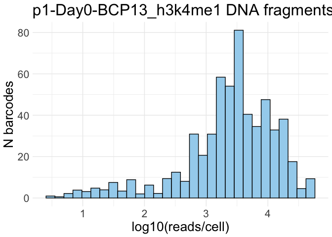

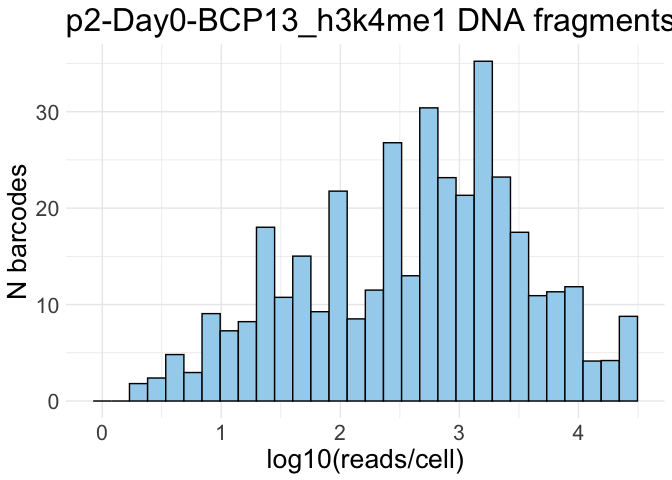

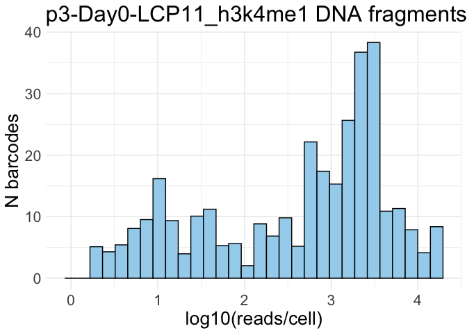

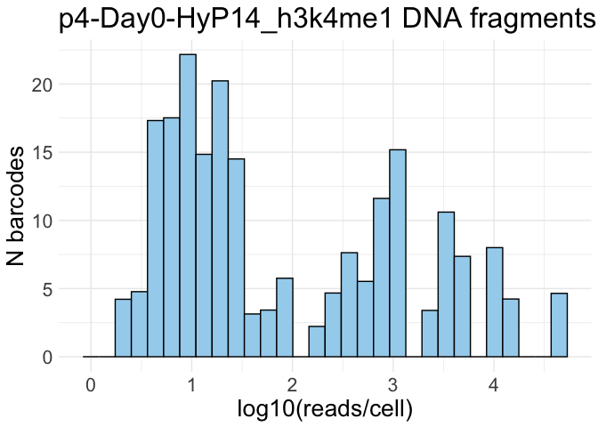

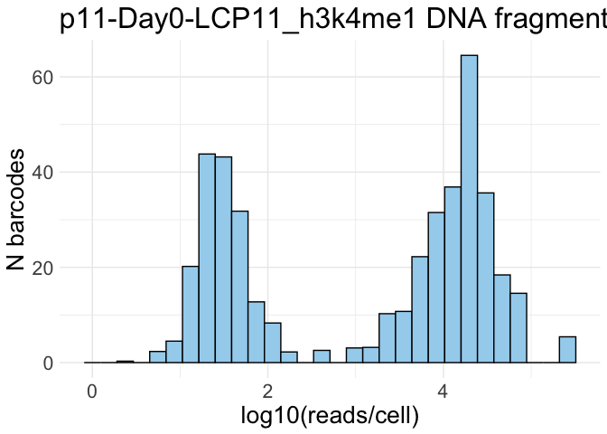

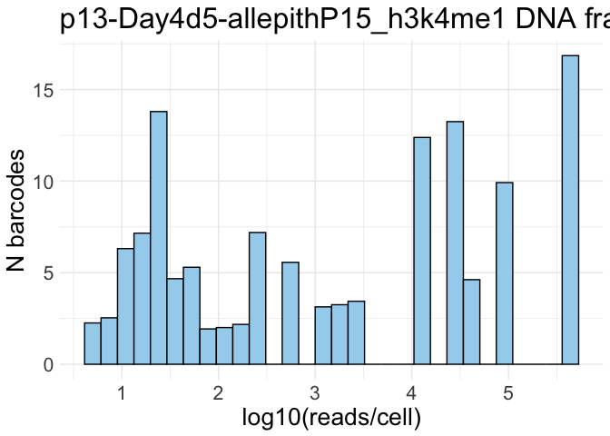

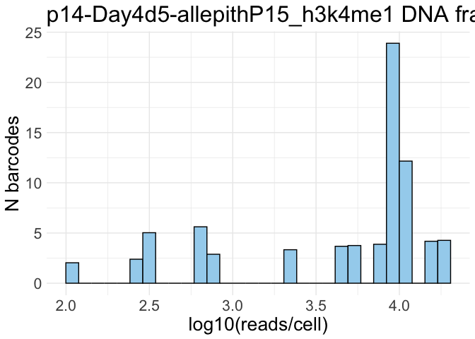

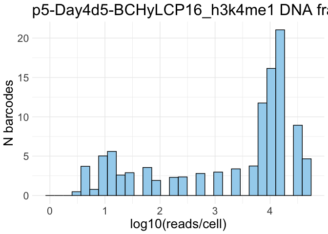

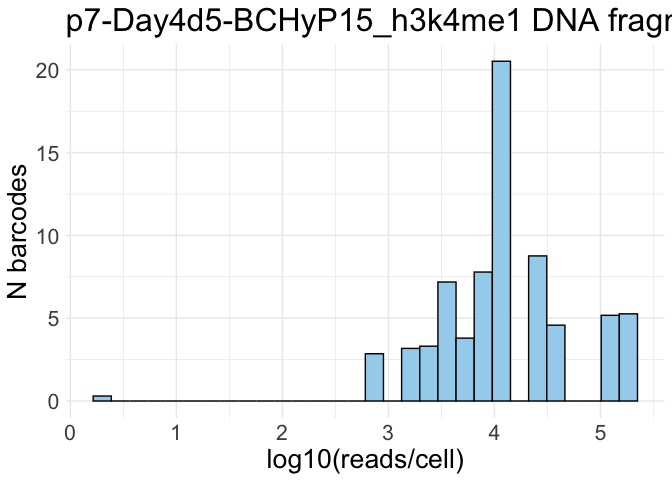

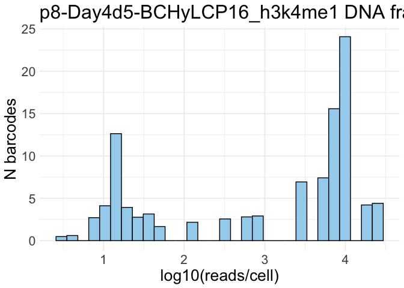

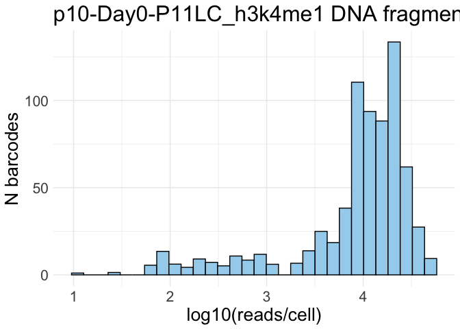

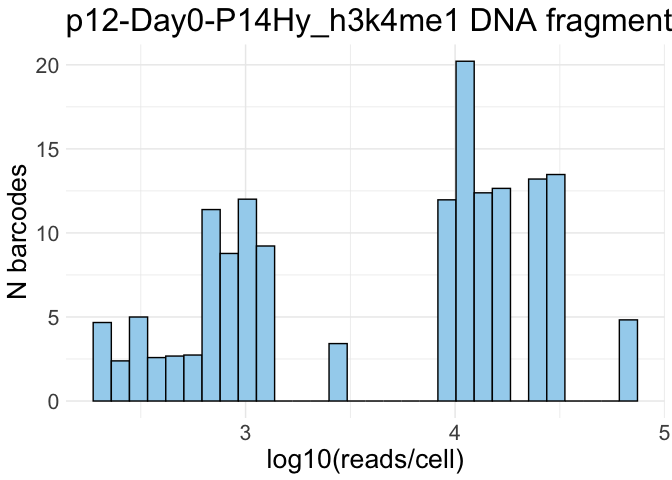

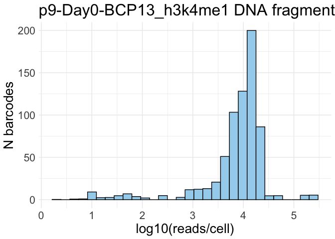

## % MT, N fragments and FRiP

``` r
seurat@meta.data$log10_fragments <- log10(seurat@meta.data$frequency_count)

DefaultAssay(seurat) <- "RNA_fl"
rna <- GetAssayData(seurat, assay = "RNA_fl", layer = "counts")
total <- Matrix::colSums(rna)

mt_features <- grep("^mt-", rownames(rna), value = TRUE, ignore.case = TRUE)
rb_features <- grep("^(Rpl|Rps)", rownames(rna), value = TRUE)

mt <- Matrix::colSums(rna[mt_features, , drop = FALSE])
rb <- Matrix::colSums(rna[rb_features, , drop = FALSE])

seurat$percent.mt <- as.numeric(100 * mt / total)
seurat$percent.rb <- as.numeric(100 * rb / total)
```

``` r
VlnPlot(seurat, c("log10_fragments", "FRiP"),
                   group.by = "orig.ident", split.by = "Exp", pt.size = 0) +
                   stat_summary(fun.y = median, geom='point', size = 2, colour = "black", position = position_dodge(width = 0.9)) +
                   scale_fill_manual(values = c(mypal, "grey"))


VlnPlot(seurat, c("percent.mt", "percent.rb"),
                   group.by = "Exp",  pt.size = 0.5) +
                   stat_summary(fun.y = median, geom='point', size = 2, colour = "black", position = position_dodge(width = 0.9)) +
                   scale_fill_manual(values = c(mypal, "grey"))

VlnPlot(seurat, c("nCount_RNA_fl", "nFeature_RNA_fl"),
                   group.by = "Exp",  pt.size = 0.5) +
                   stat_summary(fun.y = median, geom='point', size = 2, colour = "black", position = position_dodge(width = 0.9)) +
                   scale_fill_manual(values = c(mypal, "grey"))
```

## Filtering

Remove cells not passing the RNA QC from the RNA ASSAY

``` r
seurat$filtering_RNA <- ifelse(
  seurat$nCount_RNA_fl > 500 &       
  seurat$percent.mt < 35 & 
  seurat$percent.mt < 35,
  "pass",
  "fail"
)

table(seurat$filtering_RNA)

rna <- GetAssayData(seurat, assay="RNA_fl", layer="counts")
rna_cells <- colnames(rna)

pass_rna <- intersect(
  WhichCells(seurat, expression = filtering_RNA == "pass"),
  rna_cells
)

rna_pass <- rna[, pass_rna, drop = FALSE]

# replace the assay with the reduced version
seurat[["RNA_fl"]] <- CreateAssayObject(counts = rna_pass)


rna <- GetAssayData(seurat, assay="RNA_umi", layer="counts")
rna_cells <- colnames(rna)

pass_rna <- intersect(
  WhichCells(seurat, expression = filtering_RNA == "pass"),
  rna_cells
)

rna_pass <- rna[, pass_rna, drop = FALSE]

# replace the assay with the reduced version
seurat[["RNA_umi"]] <- CreateAssayObject(counts = rna_pass)
```

Remove cells not passing the K4 QC from the object

``` r
min_reads_chromatin = 400
min_frip = 0.2

seurat@meta.data[["filtering"]] <- ifelse(seurat@meta.data$frequency_count > min_reads_chromatin &
                                          seurat@meta.data$FRiP > 0.2, 'pass', 'fail')
table(seurat@meta.data$filtering)
```

``` r
seurat <- subset(seurat, subset = filtering == 'pass')
```

# Reload step 1

``` r
saveRDS(seurat, file.path(outputDir_objects, "seurat_step1.rds"))
```

``` r
seurat <- readRDS(file.path(outputDir_objects, "seurat_step1.rds"))
```

# QC plots post filtering 1

## FrIP and N fragments

``` r
p_frip <- VlnPlot(seurat, c("FRiP"),
                  group.by = "Exp", pt.size = 0) +
                  labs(title = "FRiP") +
                  stat_summary(fun.y = median, geom='point', size = 2, colour = "black", position = position_dodge(width = 0.9)) +
                  scale_fill_manual(values = c(mypal[4], mypal[7])) +
                  scale_y_continuous(limits = c(0, NA))

p_count <- VlnPlot(seurat, c("frequency_count"),
                   group.by = "Exp", pt.size = 0, y.max = 100000) +
                   labs(title = "DNA fragments per cell") +
                   stat_summary(fun.y = median, geom='point', size = 2, colour = "black", position = position_dodge(width = 0.9)) +
                   scale_fill_manual(values = c(mypal[4], mypal[7]))

p_dna <- p_frip | p_count
p_dna
```

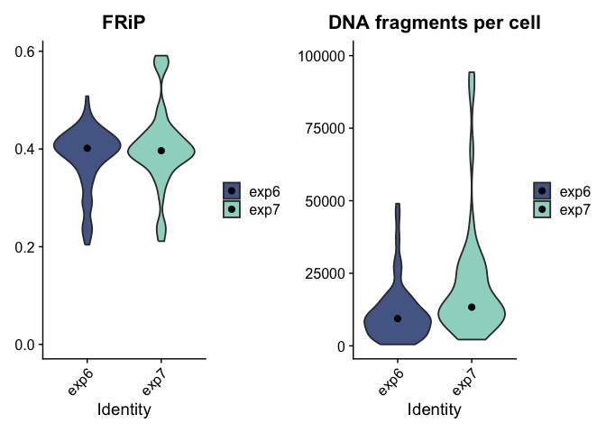

## DNA to RNA reads scatter plots

``` r
meta_all <- seurat@meta.data

frags_to_rna_reads_fl <- ggplot(meta_all,
                             aes(x = log10(frequency_count), y = log10(nCount_RNA_fl), color = Exp)) +
                             geom_point(alpha = 1, stroke = 0, size = 2) +  
                             labs(x = "log10(unique DNA fragments)",
                                  y =  "log10(unique RNA reads, fl)",
                                title = "N unique DNA fragments\n vs.\nN unique RNA reads, fl") +
                              coord_cartesian(xlim = c(0, NA), ylim = c(0, NA)) +
                              theme_classic() +
                              scale_color_manual(values = c(mypal[4], mypal[7]))

frags_to_genes_fl <- ggplot(meta_all,
                         aes(x = log10(frequency_count), y = log10(nFeature_RNA_fl), color = Exp)) +
                             geom_point(alpha = 1, stroke = 0, size = 2) +  
                             labs(x = "log10(unique DNA fragments)",
                                  y =  "log10(unique genes, fl)",
                                title = "N unique DNA fragments\n vs.\nN unique genes, fl") +
                                coord_cartesian(xlim = c(0, NA), ylim = c(0, NA)) +
                              theme_classic() +
                              scale_color_manual(values = c(mypal[4], mypal[7]))

frags_to_rna_reads_umi <- ggplot(meta_all,
                             aes(x = log10(frequency_count), y = log10(nCount_RNA_umi), color = Exp)) +
                             geom_point(alpha = 1, stroke = 0, size = 2) +  
                             labs(x = "log10(unique DNA fragments)",
                                  y =  "log10(unique RNA reads, umi)",
                                title = "N unique DNA fragments\n vs.\nN unique RNA reads, umi") +
                                coord_cartesian(xlim = c(0, NA), ylim = c(0, NA)) +
                              theme_classic() +
                              scale_color_manual(values = c(mypal[4], mypal[7]))

frags_to_genes_umi <- ggplot(meta_all,
                         aes(x = log10(frequency_count), y = log10(nFeature_RNA_umi), color = Exp)) +
                             geom_point(alpha = 1, stroke = 0, size = 2) +  
                             labs(x = "log10(unique DNA fragments)",
                                  y =  "log10(unique genes, umi)",
                                title = "N unique DNA fragments\n vs.\nN unique genes, umi") +
                                coord_cartesian(xlim = c(0, NA), ylim = c(0, NA)) +
                              theme_classic() +
                              scale_color_manual(values = c(mypal[4], mypal[7]))

p_scatter_fl <- frags_to_rna_reads_fl | frags_to_genes_fl
p_scatter_umi <- frags_to_rna_reads_umi | frags_to_genes_umi

p_scatters <- p_scatter_fl / p_scatter_umi
p_scatters
```

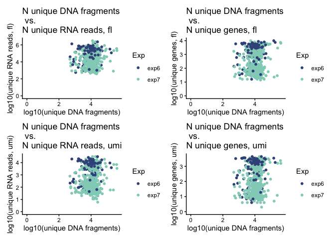

``` r
ggsave(file.path(outputDir_plots, "dna_rna_scatters_all.pdf"),
       plot = p_scatters,
       device = "pdf",
       units = "mm",
       width = 160,
       height = 145)
```

# Correlation QC

## Generate spectral embedding

Export assay

``` r
k4_assay <- GetAssayData(seurat, assay = "bin_5k_h3k4me1", layer = "counts")

Matrix::writeMM(k4_assay, file.path(snap_dir, "matrix_k4.mtx"))
write.table(colnames(k4_assay), file.path(snap_dir, "barcodes_k4.tsv"),
            quote = FALSE, sep = "\t", row.names = FALSE, col.names = FALSE)


gr <- StringToGRanges(rownames(k4_assay), sep = c(":", "-"))
bins_df <- data.frame(
  chrom = as.character(seqnames(gr)),
  start = start(gr),
  end   = end(gr),
  name  = rownames(k4_assay),
  stringsAsFactors = FALSE
)
write.table(bins_df, file.path(snap_dir, "features_k4.tsv"),
            quote = FALSE, sep = "\t", row.names = FALSE, col.names = TRUE)
```

Generate spectral embedding

``` python
snap_dir = Path(r.snap_dir) 
X = sc.read_mtx(snap_dir / "matrix_k4.mtx").X.tocsr().transpose()  
barcodes = pd.read_csv(snap_dir / "barcodes_k4.tsv", header=None, sep="\t")[0].values
feat = pd.read_csv(snap_dir / "features_k4.tsv", sep="\t")

adata_k4 = sc.AnnData(X=X)
adata_k4.obs_names = barcodes
adata_k4.var_names = feat["name"].values
adata_k4.var["chrom"] = feat["chrom"].values
adata_k4.var["start"] = feat["start"].values
adata_k4.var["end"]   = feat["end"].values

adata_k4.X = adata_k4.X.tocsr().astype(np.float64)
adata_k4
```

``` python
snap.pp.select_features(adata_k4, n_features = 300000)
snap.tl.spectral(adata_k4, features = 'selected', distance_metric='cosine')
```

Import embedding to Seurat

``` r
emb_k4 <- as.matrix(py$adata_k4$obsm[["X_spectral"]])
rownames(emb_k4) <- py$adata_k4$obs_names$tolist()

seurat[["spectral_k4"]] <- CreateDimReducObject(
  embeddings = emb_k4,
  key       = "speck4_",
  assay     = "bin_2k_h3k4me1"
)
```

# Reload step 2

``` r
saveRDS(seurat, file.path(outputDir_objects, "seurat_step2.rds"))
```

``` r
seurat <- readRDS(file.path(outputDir_objects, "seurat_step2.rds"))
```

## Calculate correlations

``` r
sce_k4 <- as.SingleCellExperiment(
  seurat,
  assay = "bin_5k_h3k4me1" 
)

sce_k4 <- correlation_and_hierarchical_clust_scExp_cosine(sce_k4, reduction = "SPECTRAL_K4")
sce_k4 <- find_clusters_louvain_scExp(sce_k4, k = 10, use.dimred = "SPECTRAL_K4")
```

``` r
cor <- as.matrix(reducedDim(sce_k4, "Cor"))
hc <- metadata(sce_k4)$hc_cor
dend <- as.dendrogram(hc)
cluster <- colData(sce_k4)$cell_cluster
exp <- colData(sce_k4)$Exp
frags <- colData(sce_k4)$log10_fragments
filtering <- colData(sce_k4)$filtering

# Correlation scores (n cells with whom a cell correlates more than by random chance)
limitC  <- 0.85
scores <- apply(cor, 2, function(x) sum(x > limitC))


cluster_levels <- if (is.factor(cluster)) levels(cluster) else sort(unique(cluster))
cluster_colors <- setNames(mypal[seq_along(cluster_levels)], cluster_levels)

exp_levels <- if (is.factor(exp)) levels(exp) else sort(unique(exp))
exp_colors <- setNames(alt_pal[seq_along(exp_levels)], exp_levels)

filt_levels <- if (is.factor(filtering)) levels(filtering) else sort(unique(filtering))
filt_colors <- setNames(mypal[seq_along(filt_levels)], filt_levels)

frags_col_fun <- colorRamp2(range(frags, na.rm = TRUE), c("white", "black"))
cor_score_col_fun <- colorRamp2(range(scores, na.rm = TRUE), c("white", "firebrick"))

top_annot <- HeatmapAnnotation(
  cell_cluster = cluster,
  exp = exp,
  filtering = filtering,
  log10_frags    = frags,
  correlation_score = scores,
  col = list(cell_cluster = cluster_colors,
             exp = exp_colors,
             filtering = filt_colors,
             log10_frags    = frags_col_fun,
             correlation_score = cor_score_col_fun)
)

p_before_k4 <- Heatmap(
  cor,
  name = "Correlation",
  col = colorRamp2(
    c(min(cor), mean(range(cor)), max(cor)),
    c("navy", "white", "firebrick3")),
  cluster_rows = dend,
  cluster_columns = dend,
  show_row_names = FALSE,
  show_column_names = FALSE,
  top_annotation = top_annot
)

draw(p_before_k4,
     show_annotation_legend = FALSE)
```

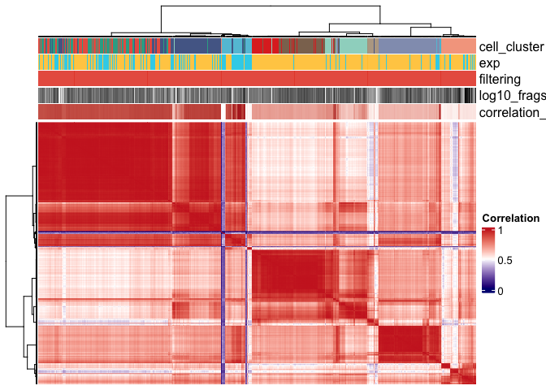

## Remove low correlated cells

``` r
sce_k4_cf <- filter_correlated_cell_scExp(sce_k4,
                                           corr_threshold = 99,
                                           percent_correlation = 3,
                                           reduction = "SPECTRAL_K4"
)
```

``` r
cor <- as.matrix(reducedDim(sce_k4_cf,"Cor"))
hc <- metadata(sce_k4_cf)$hc_cor
dend <- as.dendrogram(hc)
cluster <- colData(sce_k4_cf)$cell_cluster
exp <- colData(sce_k4_cf)$Exp
frags <- colData(sce_k4_cf)$log10_fragments
filtering <- colData(sce_k4_cf)$filtering

# Correlation scores (n cells with whom a cell correlates more than by random chance)
limitC  <- 0.85
scores <- apply(cor, 2, function(x) sum(x > limitC))


cluster_levels <- if (is.factor(cluster)) levels(cluster) else sort(unique(cluster))
cluster_colors <- setNames(mypal[seq_along(cluster_levels)], cluster_levels)

exp_levels <- if (is.factor(exp)) levels(exp) else sort(unique(exp))
exp_colors <- setNames(alt_pal[seq_along(exp_levels)], exp_levels)

filt_levels <- if (is.factor(filtering)) levels(filtering) else sort(unique(filtering))
filt_colors <- setNames(mypal[seq_along(filt_levels)], filt_levels)

frags_col_fun <- colorRamp2(range(frags, na.rm = TRUE), c("white", "black"))
cor_score_col_fun <- colorRamp2(range(scores, na.rm = TRUE), c("white", "firebrick"))

top_annot <- HeatmapAnnotation(
  cell_cluster = cluster,
  exp = exp,
  filtering = filtering,
  log10_frags    = frags,
  correlation_score = scores,
  col = list(cell_cluster = cluster_colors,
             exp = exp_colors,
             filtering = filt_colors,
             log10_frags    = frags_col_fun,
             correlation_score = cor_score_col_fun)
)

p_after_k4 <-Heatmap(
  cor,
  name = "Correlation",
  col = colorRamp2(
    c(min(cor), mean(range(cor)), max(cor)),
    c("navy", "white", "firebrick3")),
  cluster_rows = dend,
  cluster_columns = dend,
  show_row_names = FALSE,
  show_column_names = FALSE,
  top_annotation = top_annot
)

draw(p_after_k4,
     show_annotation_legend = FALSE)
```

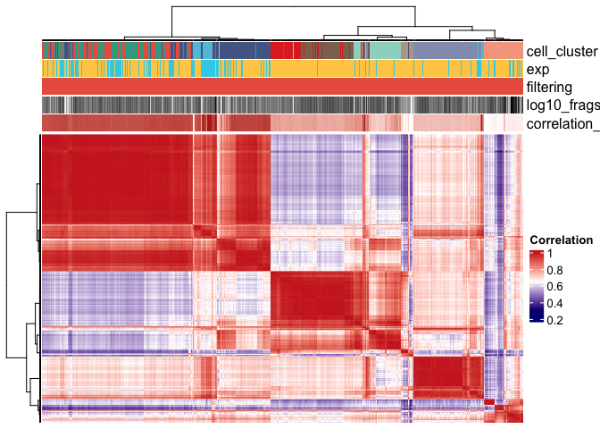

Filtering out poor-correlated cells

``` r
cells_k4_cf  <- colnames(sce_k4_cf)

seurat <- subset(seurat, cells = cells_k4_cf)
```

# Reload step 3

``` r
saveRDS(seurat, file.path(outputDir_objects, "seurat_step3.rds"))
```

``` r
seurat <- readRDS(file.path(outputDir_objects, "seurat_step3.rds"))
```

# Merging objects

``` r
seurat_mmg <- readRDS(file.path(inputDir_mouse_mammary_gland, "seurat_step3.rds"))
seurat_mmg@reductions <- list()
seurat_mmg <- subset(seurat_mmg, subset = mark == "h3k4me1")
seurat_mmg@assays[["bin_2k_h3k4me1"]] <- NULL

seurat_all <- merge(seurat, seurat_mmg)
```

# Save

``` r
saveRDS(seurat_all, file.path(outputDir_objects, "seurat_all.rds"))
```
