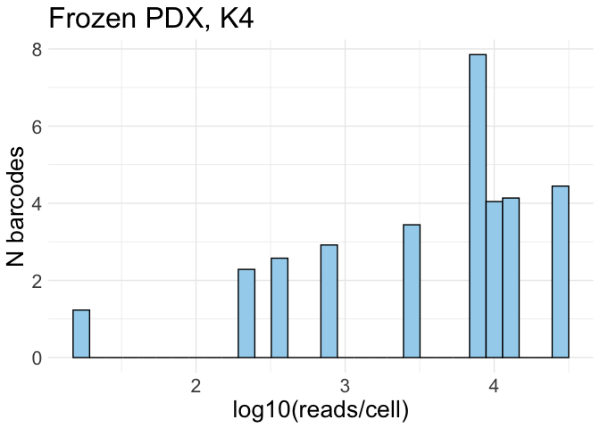
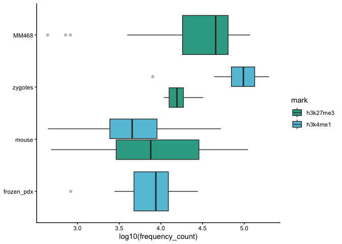
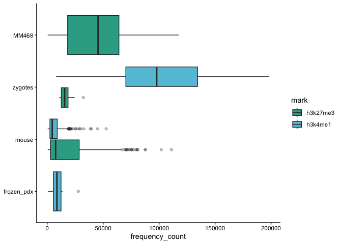
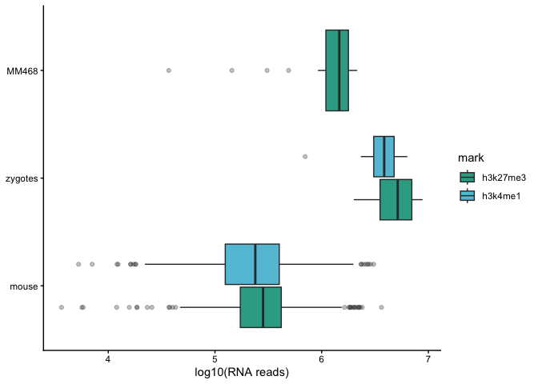
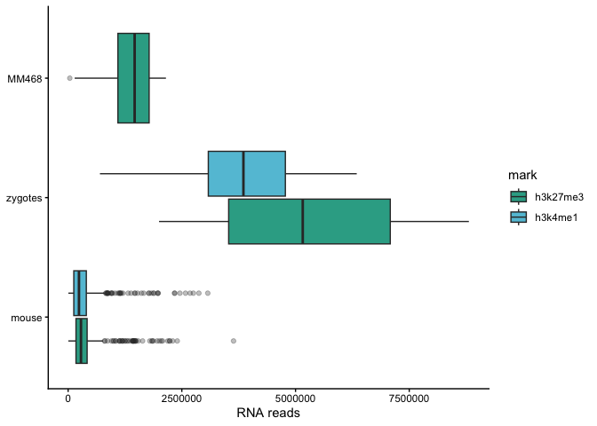

5.1_sample_type_comparison
================
Anna Schwager
2026-02-04

Load the global variables

``` r
here::i_am("scripts/5.1_sample_type_comparison.Rmd")
mainDir = here::here()
source(knitr::purl(file.path(mainDir,"scripts/global_variables.Rmd"), quiet=TRUE))
source(knitr::purl(file.path(mainDir, "scripts/functions.Rmd"), quiet=TRUE))

set.seed(123)
```

# Preparation and object creation

## Setting directories and input files

``` r
inputDir_local = inputDir
outputDir_local = file.path(outputDir, "5.1_sample_type_comparison") ; if(!file.exists(outputDir_local)){dir.create(outputDir_local)}
outputDir_objects = file.path(outputDir_local, "objects") ; if(!file.exists(outputDir_objects)){dir.create(outputDir_objects)}
outputDir_plots = file.path(outputDir_local, "plots") ; if(!file.exists(outputDir_plots)){dir.create(outputDir_plots)}
outputDir_tables = file.path(outputDir_local, "tables") ; if(!file.exists(outputDir_plots)){dir.create(outputDir_plots)}

inputDir_mm = file.path(outputDir, "1.2_multiome_MM468", "objects")
inputDir_zygote = file.path(outputDir, "2.3_multiome_zygotes", "objects")
inputDir_mouse = file.path(outputDir, "3.1_multiome_mouse_mammary_gland_preprocessing", "objects")


ld <- list.dirs(inputDir_local)
fragpaths <- list.files(ld[grepl("/.*fragmentFiles", ld)], full.names = TRUE)
fragpaths <- fragpaths[grepl("L547|L512", fragpaths)] 
fragpaths <- fragpaths[grepl(".*fragmentFiles/.*tsv.gz$", fragpaths)]

names(fragpaths) <- ifelse(grepl("L547", fragpaths), 
                              "fresh_pdx", 
                              ifelse(grepl("L512_PDX_BC152_P1", fragpaths), 
                                     "frozen_pdx_1",
                              ifelse(grepl("L512_PDX_BC152_P3", fragpaths), 
                                     "frozen_pdx_3",
                                     NA)))
```

# Creating Seurat objects

``` r
seurat_list <- list()

genome_name <- "hg38"
genome <- hg38
annotations <- annotations_hg38

for (i in names(fragpaths)) {
  message(paste0("### Making fragment object for mark sample ", i))
  total_counts <- CountFragments(fragpaths[[i]])
  barcodes <- total_counts$CB
  frags <- CreateFragmentObject(path = fragpaths[[i]], cells = barcodes)

  message(paste0("### Making 50k bin matrix for sample ", i))
  bin50k_kmatrix <- GenomeBinMatrix(
    frags,
    genome = genome,
    cells = NULL,
    binsize = 50000,
    process_n = 10000,
    sep = c(":", "_"),
    verbose = TRUE
  )

  message(paste0("### Creating chromatin assay for sample ", i))
  chrom_assay <- CreateChromatinAssay(
    counts = bin50k_kmatrix,
    sep = c(":", "_"),
    genome = genome_name,
    fragments = fragpaths[[i]],
    min.cells = 1,
    min.features = -1
  )

  message(paste0("### Creating Seurat object for sample ", i))
  seu <- CreateSeuratObject(
    counts = chrom_assay,
    assay = "bin_50k"
  )

  Annotation(seu) <- annotations
  seu <- AddMetaData(seu, total_counts)
  seu$orig.ident <- i

  seurat_list[[i]] <- seu

  rm(seu, frags, total_counts, barcodes, bin50k_kmatrix, chrom_assay)
  gc()
}

saveRDS(seurat_list, file.path(outputDir_objects, "seurat_list.rds"))
```

``` r
seurat_list <- readRDS(file.path(outputDir_objects, "seurat_list.rds"))

seurat_frozen_pdx <- merge(seurat_list[["frozen_pdx_1"]],
                          seurat_list[["frozen_pdx_3"]])
```

# Loading the already-made objects

``` r
seurat_mouse <- readRDS(file.path(inputDir_mouse, "seurat_step3.rds")) # already filtered based on experiment-specific thresholds (min_reads_chromatin = 400, min_feature_rna = 400)
seurat_zygotes <- readRDS(file.path(inputDir_zygote, "seurat_step1.rds")) # already filtered based on experiment-specific thresholds (min_reads_chromatin = 700, min_reads_rna = 1000)
seurat_mm <- readRDS(file.path(inputDir_mm, "seurat_MM468_h3k27me3_multiome.rds")) # not filtered

min_reads_dna = 400
min_feature_rna = 400
seurat_mm$filtering <- ifelse(seurat_mm$frequency_count > min_reads_dna & seurat_mm$nFeature_RNA_fl > min_feature_rna, 'pass', 'fail')
seurat_mm <- subset(seurat_mm, subset = filtering == "pass")
```

# QC for the data not already filtered

## Weighted histograms

``` r
plot_weighted_hist(seurat_frozen_pdx) + ggtitle("Frozen PDX, K4")
```

<!-- --> \##
Filtering

``` r
min_reads_dna = 400
seurat_frozen_pdx$filtering <- ifelse(seurat_frozen_pdx$frequency_count > min_reads_dna, 'pass', 'fail')
table(seurat_frozen_pdx$filtering)
```

    ## 
    ## fail pass 
    ##    3    7

``` r
seurat_frozen_pdx <- subset(seurat_frozen_pdx, subset = filtering == "pass")
```

# Comparative plots

``` r
seurat_frozen_pdx$mark <- "h3k4me1"
seurat_mm$mark <- "h3k27me3"


pull_freq <- function(seu, object_name) {
  md <- seu@meta.data

  md %>%
    transmute(
      object = object_name,
      mark = as.factor(mark),
      frequency_count = as.numeric(frequency_count)
    ) 
}

df_freq <- bind_rows(
  pull_freq(seurat_zygotes,    "zygotes"),
  pull_freq(seurat_mm,         "MM468"),
  pull_freq(seurat_mouse,      "mouse"),
  pull_freq(seurat_frozen_pdx, "frozen_pdx")
)

df_freq$object <- factor(df_freq$object, levels = c("frozen_pdx","mouse", "zygotes", "MM468"))

cols <- c("h3k4me1" = mypal[2],
          "h3k27me3" = mypal[3])


p_frags_log <- ggplot(df_freq, aes(x = object, y = log10(frequency_count))) +
  geom_boxplot(aes(fill = mark), outlier.alpha = 0.3, position = position_dodge(width = 0.8)) +
  theme_classic() +
  scale_fill_manual(values = cols) +
  labs(x = NULL, y = "log10(frequency_count)", fill = "mark") + 
  coord_flip()

p_frags_log
```

<!-- -->

``` r
p_frags <- ggplot(df_freq, aes(x = object, y = frequency_count)) +
  geom_boxplot(aes(fill = mark), outlier.alpha = 0.3, position = position_dodge(width = 0.8)) +
  theme_classic() +
  scale_fill_manual(values = cols) +
  labs(x = NULL, y = "frequency_count", fill = "mark") + 
  coord_flip()

p_frags
```

<!-- -->

``` r
pull_rna <- function(seu, object_name) {
  md <- seu@meta.data

  md %>%
    transmute(
      object = object_name,
      mark = as.factor(mark),
      nCount_RNA_fl = as.numeric(nCount_RNA_fl)
    ) 
}

df_rna <- bind_rows(
  pull_rna(seurat_zygotes,    "zygotes"),
  pull_rna(seurat_mm,         "MM468"),
  pull_rna(seurat_mouse,      "mouse")
)

df_rna$object <- factor(df_rna$object, levels = c("mouse", "zygotes", "MM468"))

cols <- c("h3k4me1" = mypal[2],
          "h3k27me3" = mypal[3])


p_rna_log <- ggplot(df_rna, aes(x = object, y = log10(nCount_RNA_fl))) +
  geom_boxplot(aes(fill = mark), outlier.alpha = 0.3, position = position_dodge(width = 0.8)) +
  theme_classic() +
  scale_fill_manual(values = cols) +
  labs(x = NULL, y = "log10(RNA reads)", fill = "mark") + 
  coord_flip()

p_rna_log
```

<!-- -->

``` r
p_rna <- ggplot(df_rna, aes(x = object, y = nCount_RNA_fl)) +
  geom_boxplot(aes(fill = mark), outlier.alpha = 0.3, position = position_dodge(width = 0.8)) +
  theme_classic() +
  scale_fill_manual(values = cols) +
  labs(x = NULL, y = "RNA reads", fill = "mark") + 
  coord_flip()

p_rna
```

<!-- -->

``` r
ggsave(file.path(outputDir_plots, "fragments.pdf"),
       plot = p_frags,
       device = "pdf",
       units = "mm",
       width = 100,
       height = 70)

ggsave(file.path(outputDir_plots, "fragments_log.pdf"),
       plot = p_frags_log,
       device = "pdf",
       units = "mm",
       width = 100,
       height = 70)

ggsave(file.path(outputDir_plots, "rna.pdf"),
       plot = p_rna,
       device = "pdf",
       units = "mm",
       width = 100,
       height = 50)

ggsave(file.path(outputDir_plots, "rna_log.pdf"),
       plot = p_rna_log,
       device = "pdf",
       units = "mm",
       width = 100,
       height = 50)
```
